# Mermaid 图表专家

创建正确、美观的Mermaid图表。支持v11+所有特性。

## 目录

1. [Agent协作模式](#agent协作模式)
   - [环境信息传递](#环境信息传递策略)
   - [并行执行](#并行执行最佳实践)
2. [核心原则](#核心原则)
3. [强制执行规则](#强制执行规则)
4. [执行流程](#执行流程)
5. [视觉质量标准](#视觉质量标准)
6. [图表类型速查](#图表类型速查)
7. [语言选择策略](#语言选择策略)
8. [返回格式规范](#返回格式规范)
9. [常用模板快速启动](#常用模板快速启动)
10. [参考资源索引](#参考资源索引)

---

## Agent协作模式

### ⚠️ 使用模式说明（必读）

**此skill必须在独立子agent中运行**，避免在主对话中创建大量mermaid代码造成token浪费。

#### 主Agent职责

❌ **错误做法**：
- 在主对话中编写大段mermaid代码
- 在主对话中反复调试修改图表

✅ **正确做法**：
- 使用 `delegate_task` 委托给子agent
- 提供清晰的任务描述
- 必要时并行创建多个图表

#### 委托示例

**单个图表**：
```python
delegate_task(
    category="quick",
    load_skills=["mermaid"],
    prompt="""
    创建电商系统架构图（Flowchart）：
    - 检查用户编辑器环境（dark/light），若不确定则询问。
    - 根据环境选择主题：dark模式用dark主题，light模式用default主题。
    - 包含：前端、API网关、微服务、数据库
    - 使用subgraph分层
    - 代码必须包裹在 ```mermaid ... ``` 中
    - 保存到 docs/architecture.md
    - 必须运行验证脚本并返回验证通过的摘要
    """,
    run_in_background=False
)
```

**多个图表（并行）**：
```python
# Step 1: 主Agent统一收集环境信息（只询问一次）
editor_mode = ask_user("在什么环境下查看图表？(dark/light/默认)")

# Step 2: 同时启动多个Task，无依赖关系
timestamp=$(date +%Y%m%d-%H%M%S)

delegate_task(
    category="quick",
    load_skills=["mermaid"],
    prompt=f"""
    创建系统架构Flowchart，保存到 /tmp/architecture-{timestamp}.md：
    - 编辑器环境：{editor_mode}（根据此选择合适的主题）
    - dark模式推荐使用dark主题，light模式使用default主题
    - 包含：前端、API网关、微服务、数据库
    - 使用subgraph分层
    - 代码必须包裹在 ```mermaid ... ``` 中
    - 使用 --move-to 参数
    - 返回简洁摘要（不要完整代码）
    """,
    run_in_background=True  # 后台执行
)

delegate_task(
    category="quick",
    load_skills=["mermaid"],
    prompt=f"""
    创建用户登录Sequence Diagram，保存到 /tmp/login-sequence-{timestamp}.md：
    - 编辑器环境：{editor_mode}
    - 使用 --move-to 参数
    - 返回简洁摘要
    """,
    run_in_background=True
)

delegate_task(
    category="quick",
    load_skills=["mermaid"],
    prompt=f"""
    创建项目计划Gantt图，保存到 /tmp/project-plan-{timestamp}.md：
    - 编辑器环境：{editor_mode}
    - 使用 --move-to 参数
    - 返回简洁摘要
    """,
    run_in_background=True
)
```

### 并行委托规则

**✅ 适合并行的场景**：
- 多个独立图表（无信息依赖）
- 不同类型的图表
- 系统文档套件

**❌ 不适合并行的场景**：
- 图表B需要图表A的具体内容
- 有顺序依赖关系
- 后续图表需要前序图表的决策结果

**并行条件检查清单**：
- [ ] 图表之间无顺序依赖
- [ ] 图表之间无信息依赖
- [ ] 每个图表可独立完成

### 环境信息传递策略

#### 核心原则

**避免重复询问用户**：多个子Agent并行执行时，主Agent应统一收集环境信息，只询问一次。

#### 环境适配决策树

**策略1：已知环境（主Agent统一收集）**

```python
# 主Agent询问用户一次
editor_mode = ask_user("在什么环境下查看图表？(dark/light/默认)")

# 并行委托时传递环境信息
delegate_task(
    category="quick",
    load_skills=["mermaid"],
    prompt=f"创建架构图，环境：{editor_mode}（根据此选择主题）"
)
```

**决策逻辑**：
```
用户明确告知环境？
├─ Light 模式
│   ├─ 推荐主题：default / forest / neutral
│   └─ 使用模板：*-templates.md
└─ Dark 模式
    ├─ 推荐主题：dark（首选）/ forest（备选）
    └─ 使用模板：*-templates-dark.md
```

---

**策略2：未知环境（默认策略，不询问）**

**不询问用户，使用智能默认值**：

```python
# 子Agent根据文档类型选择默认主题
文档类型？
├─ 技术文档/博客 → default
├─ 演示文稿 → dark
└─ 不确定 → default
```

**在返回结果中提供切换指南**：
```markdown
✅ 图表已创建
- 主题：default（适用于浅色背景）

🎨 主题切换指南：
- 如果在dark模式编辑器中查看，建议将主题改为 `dark`
- 修改方式：将首行改为 `%%{init: {'theme':'dark'}}%%`
```

---

### 并行执行最佳实践

#### ⚠️ 并行执行风险（必读）

当多个 sub-agent 并行创建图表时存在以下风险：

| 风险 | 后果 | 严重性 |
|------|------|--------|
| 文件冲突 | 多个 agent 写入相同路径，导致覆盖 | 🔴 严重 |
| 验证混乱 | 验证脚本可能读取到不完整的内容 | 🟠 中等 |
| 结果丢失 | 后执行的结果覆盖先执行的 | 🔴 严重 |
| 结果不可信 | 无法确定哪个 agent 生成的图表被验证 | 🔴 严重 |

#### ✅ 推荐做法（原子操作）

**单 Agent 执行（推荐）**：
```
Step 3: 创建代码 → 保存文件
Step 4: 运行验证：直接验证该文件
```

**并行执行（需谨慎）**：
```
Step 3: 创建代码 → 保存临时文件
  格式：/tmp/{name}-{uuid}.md
  示例：/tmp/architecture-8F2A3D9B.md

Step 4: 验证临时文件（使用 --move-to 参数）
  python3 scripts/validate_mermaid.py /tmp/{name}-{uuid}.md --move-to docs/{name}.md

Step 5: 验证通过 → 自动移动到最终路径（原子操作）
  验证脚本自动处理文件移动，无需手动 mv 命令

Step 6: 验证失败 → 删除临时文件，重新生成
```

#### 🎯 文件命名策略

| 场景 | 文件名格式 | 示例 |
|--------|-----------|------|
| 单 Agent | 简单命名 | `docs/architecture.md` |
| 并行推荐 | UUID 后缀（最可靠） | `docs/architecture-8F2A3D9B.md` |
| 并行推荐 | 时间戳后缀 | `docs/architecture-20250208-143521.md` |
| 并行推荐 | Agent ID 后缀 | `docs/architecture-agent1.md` |

---

## 核心原则

### 🧠 复杂度预判框架（Step 0）

**在编写任何 Mermaid 代码之前，必须先进行预判。**

#### 第一步：快速评估源内容

**1. 源内容类型识别**

| 内容类型 | 典型特征 | 预估节点数 | 推荐策略 |
|---------|---------|-----------|---------|
| **代码流程** | 函数调用、条件分支、循环 | 15-40 | 概括模式 |
| **架构设计** | 系统分层、模块关系 | 10-30 | 详细模式 |
| **业务流程** | 步骤序列、决策点 | 8-25 | 详细模式 |
| **数据模型** | 实体关系、字段 | 12-50 | 概括模式 |
| **时序交互** | 服务间调用、消息传递 | 6-20 | 详细模式 |

**2. 节点数量快速估算**

```
逻辑步骤数 ≈ 源文本段落数 / 2
代码行数 → 节点数：每 5-10 行 ≈ 1 个节点
参与者数量 ≈ 名词实体数 / 3
```

#### 第二步：策略选择决策树

```
预估节点数？
├─ < 20 节点
│  └─ 详细模式（1:1 映射，保留所有关键信息）
│     ├─ 优点：信息完整，适合文档
│     └─ 缺点：可能略显复杂
│
├─ 20-50 节点
│  └─ 概括模式（合并琐碎步骤，仅保留关键逻辑）
│     ├─ 合并规则：
│     │  • 连续的简单步骤 → 合并为1个节点
│     │  • 相似功能 → 抽象为"XX处理"
│     │  • 错误处理分支 → 仅保留关键路径
│     └─ 示例：
│        ❌ "参数解析 → 参数校验 → 格式转换"
│        ✅ "参数处理"
│
└─ > 50 节点
   └─ 拆分模式（创建多个相关图表）
      ├─ 方案A：按层次拆分
      │  • 总体架构图（顶层，< 20节点）
      │  • 各层详细图（每层< 20节点）
      ├─ 方案B：按模块拆分
      │  • 用户模块图
      │  • 订单模块图
      │  • 支付模块图
      └─ 方案C：按时序拆分
         • 请求处理阶段图
         • 业务逻辑阶段图
```

#### 第三步：环境适配决策

**编辑器环境检测**
```
用户环境？
├─ Dark 模式编辑器
│  ├─ 推荐主题：dark（首选）/ forest（备选）
│  └─ 使用模板：*-templates-dark.md
└─ Light 模式编辑器
   ├─ 推荐主题：default / forest / neutral
   └─ 使用模板：*-templates.md
```

**环境适配最佳实践**
- ✅ 主Agent统一收集环境信息（只询问一次）
- ✅ 通过prompt传递环境信息给子Agent
- ❌ 避免每个子Agent都询问用户

#### 第四步：质量目标设定

根据用途设定质量目标：

| 用途 | 节点数目标 | 评分目标 | 说明 |
|------|-----------|---------|------|
| 技术文档 | < 20 | ≥ 85分 | 追求高质量，详细准确 |
| 演示文稿 | < 15 | ≥ 90分 | 简洁美观，突出重点 |
| 快速原型 | < 30 | ≥ 70分 | 可用即可，快速迭代 |
| 正式文档 | < 20 | ≥ 90分 | 完美呈现，无懈可击 |

#### 预判示例

**示例1：用户登录流程（代码流程）**
```
源内容：登录函数包含50行代码，包括参数解析、验证、数据库查询、错误处理
├─ 预估节点：50 / 5 ≈ 10个节点
├─ 策略：详细模式（节点数 < 20）
├─ 图表类型：Sequence Diagram（展示时序交互）
└─ 质量目标：≥ 85分
```

**示例2：微服务架构（架构设计）**
```
源内容：包含10个微服务，数据库、缓存、消息队列
├─ 预估节点：约15-20个节点
├─ 策略：详细模式（节点数在边界）
├─ 图表类型：Flowchart + subgraph 分层
└─ 质量目标：≥ 90分（正式文档）
```

**示例3：电商系统（大型系统）**
```
源内容：用户、商品、订单、支付、物流、库存等模块，共80+功能点
├─ 预估节点：> 50个节点
├─ 策略：拆分模式
│  • 总体架构图（15节点）
│  • 订单流程图（20节点）
│  • 支付流程图（15节点）
└─ 质量目标：每个图表 ≥ 85分
```

#### 代码可视化特别规则

**❌ 严禁的做法**
- 逐行翻译代码：`if (x > 0) { return true; }` → 单独节点
- 展示所有错误处理分支
- 包含日志记录等非业务逻辑

**✅ 正确的做法**
- 逻辑抽象：`参数解析 + 校验 + 报错` → `参数处理` 节点
- 仅保留主流程：省略异常处理细节
- 使用注释补充细节

### 四大质量标准

| 优先级 | 标准 | 验证方式 |
|--------|------|----------|
| 1 | **语法正确性** | ⚠️ 严格自动化：validate_mermaid.py |
| 2 | **视觉美观性** | ⭐ 半自动：视觉评分≥80分 |
| 3 | **布局合理性** | 节点<50、层次<6 |
| 4 | **语言适配** | 根据上下文选择中/英文 |

### 语言自动检测

| 对话语言 | 图表受众 | 标签语言 |
|----------|----------|----------|
| 中文 | 中文读者 | **中文** |
| 中文 | 国际化需求 | **英文** |
| 英文 | 任何 | **英文** |
| 用户明确要求 | - | **遵循要求** |

---

## 强制执行规则

### ⚠️ CRITICAL - 任务完成标准

**只有满足以下所有条件，任务才算完成（DONE）：**
1.  ✅ `validate_mermaid.py` 已运行。
2.  ✅ 脚本返回 **exit code 0**（成功）。
3.  ✅ 在工具输出中看到了 "✅ 验证通过" 的日志。

**🚫 如果验证失败或脚本未运行，严禁向用户返回结果！**

### 1. 语法与质量验证
```bash
# 必须运行，不可跳过
python3 scripts/validate_mermaid.py <file>
```
- **如果失败**：必须阅读错误日志 -> 修正代码 -> 重新验证。
- **自我修正**：如果提示节点过多，**必须**执行拆分或概括策略。

### 2. 标签与ID规范（反偷懒协议）

| 项目 | ❌ 错误示范 (Bad) | ✅ 正确示范 (Good) |
|------|-------------------|-------------------|
| **ID** | `ParseArgs[main 解析参数...]` | `ParseArgs` |
| **Label** | `检查文件是否存在并返回错误` | `检查文件` |
| **内容** | `if (x > 0) { return true; }` | `x > 0 ?` |
| **细节** | (在节点中写满代码细节) | (放入注释或文档描述) |

**规则**：
- ID 必须是简短的英文标识符。
- Label 长度推荐 < 10 字符，严禁超过 25 字符。
- 复杂逻辑必须抽象概括。

### 3. 视觉质量评分
- 目标：≥80分（良好）
- 评分<80：根据建议优化后重新验证

**3. 复杂度限制（分级标准）**

| 级别 | 节点数 | 标签长度 | 层次深度 | 用途 |
|------|--------|----------|----------|------|
| **推荐标准** | <20 | <10字 | <5层 | 追求高质量 |
| **最小要求** | <50 | <25字 | <6层 | 基本可用 |

**验证脚本使用方式**：
- 默认模式：检查最小要求（向后兼容）
- 严格模式：`--strict` 参数，使用推荐标准

```bash
# 默认模式
python3 scripts/validate_mermaid.py diagram.md

# 严格模式
python3 scripts/validate_mermaid.py diagram.md --strict
```

**4. 返回格式**
- ⚠️ 严禁返回完整代码（几百行）
- ✅ 仅返回：类型 + 指标 + 文件位置

### ❌ 禁止行为

| 行为 | 为什么禁止 |
|------|-----------|
| 跳过验证直接返回 | 无法保证语法正确 |
| 返回完整mermaid代码 | 浪费主对话token |
| 笼统确认"已完成检查" | 无法验证是否真正执行 |
| 不配置主题 | 视觉效果差 |
| 节点>20不拆分 | 图表过于复杂 |

---

## 执行流程

### 标准5步流程（不可跳步）

```
Step 0: 🧠 预判 (思维链)
  - 估算节点数 → 决定策略：详细 / 概括 / 拆分
  - 确认环境(Dark/Light) → 决定主题：dark / default
  ↓
Step 1: 选择图表类型 ✅ 必须明确声明
  ↓
Step 2: 应用模板 → 从 assets/templates/ 选择
  ↓
Step 3: 创建代码 ⚠️ 遵循预判策略
  ↓
  1. **代码必须包含主题配置**
  2. **ID/Label 必须简短**
  3. **填充内容** + **优化视觉**
  ↓
Step 4: 验证并返回 ⚠️ CRITICAL
```

### Step 4 详细流程

**单 Agent 执行模式（默认）**：
```
4.1 保存文件到指定路径
  ↓
4.2 运行验证：python3 scripts/validate_mermaid.py <diagram.md>
  ↓
4.3 检查结果：
    ├─ 语法通过 + 视觉≥60 → 继续4.4
    ├─ 语法失败 → 修复 → 重新4.2（最多3次）
    └─ 视觉<60 → 根据建议优化 → 重新4.2
  ↓
4.4 填写检查清单
  ↓
4.5 按标准格式返回结果
```

**并行执行模式（需谨慎）**：
```
4.1 保存临时文件
  - 使用唯一文件名：/tmp/{name}-{uuid}.md
  - 示例：/tmp/architecture-8F2A3D9B.md
  ↓
4.2 验证临时文件（使用 --move-to 参数）
  - python3 scripts/validate_mermaid.py /tmp/{name}-{uuid}.md --move-to docs/{name}.md
  ↓
4.3 检查结果：
    ├─ 验证通过 → 自动移动到最终路径（--move-to参数生效）
    ├─ 验证失败 → 自动删除临时文件，重新生成
    └─ 视觉<60 → 优化后重新4.2
  ↓
4.4 填写检查清单
  ↓
4.5 按标准格式返回结果
```

### 强制检查清单

创建图表后，必须在返回结果中包含：

```
📋 质量检查：
- [x] 验证脚本：已运行，结果PASS
- [x] 视觉评分：XX分（≥80）
- [x] 节点数量：XX个（<20）
- [x] 主题配置：default/dark/forest/neutral
- [x] 文件保存：<路径>
```

---

## 视觉质量标准

### ⭐ 视觉评分目标：≥80分

### ✅ 必须做到（基础视觉）

**1. 主题配置（强制）**
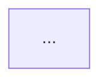
- 必选：default / dark / forest / neutral
- 技术文档用 default，演示用 dark
**2. 布局方向（强制）**
- Flowchart必须明确：TD / LR / RL / BT
- 时间流程 → LR，层次结构 → TD
**3. 节点分组（节点>10时强制）**
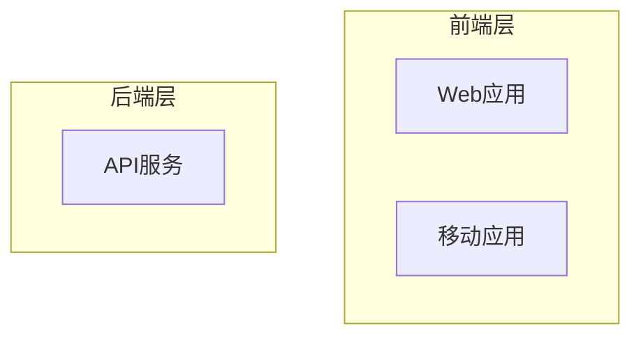

### 💎 应该做到（高级视觉）

**4. 节点形状区分**
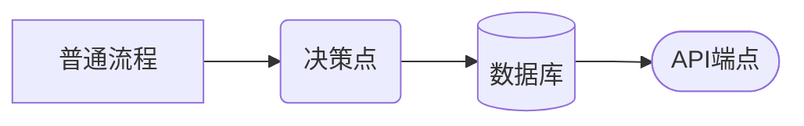
**5. 样式突出重点**

**6. 协调配色**
```
默认(Light)：
- 成功：#51cf66（绿） | 错误：#ff6b6b（红）
- 警告：#ffd93d（黄） | 信息：#4dabf7（蓝）

深色(Dark)：
- 蓝色：#4dabf7（白字）| 绿色：#69db7c（黑字）
- 黄色：#ffd43b（黑字）| 红色：#ff8787（白字）
```

### 视觉质量检查清单

- [ ] ✅ 已配置主题
- [ ] ✅ 已明确布局方向
- [ ] ✅ 节点标签简洁（<10字）
- [ ] ✅ 复杂图表使用subgraph分组
- [ ] 💎 重要节点有样式突出
- [ ] 💎 使用不同节点形状区分类型
- [ ] 💎 颜色使用协调统一

**详细视觉指南**：references/visual-design-guide.md

---

## 图表类型速查

| 类型 | 用途 | 模板 |
|------|------|------|
| **Flowchart** | 流程图、系统架构、决策树 | `assets/templates/flowchart-templates.md` (Light)<br>`assets/templates/flowchart-templates-dark.md` (Dark) |
| **Sequence Diagram** | 时序图、API交互、对象通信 | `assets/templates/sequence-templates.md` (Light)<br>`assets/templates/sequence-templates-dark.md` (Dark) |
| **Class Diagram** | 类图、对象模型、数据结构 | `assets/templates/class-diagram-templates.md` (Light)<br>`assets/templates/class-diagram-templates-dark.md` (Dark) |
| **State Diagram** | 状态机、生命周期、工作流 | `assets/templates/state-diagram-templates.md` (Light)<br>`assets/templates/state-diagram-templates-dark.md` (Dark) |
| **Gantt** | 项目计划、时间线、里程碑 | `assets/templates/gantt-templates.md` (Light)<br>`assets/templates/gantt-templates-dark.md` (Dark) |
| **ER Diagram** | 数据库设计、实体关系 | `assets/templates/er-diagram-templates.md` (Light)<br>`assets/templates/er-diagram-templates-dark.md` (Dark) |
| **Architecture** 🔥 | 系统架构、服务拓扑（v11+） | `assets/templates/architecture-templates.md` (Light)<br>`assets/templates/architecture-templates-dark.md` (Dark) |

**完整类型详解**：references/diagram-types-guide.md  
**v11+新特性**：references/v11-new-features.md

---

## 语言选择策略

### 自动检测规则

```
对话主要是中文 AND 未明确要求英文？
├─ 是 → 标签(Label)使用中文
└─ 否 → 标签(Label)使用英文
```

**⚠️ 标识符(ID)规则**：
- 无论标签语言如何，**ID必须始终使用简短英文**（如 `user_node` 而非 `用户节点`）。
- Class名必须使用英文。

### 示例

**中文对话 + 中文受众**：
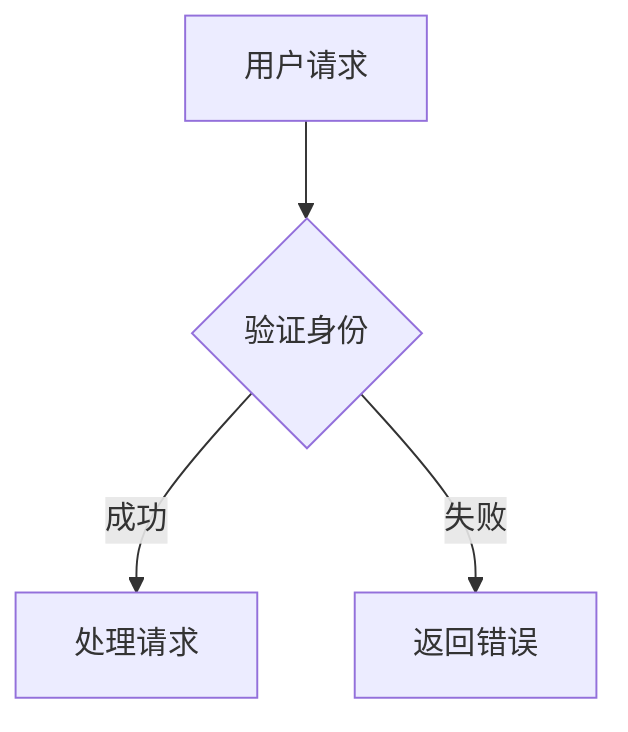

**英文对话 或 国际化需求**：
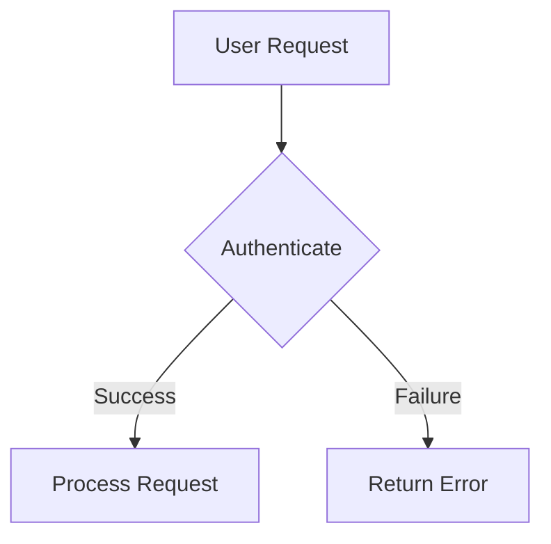

---

## 返回格式规范

### ✅ 标准格式（强制使用）

```markdown
✅ [图表名称]已创建

📊 图表信息：
- 类型：[Flowchart/Sequence/Gantt等] [方向]
- 规模：[节点数/参与者数]个
- 主题：[default/dark/forest/neutral]（适用于[浅色/深色]背景）
- 文件：[完整路径]

📋 质量检查：
- [x] 语法验证：PASS
- [x] 视觉评分：XX分
- [x] 复杂度：合理

🎨 主题切换指南：
- 如果在dark模式编辑器中查看，建议将主题改为 `dark`
- 修改方式：将首行改为 `%%{init: {'theme':'dark'}}%%`
- 其他可选主题：forest、neutral

💡 可在 Mermaid Live Editor 或支持mermaid的编辑器中查看。
如需调整，请说明具体需求。
```

### ❌ 错误格式（严禁）

我创建了一个系统架构图，代码如下：
```mermaid
flowchart TB
    [此处几百行代码...]  ❌ 严禁返回完整代码！
```

------

## 常用模板快速启动

### Flowchart - 系统架构图

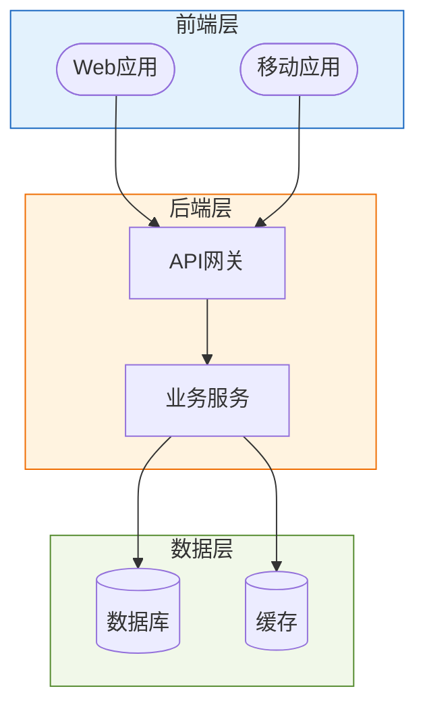

### Flowchart - 系统架构图 (Dark适配)

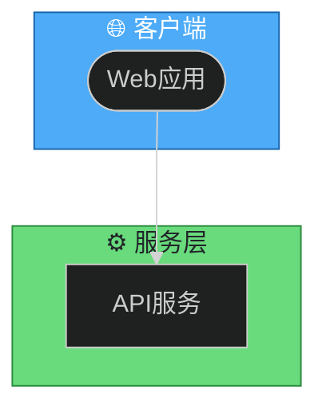

### Sequence Diagram - API交互

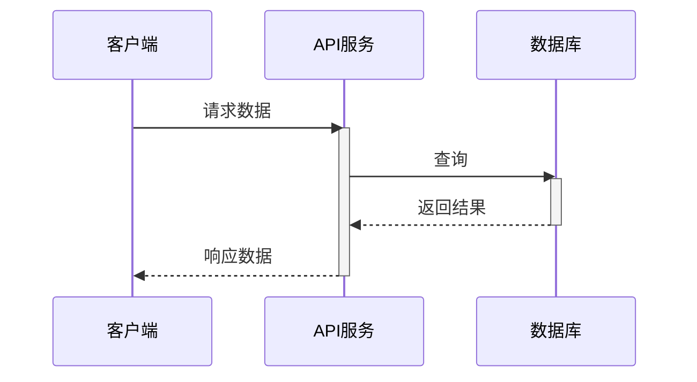

### Gantt - 项目计划

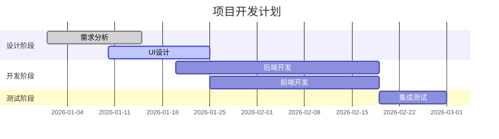

**更多模板**：assets/templates/

---

## 常见问题与解决

### 问题1：关键字冲突

**错误**：使用 `end`、`class` 等关键字作为节点ID

**解决**：使用反引号(`)包裹
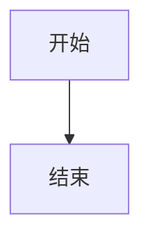

### 问题2：特殊字符显示异常

**错误**：标签包含 `()`、`{}` 等特殊字符

**解决**：使用引号包裹
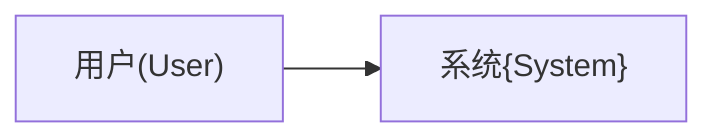

### 问题3：图表过于复杂（验证脚本报错）

**错误**：`节点数过多(55个)，建议<50`

**解决策略**：
1.  **概括模式**：将连续的简单步骤合并。
    - ❌ `解析A` -> `解析B` -> `解析C`
    - ✅ `解析参数`
2.  **拆分模式**：
    - 创建 `主流程图`（仅包含高层模块）
    - 创建 `子流程图`（详细展示某个模块）
3.  **移除细节**：
    - 移除错误处理分支（除非是专门的错误流程图）
    - 移除日志记录等非业务节点

**更多问题**：references/best-practices.md

---

## 参考资源索引

| 文件 | 内容 | 何时查看 |
|------|------|----------|
| references/visual-design-guide.md | 配色方案、形状语义、布局原则 | 优化视觉效果时 |
| references/diagram-types-guide.md | 所有图表类型详细说明 | 选择图表类型时 |
| references/syntax-reference.md | 语法速查手册 | 忘记具体语法时 |
| references/styling-themes.md | 主题配置详解 | 定制样式时 |
| references/best-practices.md | 最佳实践、常见陷阱 | 优化图表质量时 |
| references/v11-new-features.md | v11+新特性说明 | 使用最新特性时 |

---

## 验证工具使用

### 运行验证

```bash
# 验证单个文件
python3 scripts/validate_mermaid.py diagram.md

# 详细模式
python3 scripts/validate_mermaid.py diagram.md --verbose

# 严格模式（使用推荐标准：节点<20, 深度<5, 标签<10字）
python3 scripts/validate_mermaid.py diagram.md --strict
```

### 自动修复功能（v2.0 新增）

**当验证失败或评分不理想时，使用自动修复功能快速提升质量。**

#### 1. 自动修复所有问题

```bash
# 一键修复所有常见问题
python3 scripts/validate_mermaid.py diagram.md --fix

# 修复内容：
# ✅ 添加缺失的主题配置
# ✅ 替换废弃的 graph 为 flowchart
# ✅ 缩短过长的标签（>25字）
# ✅ 为浅色背景节点添加深色文字
```

#### 2. 选择性修复

```bash
# 仅修复主题配置
python3 scripts/validate_mermaid.py diagram.md --fix theme

# 仅修复颜色对比度
python3 scripts/validate_mermaid.py diagram.md --fix contrast

# 仅修复废弃语法
python3 scripts/validate_mermaid.py diagram.md --fix syntax

# 仅修复标签过长
python3 scripts/validate_mermaid.py diagram.md --fix labels
```

#### 3. 预览修复（不实际修改）

```bash
# 预览修复效果（Dry Run）
python3 scripts/validate_mermaid.py diagram.md --fix --fix-dry-run

# 输出预览：
# 🔍 预览修复...
#
# ✅ 已修复以下问题：
#    • 添加主题配置：default
#    • 将 'graph' 替换为 'flowchart'
#    • 缩短标签：'用户认证和授权流程...' → '用户认证和授权...'
#
# 💡 使用 --fix-dry-run 预览，确认无误后去掉该参数执行实际修复
```

#### 4. 自动修复工作流

```bash
# Step 1: 验证图表
python3 scripts/validate_mermaid.py diagram.md

# Step 2: 如果验证失败或评分不理想，预览修复
python3 scripts/validate_mermaid.py diagram.md --fix --fix-dry-run

# Step 3: 确认修复计划后，执行实际修复（自动创建.backup备份）
python3 scripts/validate_mermaid.py diagram.md --fix

# Step 4: 重新验证
python3 scripts/validate_mermaid.py diagram.md

# 备份文件位置：diagram.md.backup
```

#### 5. 常见问题的手动修复

**问题1：主题缺失（-15分）**
```mermaid
# ❌ 修复前
flowchart TD
    A[开始]

# ✅ 修复后
%%{init: {'theme':'default'}}%%
flowchart TD
    A[开始]
```

**问题2：使用废弃语法（扣5分）**
```mermaid
# ❌ 修复前
graph TD
    A --> B

# ✅ 修复后
flowchart TD
    A --> B
```

**问题3：标签过长（-8分）**
```mermaid
# ❌ 修复前
A[用户提交订单请求到系统进行处理]

# ✅ 修复后
A["用户提交订单..."]
```

**问题4：颜色对比度不足（-10分）**
```mermaid
# ❌ 修复前
style A fill:#fff3e0,stroke:#ef6c00

# ✅ 修复后（添加深色文字）
style A fill:#fff3e0,stroke:#ef6c00,color:#333
```

#### 6. 修复优先级（P0/P1/P2）

| 优先级 | 问题类型 | 影响 | 自动修复 |
|--------|---------|------|---------|
| **P0** | 语法错误 | 无法渲染 | ❌ 需手动修复 |
| **P0** | 主题缺失 | -15分 | ✅ 自动添加 |
| **P1** | 废弃语法 | -5分 | ✅ 自动替换 |
| **P1** | 标签过长 | -8分 | ✅ 自动缩短 |
| **P1** | 对比度不足 | -10分 | ✅ 自动调整 |
| **P2** | 缺少分组 | -20分 | ❌ 需手动设计 |
| **P2** | 形状单一 | 建议 | ❌ 需手动优化 |

### 验证输出示例

```
============================================================
📊 Mermaid图表验证报告
============================================================
✅ 语法验证：通过

📈 复杂度分析：
   节点数：15 ✅
   层次深度：3 ✅
   连接线：18

🎨 视觉质量评分：85分 - 良好 ⭐⭐⭐⭐

💡 优化建议：
   - 建议使用style突出重要节点
============================================================
```

**首次运行会自动检测并提示安装 @mermaid-js/mermaid-cli**

---

## 总结

### 三个关键要素

1. **正确性** - 始终验证语法（自动化）
2. **美观性** - 视觉评分≥80（半自动）
3. **清晰性** - 简洁标签、合理布局

### 快速工作流

```
从模板开始 → 填充内容 → 优化视觉 → 验证语法 → 返回摘要
```

### 核心约束

- ⚠️ 必须在子agent中运行
- ⚠️ 必须运行验证脚本
- ⚠️ 严禁返回完整代码
- ⭐ 视觉评分目标≥80分
