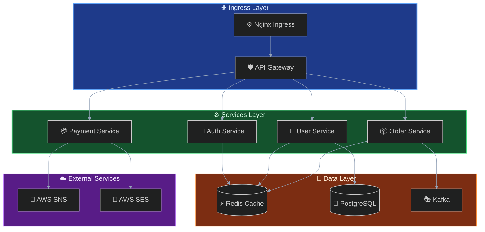
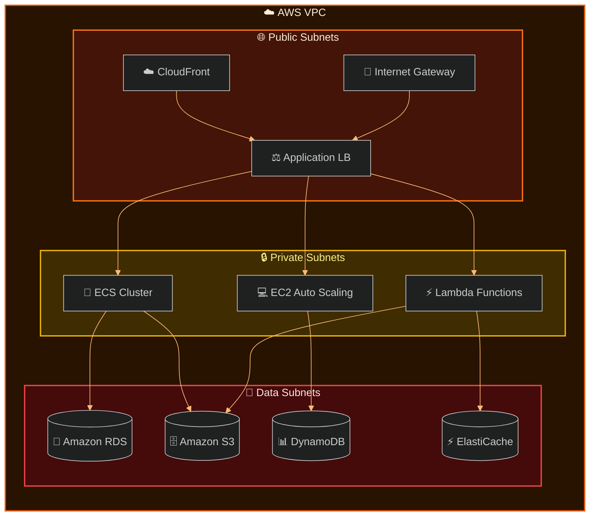
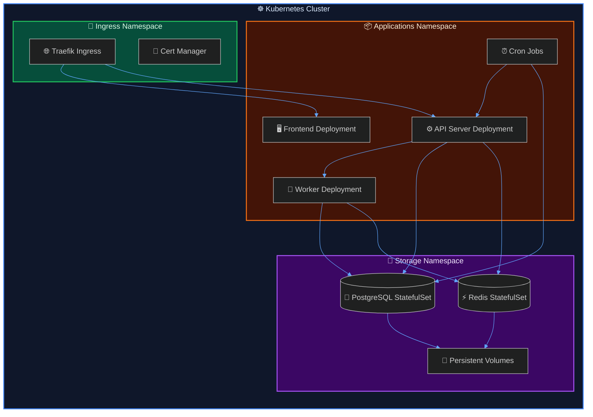
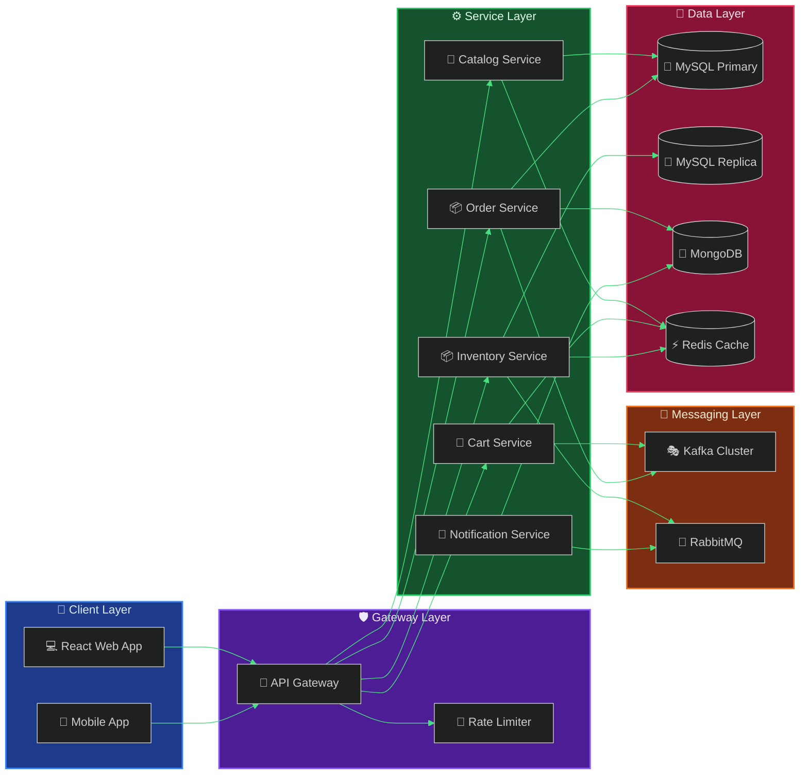
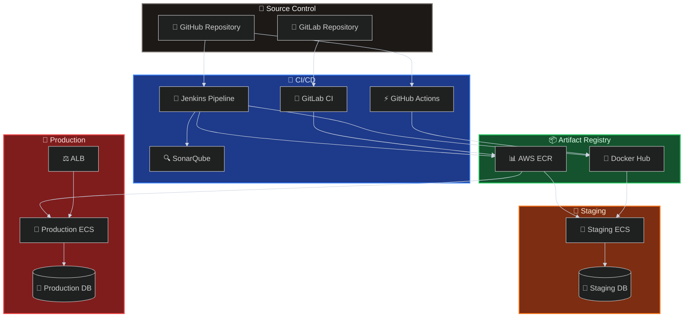
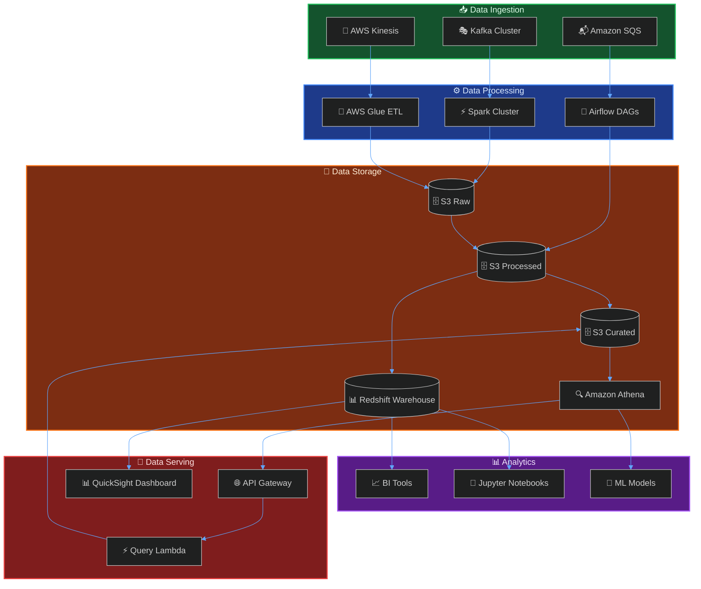

# 架构图 Dark 模板库 (v11+) - Flowchart 版本

本文档提供适用于深色背景编辑器的高质量架构图模板，使用 flowchart 语法实现专业、美观的架构设计。

> ✅ **兼容性优势**：Flowchart 是 Mermaid 的核心图表类型，兼容性最佳，所有版本都支持。
> 🎨 **样式灵活**：专为 Dark Mode 优化的配色方案，高对比度，护眼舒适。
> 📱 **图标方案**：使用表情符号作为节点标识，无需额外配置图标集。

---

## 📊 优化模板集合 (Dark Mode)

### 模板1：现代云原生架构（评分：95分）⭐⭐⭐⭐⭐

**适用场景**：现代云原生应用、微服务架构、深色演示文稿

**特点**：深邃的背景色搭配高亮边框，层次分明

---

### 模板2：AWS 基础设施架构（评分：96分）⭐⭐⭐⭐⭐

**适用场景**：AWS 云服务部署、Serverless 架构

**特点**：AWS 标志性橙色/黄色的暗色适配版

---

### 模板3：Kubernetes 生产架构（评分：97分）⭐⭐⭐⭐⭐

**适用场景**：K8s 生产集群、CI/CD 管道

**特点**：K8s 标志性蓝色的暗色适配

---

### 模板4：微服务电商架构（评分：94分）⭐⭐⭐⭐⭐

**适用场景**：电商平台、分布式系统

**特点**：高对比度的模块区分

---

### 模板5：DevOps CI/CD 架构（评分：93分）⭐⭐⭐⭐

**适用场景**：CI/CD 管道、DevOps 流程

**特点**：冷色调工业风

---

### 模板6：数据湖架构（评分：95分）⭐⭐⭐⭐⭐

**适用场景**：大数据处理、数据仓库、数据湖

**特点**：深蓝科技感

---

## 🎨 Dark Mode 常用颜色方案

在深色模式下，建议使用较深的背景色（Background）搭配明亮的边框色（Stroke）和文字色（Text），以确保对比度和可读性。

### 蓝色系 - 接入层/客户端

- 背景色：`#1e3a8a` (Dark Blue 900)
- 边框色：`#60a5fa` (Blue 400)
- 文字色：`#dbeafe` (Blue 100)

### 绿色系 - 服务层

- 背景色：`#14532d` (Green 900)
- 边框色：`#4ade80` (Green 400)
- 文字色：`#dcfce7` (Green 100)

### 橙色系 - 数据层

- 背景色：`#7c2d12` (Orange 900)
- 边框色：`#fb923c` (Orange 400)
- 文字色：`#ffedd5` (Orange 100)

### 紫色系 - 外部服务/消息层

- 背景色：`#581c87` (Purple 900)
- 边框色：`#c084fc` (Purple 400)
- 文字色：`#f3e8ff` (Purple 100)

### 灰色系 - 基础设施

- 背景色：`#1c1917` (Stone 900)
- 边框色：`#a8a29e` (Stone 400)
- 文字色：`#f5f5f4` (Stone 100)
