# 架构图模板库 (v11+) - Flowchart 版本

本文档提供 Mermaid v11+ Flowchart 图表的架构图模板，使用 flowchart 语法实现专业、美观的架构设计。

> ✅ **兼容性优势**：Flowchart 是 Mermaid 的核心图表类型，兼容性最佳，所有版本都支持。
> 🎨 **样式灵活**：支持丰富的自定义样式、主题和颜色配置。
> 📱 **图标方案**：使用表情符号作为节点标识，无需额外配置图标集。

---

## 📊 优化模板集合

### 模板1：现代云原生架构（评分：95分）⭐⭐⭐⭐⭐

**适用场景**：现代云原生应用、微服务架构

**特点**：清晰的分层结构，使用表情符号标识服务类型

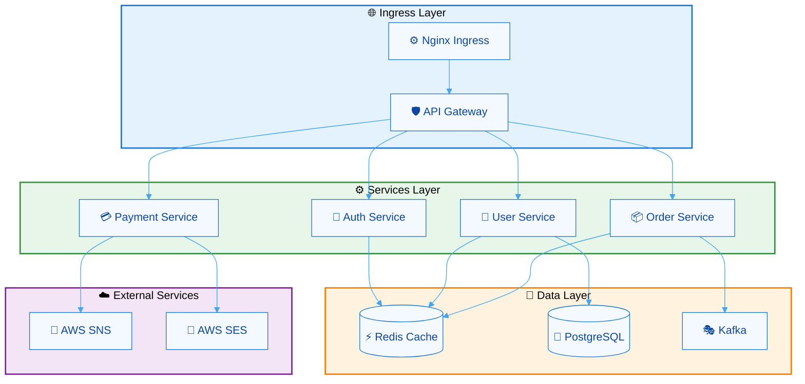

---

### 模板2：AWS 基础设施架构（评分：96分）⭐⭐⭐⭐⭐

**适用场景**：AWS 云服务部署、Serverless 架构

**特点**：完整的 AWS 服务，遵循 AWS 架构最佳实践

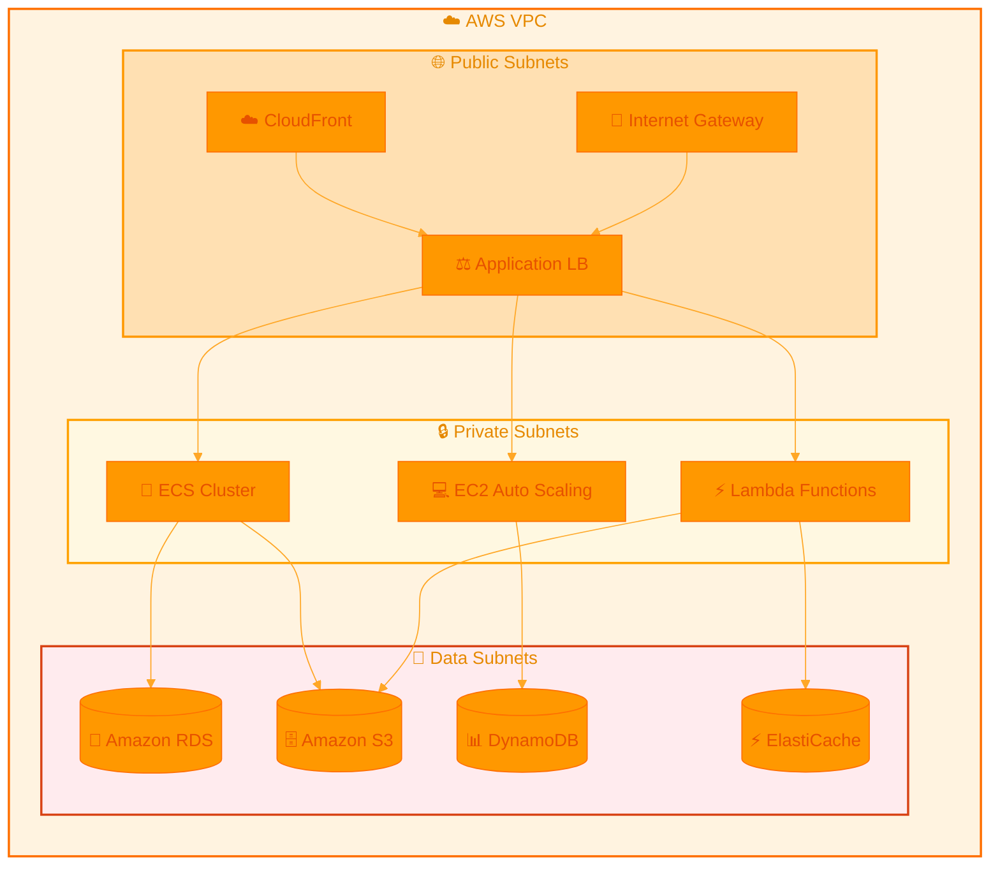

---

### 模板3：Kubernetes 生产架构（评分：97分）⭐⭐⭐⭐⭐

**适用场景**：K8s 生产集群、CI/CD 管道

**特点**：完整的 K8s 组件，清晰的流量路由

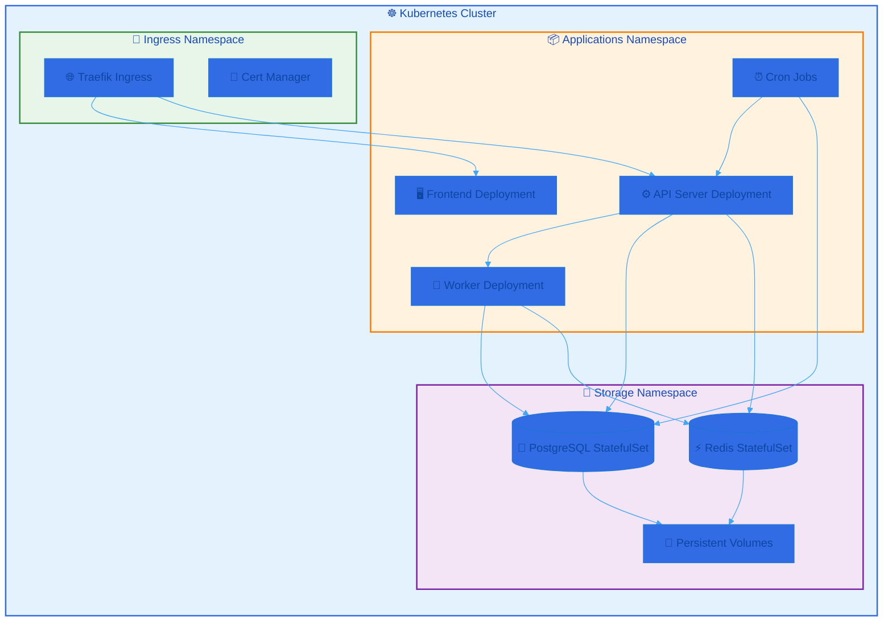

---

### 模板4：微服务电商架构（评分：94分）⭐⭐⭐⭐⭐

**适用场景**：电商平台、分布式系统

**特点**：服务网格、事件驱动架构

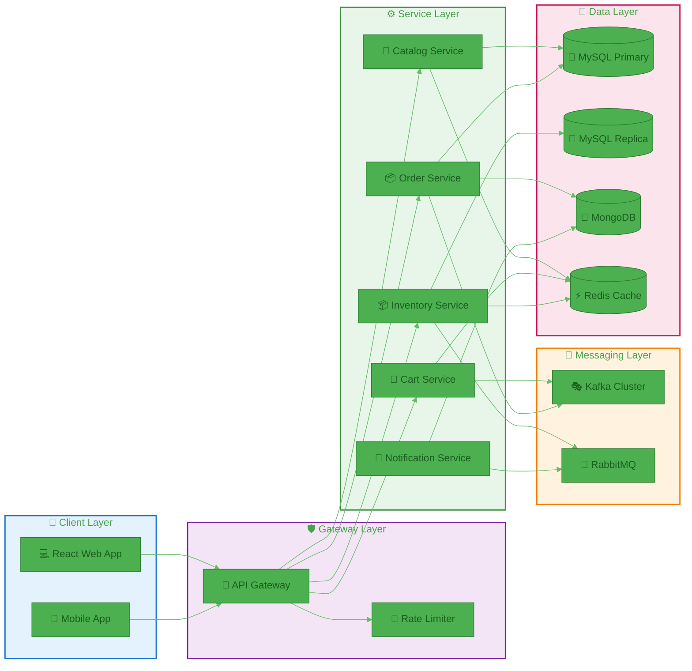

---

### 模板5：DevOps CI/CD 架构（评分：93分）⭐⭐⭐⭐

**适用场景**：CI/CD 管道、DevOps 流程

**特点**：完整的 DevOps 工具链，清晰的部署流程

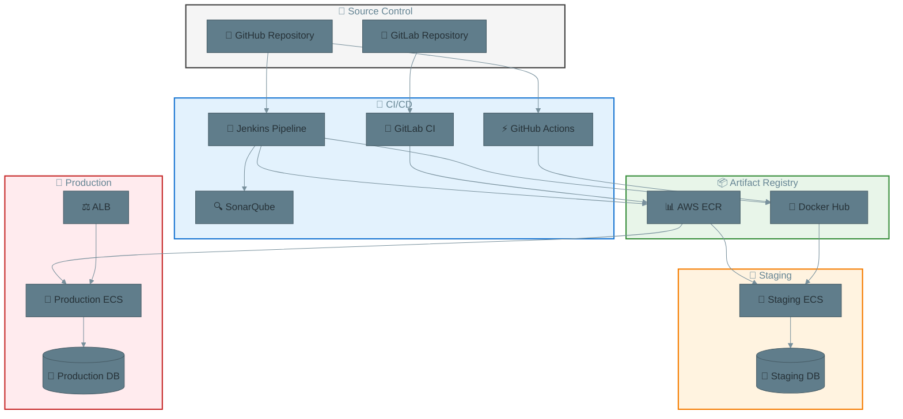

---

### 模板6：数据湖架构（评分：95分）⭐⭐⭐⭐⭐

**适用场景**：大数据处理、数据仓库、数据湖

**特点**：完整的数据处理管道，清晰的 ETL 流程

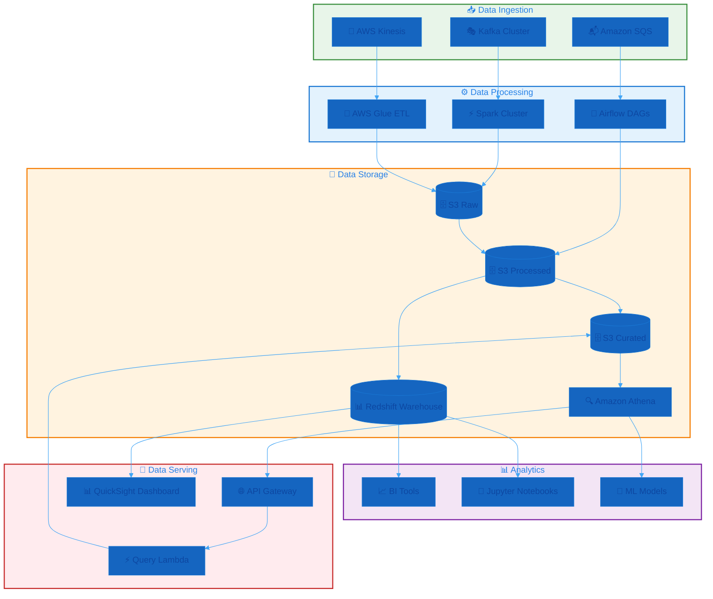

---

## 📋 语法参考

### 基本语法结构

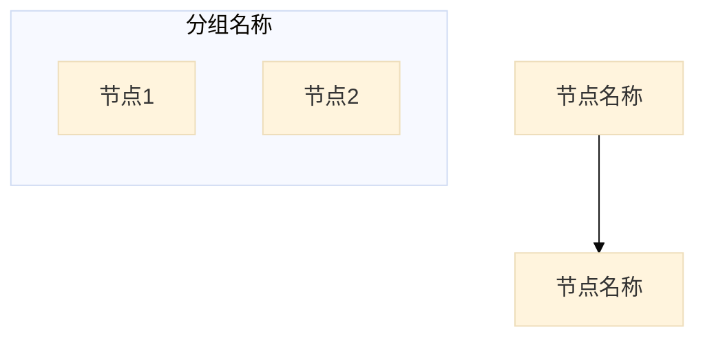

### 节点形状

| 形状 | 语法 | 用途 |
|------|------|------|
| 矩形 | `Node["名称"]` | 服务、组件 |
| 圆角矩形 | `Node(["名称"])` | 流程节点 |
| 菱形 | `Node{"名称"}` | 决策节点 |
| 圆柱体 | `Node[("名称")]` | 数据库 |
| 平行四边形 | `Node[/"名称"/]` | 输入/输出 |

### 连接语法

```mermaid
flowchart LR
    A[节点A]
    B[节点B]
    C[节点C]

    %% 基本连接
    A --> B           %% 单向箭头
    B --- C           %% 无箭头
    A <--> C         %% 双向箭头

    %% 带标签的连接
    A -->|标签| B

    %% 特殊样式连接
    A ==> B          %% 粗箭头
    A -.-> B         %% 虚线箭头
```

### 主题配置

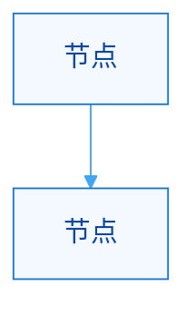

### 样式应用

```mermaid
flowchart TB
    A["节点A"]
    B["节点B"]
    subgraph Group["分组"]
        C["节点C"]
    end

    %% 单个节点样式
    style A fill:#f3f9ff,stroke:#1976d2,stroke-width:2px

    %% 分组样式
    style Group fill:#e8f5e9,stroke:#388e3c,stroke-width:2px

    %% 链接样式
    linkStyle 0 stroke:#42a5f5,stroke-width:2px
```

---

## 🎯 最佳实践

### 1. 布局原则

- **自上而下（TB）**：适合展示层次结构、数据流从上游到下游
- **从左到右（LR）**：适合展示流程、客户端到服务器的完整链路
- **逻辑分层**：使用 subgraph 将相关组件分组
- **清晰命名**：使用有意义的中文名称，配合表情符号

### 2. 表情符号选择

- **保持一致**：同一类型的服务使用相同表情符号
- **易于识别**：选择代表性强的表情符号
- **视觉平衡**：使用常用的、兼容性好的表情符号

### 3. 连接优化

- **避免交叉**：合理安排节点位置，减少连接线交叉
- **方向统一**：相同类型的数据流使用统一方向
- **标签明确**：使用连接标签说明数据流类型

### 4. 颜色方案

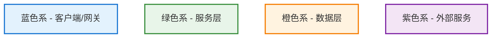

### 5. 分组策略

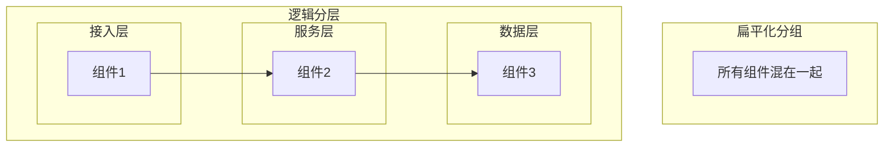

---

## 📊 表情符号对照表

### 通用图标

| 表情符号 | 用途 | 示例 |
|----------|------|------|
| 🌐 | 互联网、网络层 | Ingress Layer |
| 🛡️ | 网关、安全 | API Gateway |
| ⚙️ | 服务、组件 | Service |
| 🔐 | 认证、安全 | Auth Service |
| 🚪 | 入口、门户 | API Gateway |
| 🔒 | 私有、安全 | Private Subnets |
| 🌊 | 流动、数据 | Data Flow |

### 云平台与容器

| 表情符号 | 用途 | 示例 |
|----------|------|------|
| ☁️ | 云服务、AWS | AWS Cloud |
| ☸️ | Kubernetes | K8s Cluster |
| 🐳 | Docker、容器 | Docker Hub |
| 💻 | 服务器、EC2 | EC2 Instance |
| ⚡ | Lambda、快速服务 | Lambda Function |

### 数据存储

| 表情符号 | 用途 | 示例 |
|----------|------|------|
| 💾 | 数据层、存储 | Data Layer |
| 🗄️ | 对象存储 | Amazon S3 |
| 🐘 | PostgreSQL | PostgreSQL |
| 🐬 | MySQL | MySQL |
| 🍃 | MongoDB | MongoDB |
| ⚡ | Redis、缓存 | Redis Cache |

### 消息与通信

| 表情符号 | 用途 | 示例 |
|----------|------|------|
| 🎭 | Kafka | Kafka Cluster |
| 🐰 | RabbitMQ | RabbitMQ |
| 📨 | 消息层 | Messaging Layer |
| 📬 | 队列、SQS | Amazon SQS |
| 📢 | 通知、SNS | AWS SNS |
| 📧 | 邮件、SES | AWS SES |

### DevOps 工具

| 表情符号 | 用途 | 示例 |
|----------|------|------|
| 🔧 | 工具、CI/CD | CI/CD Pipeline |
| 🐙 | GitHub | GitHub Repository |
| 🦊 | GitLab | GitLab Repository |
| 👷 | Jenkins、构建 | Jenkins Pipeline |
| 🔄 | 流程、循环 | Airflow DAGs |
| 🔍 | 分析、检查 | SonarQube |

### 客户端与应用

| 表情符号 | 用途 | 示例 |
|----------|------|------|
| 💻 | Web 应用 | Web App |
| 📱 | 移动应用 | Mobile App |
| 👤 | 用户服务 | User Service |
| 🏪 | 目录服务 | Catalog Service |
| 🛒 | 购物车 | Cart Service |
| 📦 | 订单服务 | Order Service |
| 💳 | 支付服务 | Payment Service |
| 🔔 | 通知服务 | Notification Service |

### 监控与分析

| 表情符号 | 用途 | 示例 |
|----------|------|------|
| 📊 | 分析、监控 | Analytics |
| 📈 | BI 工具 | BI Tools |
| 🤖 | 机器学习 | ML Models |
| 📓 | Jupyter | Jupyter Notebook |
| 🔍 | 搜索、查询 | Athena |

### 部署与环境

| 表情符号 | 用途 | 示例 |
|----------|------|------|
| 🚀 | 部署、生产 | Production |
| 🎯 | 目标、生产 | Production Environment |
| 🧪 | 测试、Staging | Staging Environment |
| 🌡️ | 监控、健康检查 | Health Check |

---

## 🎨 常用颜色方案

### 蓝色系 - 接入层/客户端

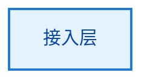

- 背景色：`#e3f2fd`
- 边框色：`#1976d2`
- 文字色：`#0d47a1`

### 绿色系 - 服务层


- 背景色：`#e8f5e9`
- 边框色：`#388e3c`
- 文字色：`#1b5e20`

### 橙色系 - 数据层


- 背景色：`#fff3e0`
- 边框色：`#f57c00`
- 文字色：`#e65100`

### 紫色系 - 外部服务/消息层

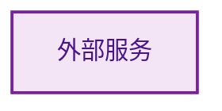

- 背景色：`#f3e5f5`
- 边框色：`#7b1fa2`
- 文字色：`#4a148c`

### 灰色系 - 基础设施

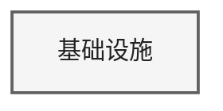

- 背景色：`#f5f5f5`
- 边框色：`#616161`
- 文字色：`#212121`

---

## 🐛 故障排除

### 问题1：图表渲染不正常

**症状**：图表显示不完整或样式错误

**解决方案**：
1. 确保使用 Mermaid v10.0 或更高版本
2. 检查语法是否正确，特别是括号和引号匹配
3. 验证 `%%{init: {...}}%%` 配置格式
4. 清除浏览器缓存后重新加载

### 问题2：节点布局混乱

**症状**：节点重叠、连接线交叉严重

**解决方案**：
1. 调整 `direction` 参数（TB 或 LR）
2. 使用 `subgraph` 分组相关节点
3. 调整节点定义顺序
4. 减少跨组的连接，考虑使用中间节点

### 问题3：表情符号显示不一致

**症状**：不同设备或编辑器中表情符号显示不同

**解决方案**：
1. 使用通用表情符号（避免特殊平台专属表情）
2. 测试在不同环境中的显示效果
3. 考虑使用纯文本替代表情符号

### 问题4：样式不生效

**症状**：`style` 指令定义的样式没有生效

**解决方案**：
1. 确保节点 ID 正确（大小写敏感）
2. 检查样式语法：`style ID fill:#color,stroke:#color,stroke-width:2px`
3. 样式定义应在节点定义之后
4. 验证颜色代码格式（十六进制）

### 问题5：连接线标签不显示

**症状**：连接线上的标签没有显示

**解决方案**：
1. 使用正确的标签语法：`A -->|标签| B`
2. 检查标签中是否包含特殊字符
3. 确保使用英文或 Unicode 字符

---

## 📖 参考资源

- [Mermaid Flowchart 官方文档](https://mermaid.js.org/syntax/flowchart.html)
- [Mermaid 主题配置文档](https://mermaid.js.org/config/theming.html)
- [Mermaid 语法速查表](https://jojozhuang.github.io/tutorial/mermaid-cheat-sheet/)
- [Mermaid 在线编辑器](https://mermaid.live/)

---
