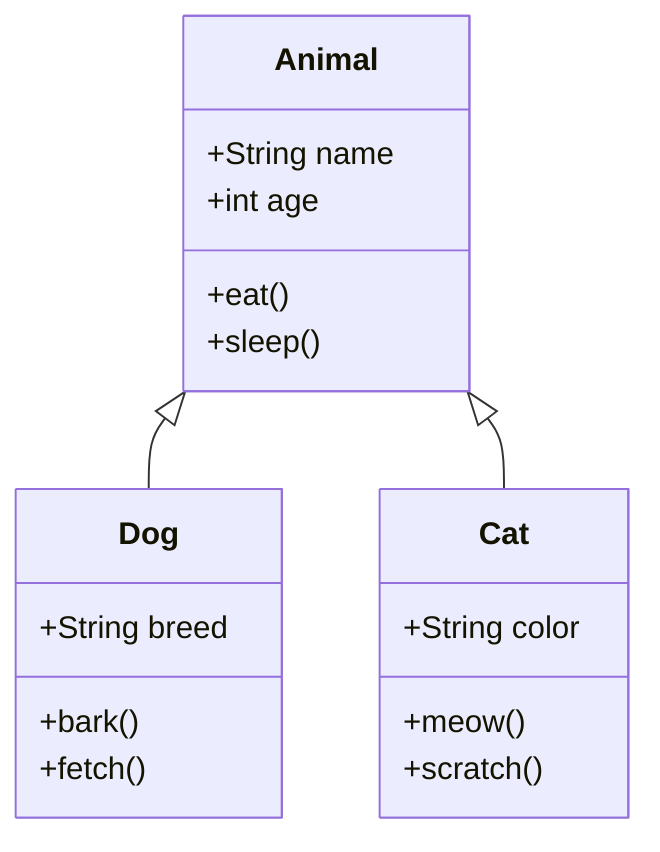
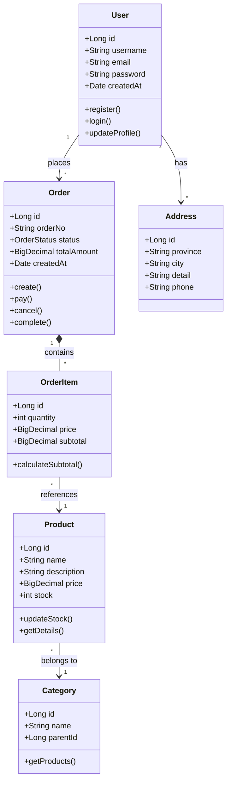
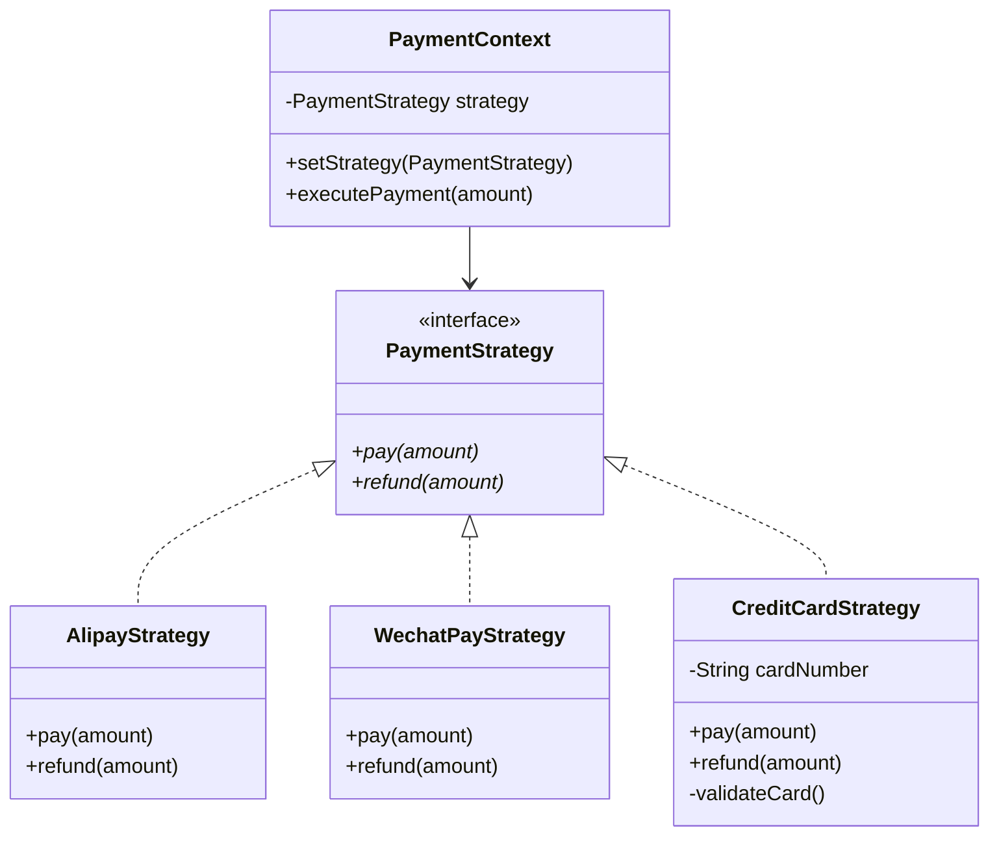
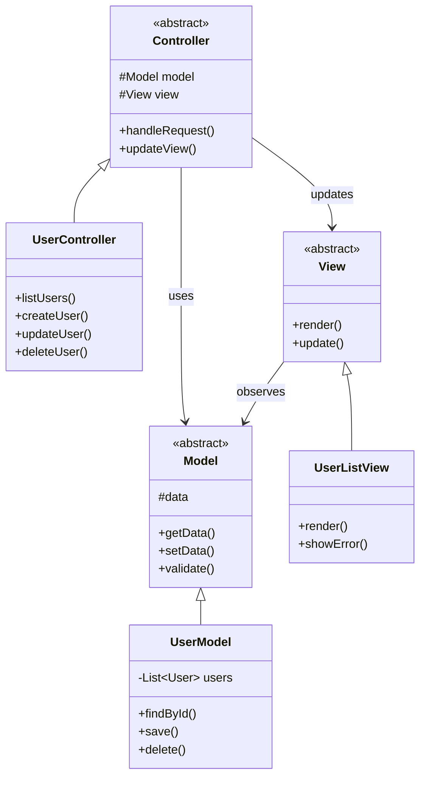
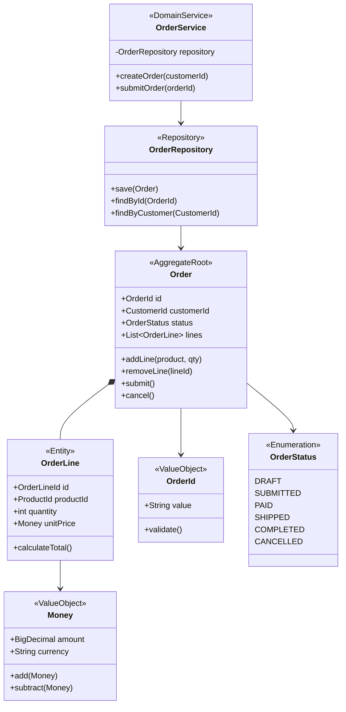
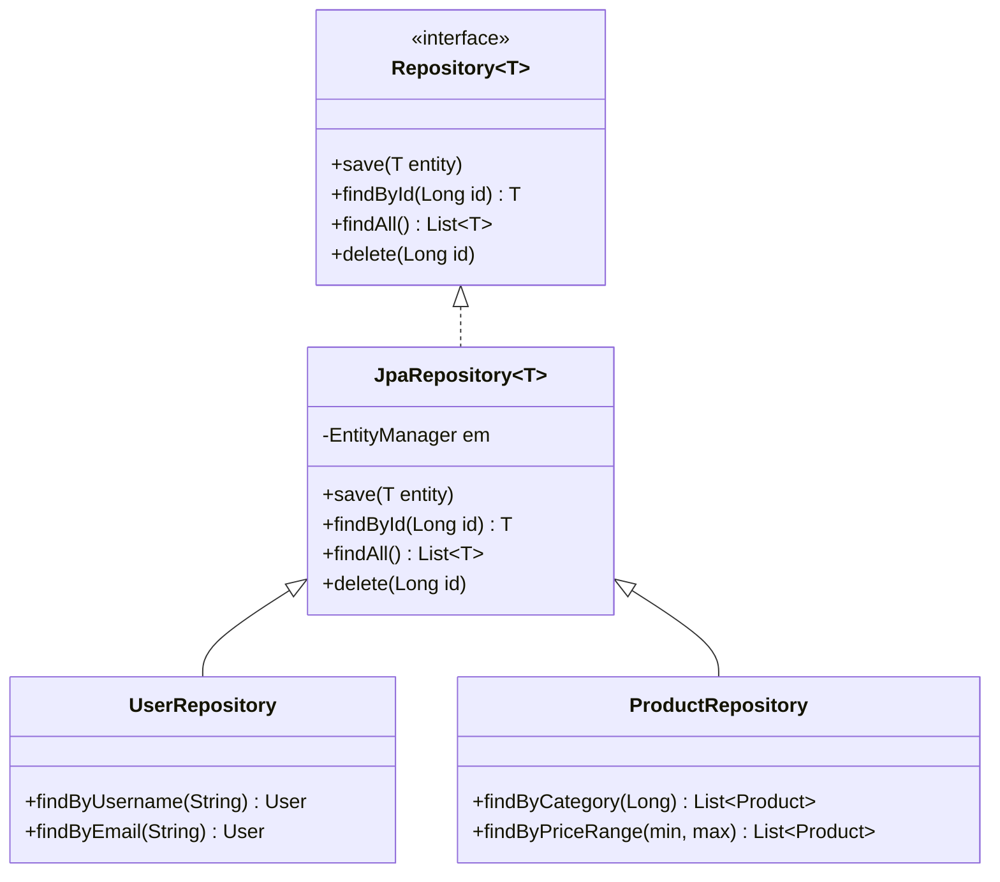
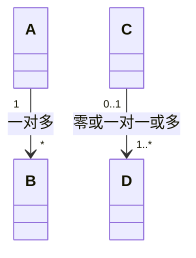
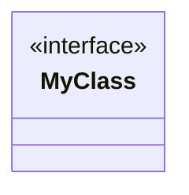

# Class Diagram 模板库

本文档提供高质量的类图模板，可直接复制使用。

---

## 模板1：简单类关系（评分：85分）⭐⭐⭐⭐

**适用场景**：基础OOP设计、简单继承关系

---

## 模板2：电商系统模型（评分：92分）⭐⭐⭐⭐⭐

**适用场景**：电商系统、订单管理、用户模型

---

## 模板3：设计模式 - 策略模式（评分：88分）⭐⭐⭐⭐

**适用场景**：设计模式、策略模式实现

---

## 模板4：MVC架构（评分：86分）⭐⭐⭐⭐

**适用场景**：MVC模式、Web应用架构

---

## 模板5：领域驱动设计（评分：90分）⭐⭐⭐⭐⭐

**适用场景**：DDD、领域模型、聚合根

---

## 模板6：泛型类（评分：85分）⭐⭐⭐⭐

**适用场景**：泛型设计、容器类

---

## 使用说明

### 关系类型

| 语法 | 说明 | 示例 |
|------|------|------|
| `<\|--` | 继承 | Animal <\|-- Dog |
| `*--` | 组合 | Order *-- OrderItem |
| `o--` | 聚合 | Team o-- Player |
| `-->` | 关联 | User --> Order |
| `--` | 链接 | A -- B |
| `..>` | 依赖 | Controller ..> Service |
| `..\|>` | 实现 | Class ..\|> Interface |

### 可见性修饰符

| 符号 | 含义 |
|------|------|
| `+` | public |
| `-` | private |
| `#` | protected |
| `~` | package |

### 多重性

### 注解

