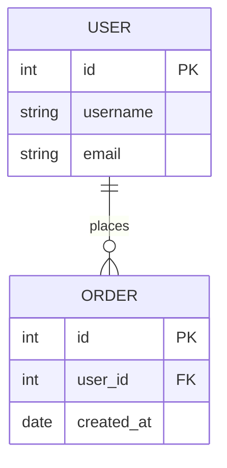
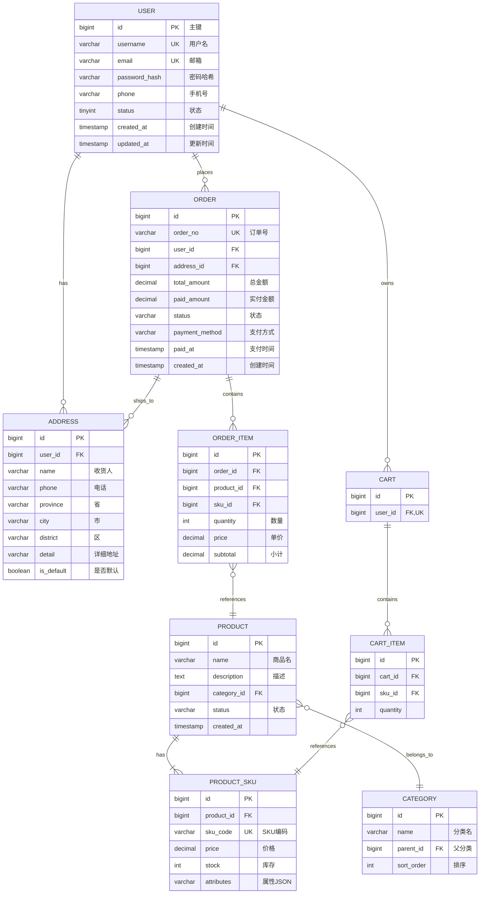
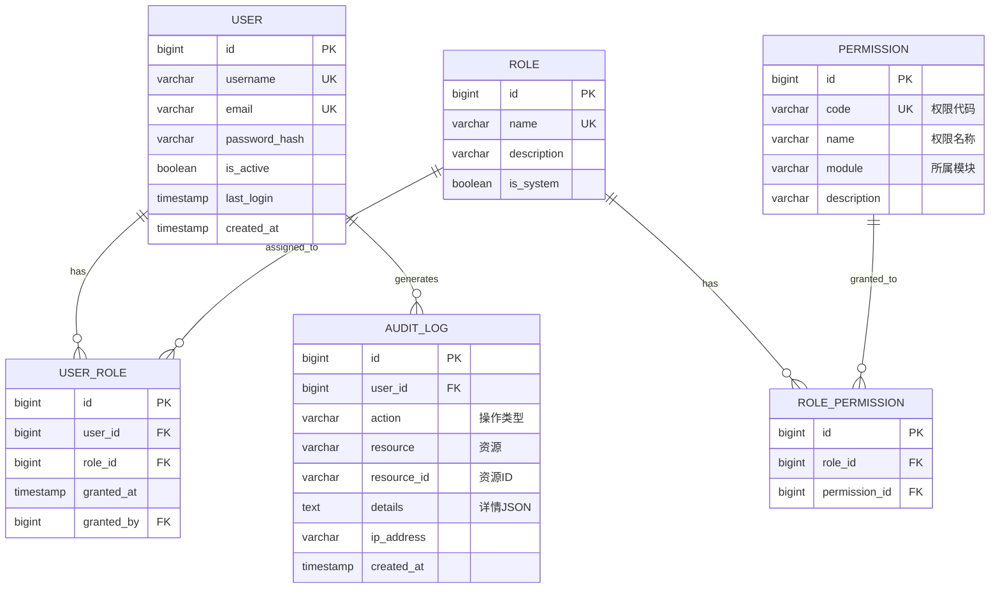
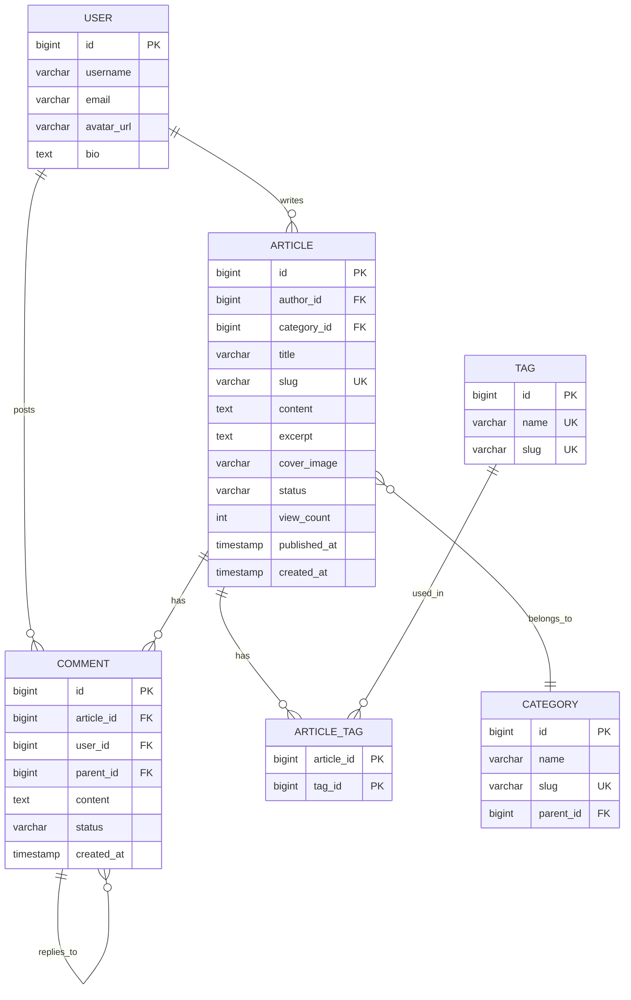
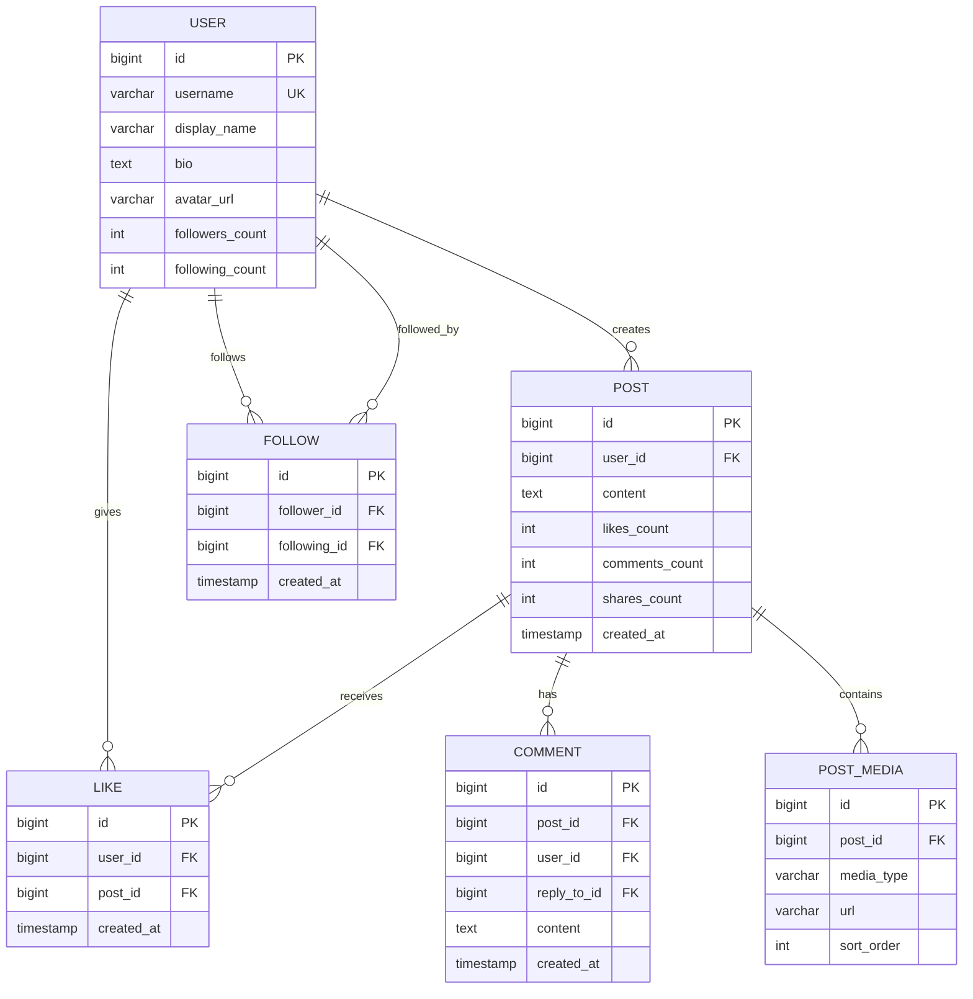
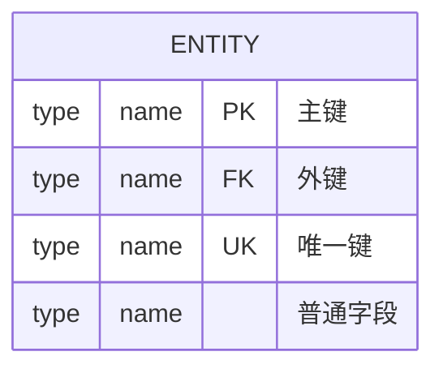
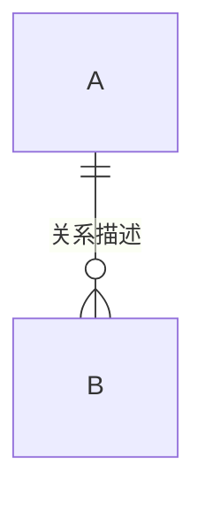

# ER Diagram 模板库

本文档提供高质量的实体关系图模板，可直接复制使用。

---

## 模板1：简单实体关系（评分：85分）⭐⭐⭐⭐

**适用场景**：基础数据库设计、简单关系



---

## 模板2：电商系统数据库（评分：92分）⭐⭐⭐⭐⭐

**适用场景**：电商系统、订单管理、完整数据模型



---

## 模板3：用户权限系统（评分：90分）⭐⭐⭐⭐⭐

**适用场景**：RBAC权限、用户管理



---

## 模板4：内容管理系统（评分：88分）⭐⭐⭐⭐

**适用场景**：CMS、博客系统、内容平台



---

## 模板5：社交网络（评分：87分）⭐⭐⭐⭐

**适用场景**：社交平台、关注关系



---

## 使用说明

### 关系符号

| 符号 | 说明 | 示例 |
|------|------|------|
| `\|\|` | 恰好一个 | 一 |
| `o\|` | 零或一个 | 零或一 |
| `}o` | 零或多个 | 多（可选） |
| `}\|` | 一或多个 | 多（必须） |

### 关系组合

```
||--||  一对一
||--o{  一对多
}o--o{  多对多
||--o|  一对零或一
||--|{  一对一或多个
```

### 实体定义



### 数据类型建议

| 类型 | 用途 |
|------|------|
| `bigint` | ID、外键 |
| `varchar` | 短文本 |
| `text` | 长文本 |
| `decimal` | 金额 |
| `int` | 整数 |
| `boolean` | 布尔值 |
| `timestamp` | 时间戳 |
| `date` | 日期 |

### 关系标签


