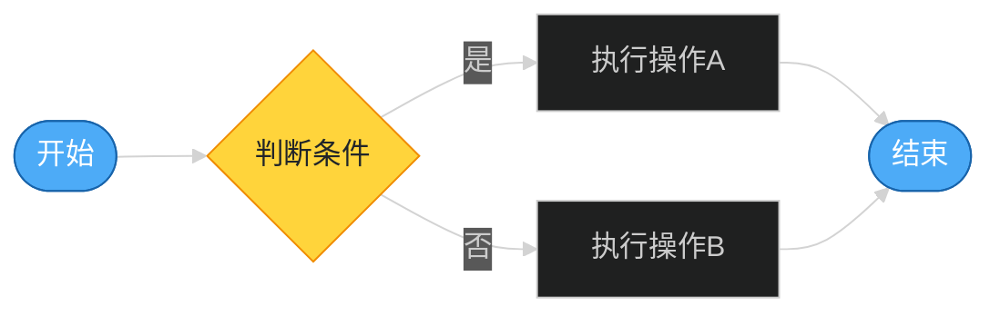
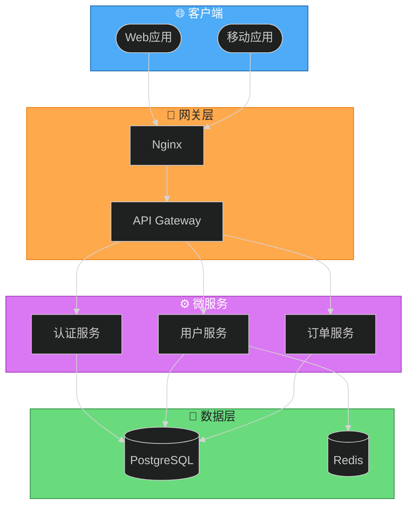
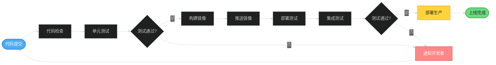
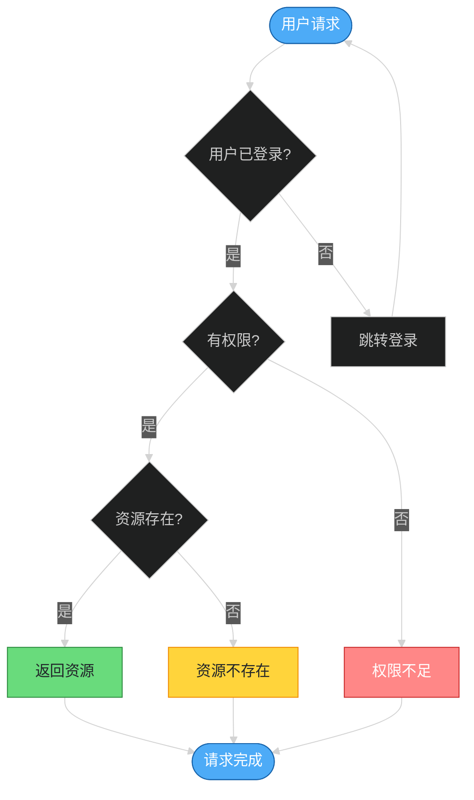
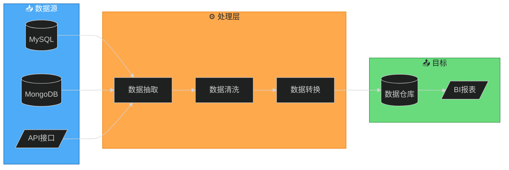
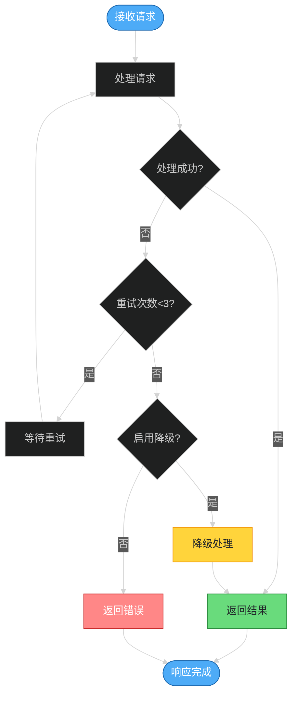
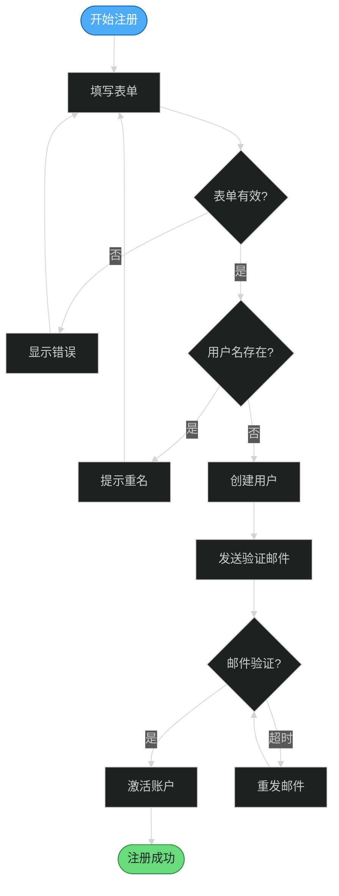
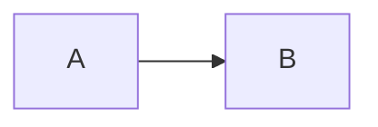
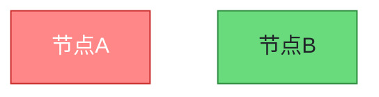

# Flowchart Dark 模板库

本文档提供适用于深色背景编辑器的高质量 Flowchart 模板，可直接复制使用。

**使用场景**：
- Dark 模式编辑器（如 VS Code Dark、JetBrains Darcula 等）
- 演示文稿中的深色幻灯片
- 深色主题的博客或文档网站

---

## 模板1：简单流程（评分：88分）⭐⭐⭐⭐

**适用场景**：基础流程、简单逻辑、快速草图



**视觉特点**：
- ✅ 使用 dark 主题（深色背景适配）
- ✅ 高对比度配色（文字使用白色/浅色）
- ✅ 起止点使用体育场形
- ✅ 判断使用菱形

---

## 模板2：系统架构图（评分：93分）⭐⭐⭐⭐⭐

**适用场景**：Web应用架构、分层系统、微服务架构



**视觉特点**：
- ✅ 使用 dark 主题，深色背景适配
- ✅ 高对比度分层配色
- ✅ 每层使用 emoji 增强识别
- ✅ 文字使用白色/深色确保可读性
- ✅ 数据库使用圆柱形，端点使用体育场形

---

## 模板3：CI/CD流水线（评分：89分）⭐⭐⭐⭐

**适用场景**：DevOps流程、自动化部署、发布流程



**视觉特点**：
- ✅ 使用 dark 主题
- ✅ 高对比度状态颜色（成功绿、失败红、关键黄）
- ✅ 使用 LR 方向（符合流程阅读习惯）
- ✅ 判断节点使用菱形

---

## 模板4：决策树（评分：86分）⭐⭐⭐⭐

**适用场景**：业务规则、条件判断、分类逻辑



---

## 模板5：数据流图（评分：87分）⭐⭐⭐⭐

**适用场景**：ETL流程、数据处理、数据管道



---

## 模板6：错误处理流程（评分：88分）⭐⭐⭐⭐

**适用场景**：异常处理、重试逻辑、降级策略



---

## 模板7：用户注册流程（评分：86分）⭐⭐⭐⭐

**适用场景**：用户流程、表单处理、验证逻辑



---

## 使用说明

### 如何使用模板

1. **复制模板代码**
2. **替换占位内容**：修改节点标签为实际内容
3. **调整结构**：根据需要增删节点和连接
4. **优化样式**：调整颜色和布局
5. **验证语法**：运行 `validate_mermaid.py`

### 切换主题

**切换到浅色主题**：
```text
%%{init: {'theme':'default'}}%%  %% 改为浅色主题
```

**切换到 forest 主题**：
```text
%%{init: {'theme':'forest'}}%%  %% 改为森林主题
```

### Dark 主题配色建议

**高对比度配色方案**：

| 用途 | 推荐颜色 | 文字颜色 |
|------|----------|----------|
| 蓝色系 | `#4dabf7`（浅蓝） | `#fff`（白色） |
| 绿色系 | `#69db7c`（浅绿） | `#212529`（深色） |
| 黄色系 | `#ffd43b`（浅黄） | `#212529`（深色） |
| 红色系 | `#ff8787`（浅红） | `#fff`（白色） |
| 紫色系 | `#da77f2`（浅紫） | `#fff`（白色） |
| 橙色系 | `#ffa94d`（浅橙） | `#212529`（深色） |

**配色原则**：
- 浅色背景节点 → 使用白色文字 `color:#fff`
- 深色/中性背景节点 → 使用深色文字 `color:#212529`
- 确保对比度至少 4.5:1（WCAG AA 标准）

### 自定义样式

**修改方向**：


**添加更多样式**：


**使用 classDef 批量定义**：

