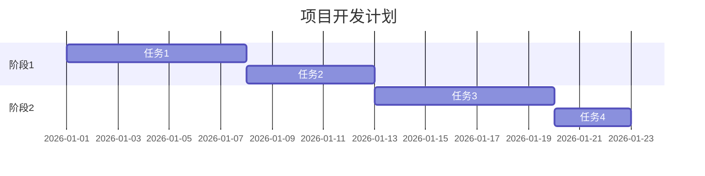
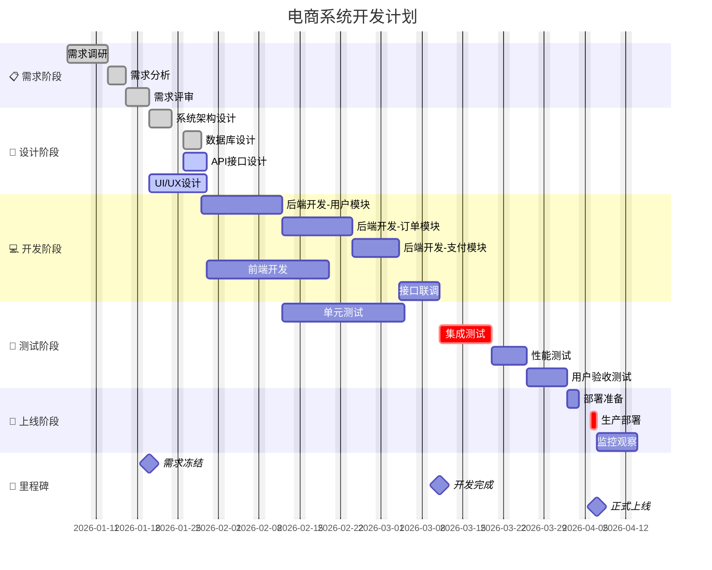
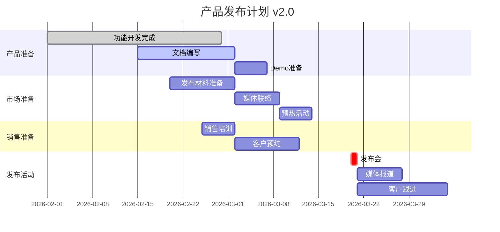
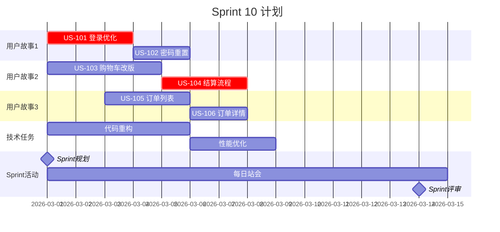
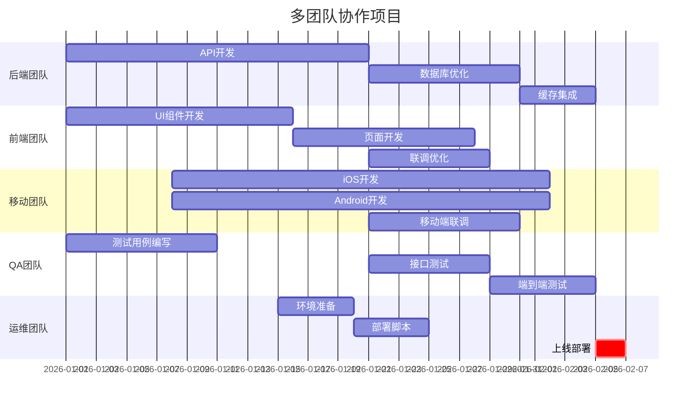
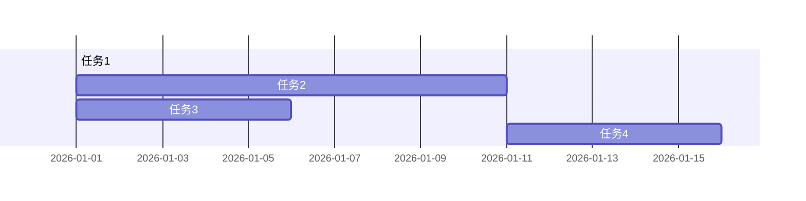
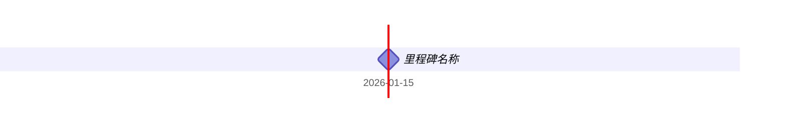

# Gantt 模板库

本文档提供高质量的甘特图模板，可直接复制使用。

---

## 模板1：简单项目计划（评分：85分）⭐⭐⭐⭐

**适用场景**：简单项目、短期计划



---

## 模板2：软件开发项目（评分：92分）⭐⭐⭐⭐⭐

**适用场景**：软件开发、敏捷项目、迭代计划



---

## 模板3：产品发布计划（评分：88分）⭐⭐⭐⭐

**适用场景**：产品发布、市场活动



---

## 模板4：Sprint计划（评分：86分）⭐⭐⭐⭐

**适用场景**：敏捷开发、Sprint规划



---

## 模板5：多团队协作（评分：87分）⭐⭐⭐⭐

**适用场景**：多团队项目、跨部门协作



---

## 使用说明

### 基本语法

```mermaid
gantt
    title 图表标题
    dateFormat YYYY-MM-DD
    
    section 阶段名称
    任务名称 :状态, id, 开始日期, 结束日期或持续时间
```

### 日期格式

| 格式 | 示例 |
|------|------|
| `YYYY-MM-DD` | 2026-01-15 |
| `DD-MM-YYYY` | 15-01-2026 |
| `YYYY-MM-DD HH:mm` | 2026-01-15 10:00 |

### 任务定义方式



### 任务状态

| 状态 | 说明 | 显示效果 |
|------|------|----------|
| `done` | 已完成 | 灰色填充 |
| `active` | 进行中 | 蓝色边框 |
| `crit` | 关键任务 | 红色填充 |
| (无) | 待开始 | 默认样式 |

### 里程碑



### 排除日期

```mermaid
gantt
    excludes weekends                    %% 排除周末
    excludes 2026-01-01, 2026-05-01     %% 排除特定日期
```

### 时间轴模式

```mermaid
gantt
    %% 周显示模式
    tickInterval 1week
    
    %% 月显示模式
    tickInterval 1month
```
