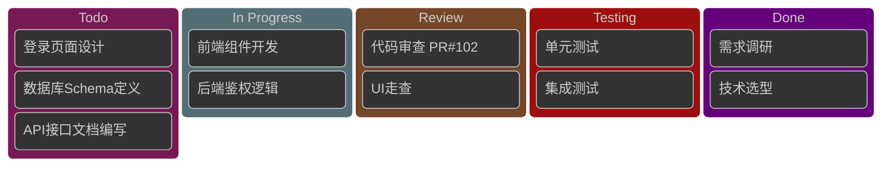
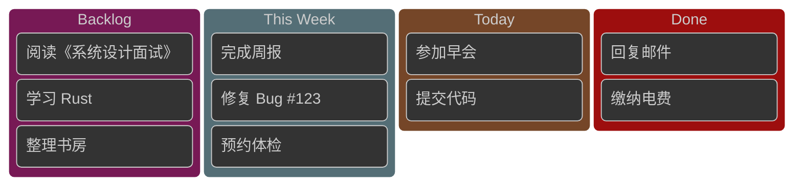
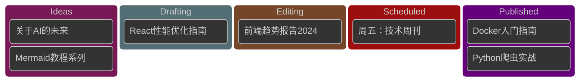
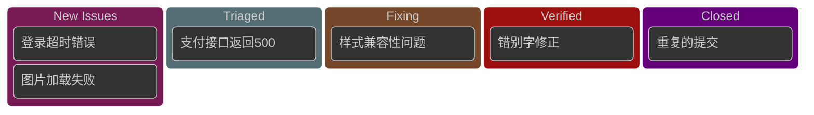

# Kanban Dark 模板库 (v11+)

本文档提供适用于深色背景编辑器的 Mermaid Kanban 模板。

**注意**：Kanban 是 Mermaid v11+ 新增的实验性功能。

**适用场景**：
- Dark 模式编辑器
- 深色背景仪表板

---

## 模板1：敏捷软件开发看板 (Dark)（评分：95分）⭐⭐⭐⭐⭐

---

## 模板2：个人任务管理 (Dark)（评分：92分）⭐⭐⭐⭐

---

## 模板3：内容发布工作流 (Dark)（评分：90分）⭐⭐⭐⭐

---

## 模板4：缺陷追踪看板 (Dark)（评分：88分）⭐⭐⭐⭐

