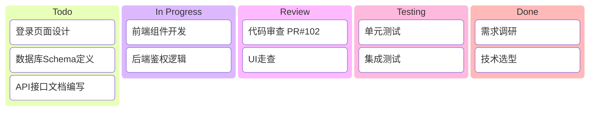
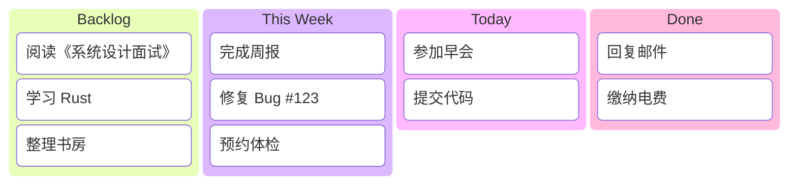
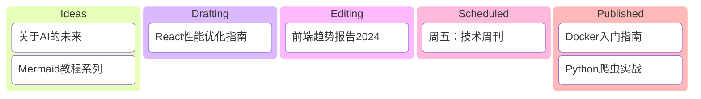
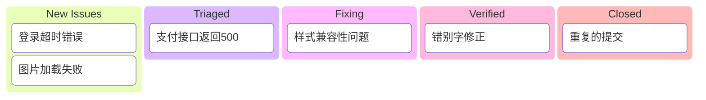
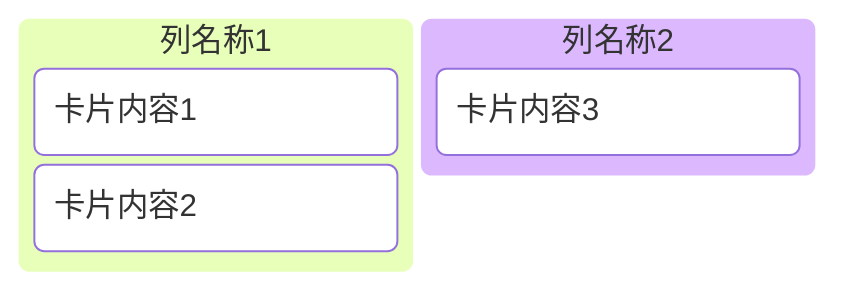

# Kanban 模板库 (v11+)

本文档提供 Mermaid Kanban (看板) 的标准模板，用于敏捷开发、任务管理和工作流可视化。

**注意**：Kanban 是 Mermaid v11+ 新增的实验性功能，请确保您的环境支持该版本。

**适用场景**：
- 敏捷软件开发 (Scrum/Kanban)
- 个人任务管理
- 内容发布流水线
- 问题/缺陷追踪

---

## 模板1：敏捷软件开发看板（评分：95分）⭐⭐⭐⭐⭐

**适用场景**：软件研发团队、Sprint管理

**特点**：
- 典型的软件开发流程列
- 简洁的任务卡片

---

## 模板2：个人任务管理（评分：92分）⭐⭐⭐⭐

**适用场景**：GTD (Getting Things Done)、个人计划

**特点**：
- 按照时间维度划分（本周、今天）
- 适合个人日常管理

---

## 模板3：内容发布工作流（评分：90分）⭐⭐⭐⭐

**适用场景**：博客、媒体运营、内容创作

**特点**：
- 反映了内容从创意到发布的完整生命周期

---

## 模板4：缺陷追踪看板（评分：88分）⭐⭐⭐⭐

**适用场景**：QA测试、Bug修复、工单管理

**特点**：
- 包含 ID 标识（虽然目前 Kanban 语法对元数据的显示支持有限，但结构上可以模拟）

---

## 语法参考

### 基本结构

### 样式说明
目前 Mermaid Kanban 的样式定制能力相对较弱，主要依赖主题 (Theme) 进行自动着色。建议使用简洁的文本描述。
