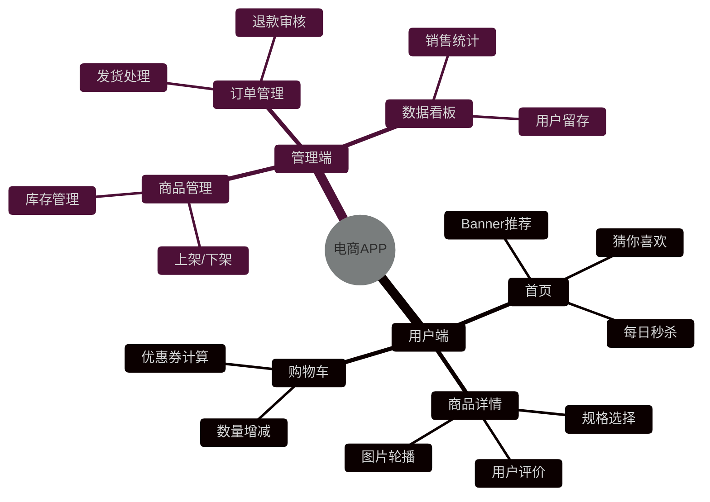
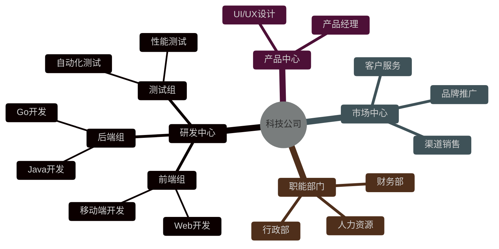
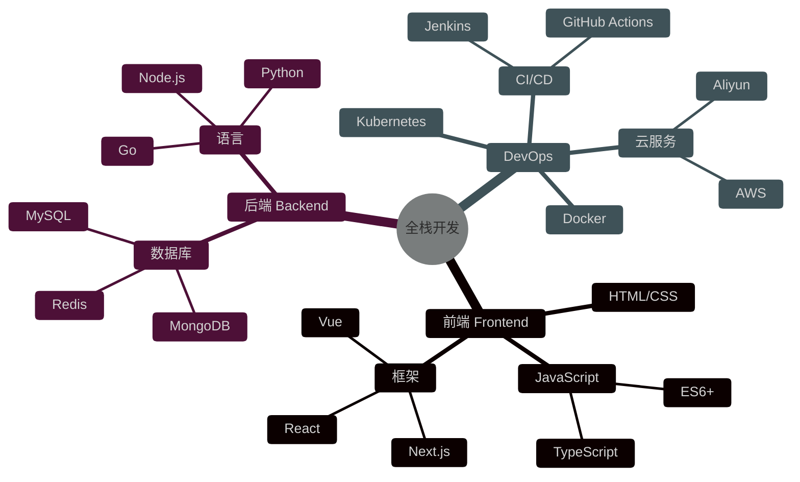
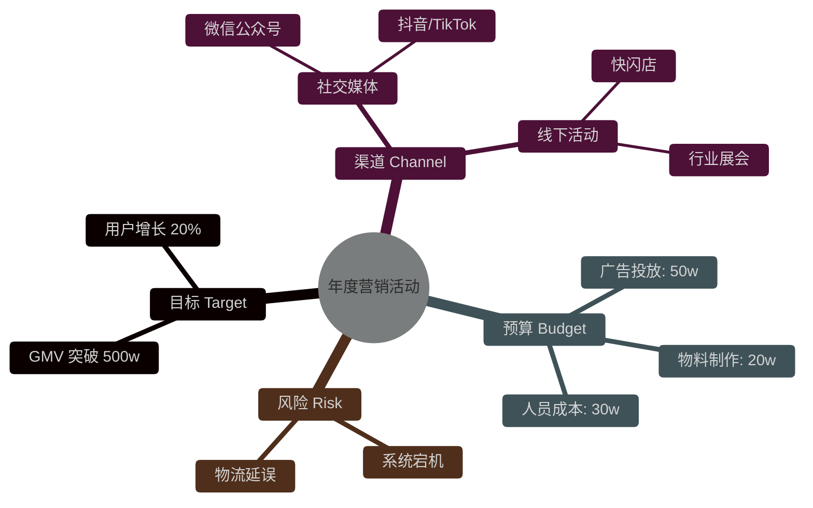

# Mindmap Dark 模板库

本文档提供适用于深色背景编辑器的 Mermaid Mindmap 模板。

**适用场景**：
- Dark 模式编辑器
- 深色背景的知识库或笔记

---

## 模板1：产品功能规划 (Dark)（评分：96分）⭐⭐⭐⭐⭐

---

## 模板2：公司组织架构 (Dark)（评分：92分）⭐⭐⭐⭐

---

## 模板3：全栈技术路线图 (Dark)（评分：94分）⭐⭐⭐⭐⭐

---

## 模板4：项目会议头脑风暴 (Dark)（评分：88分）⭐⭐⭐⭐

