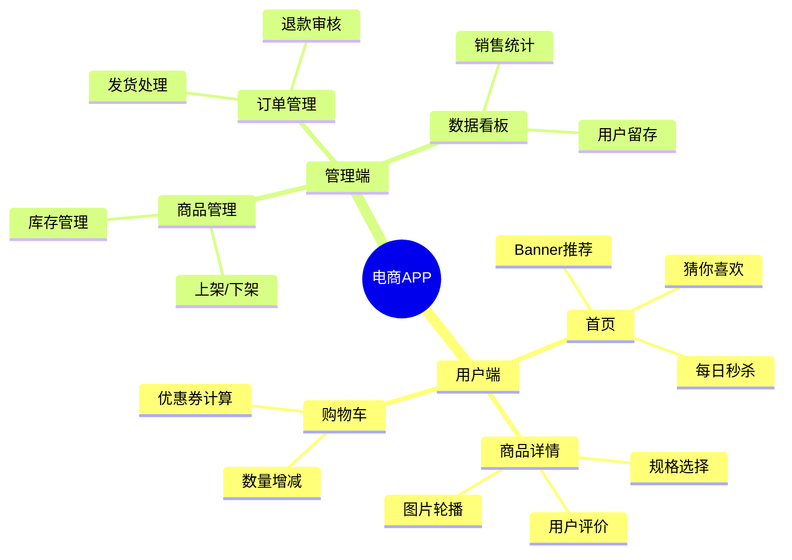
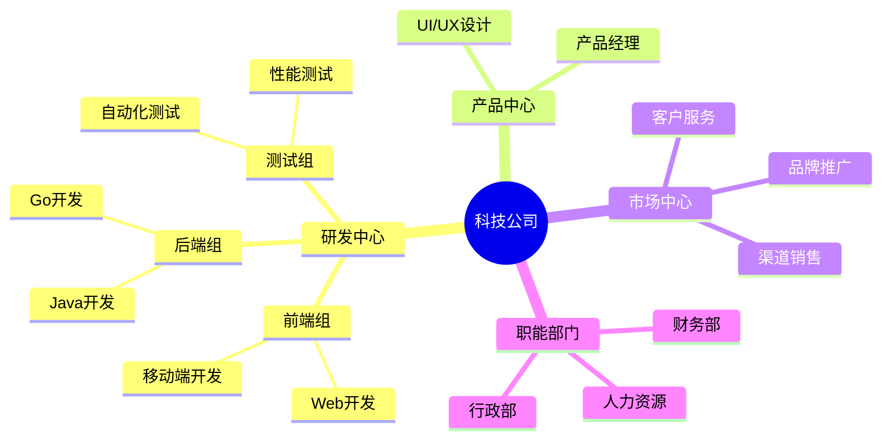
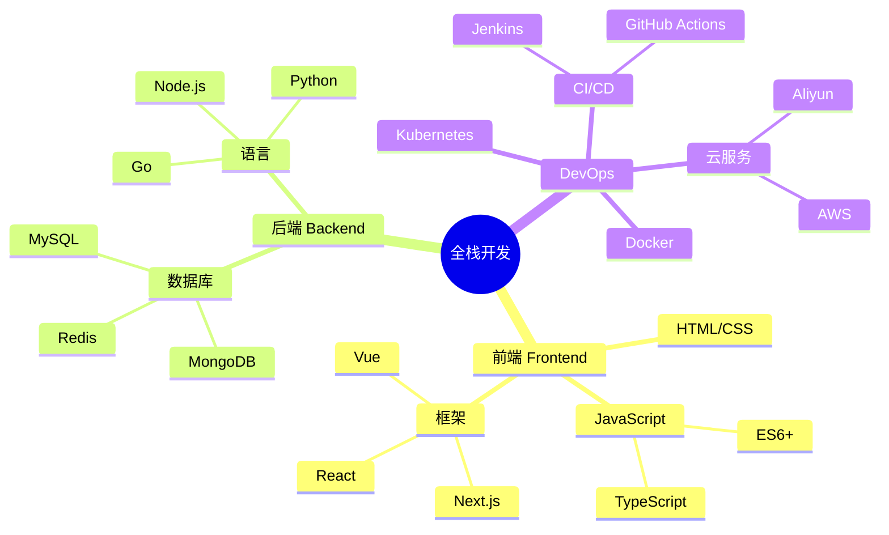
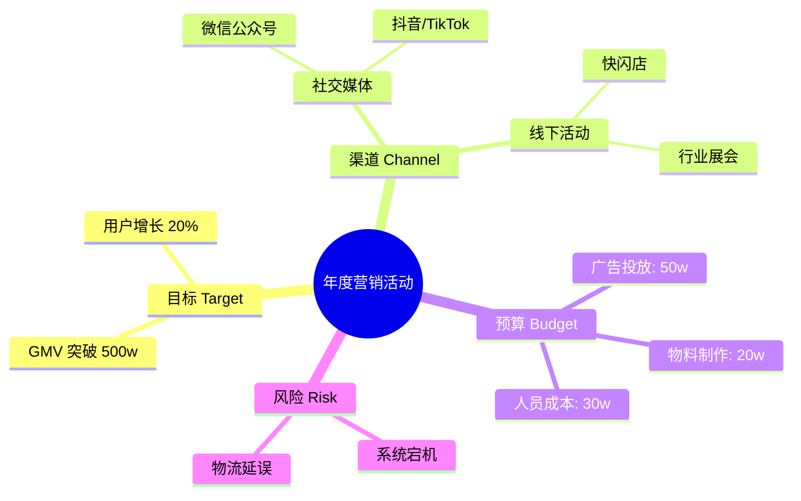
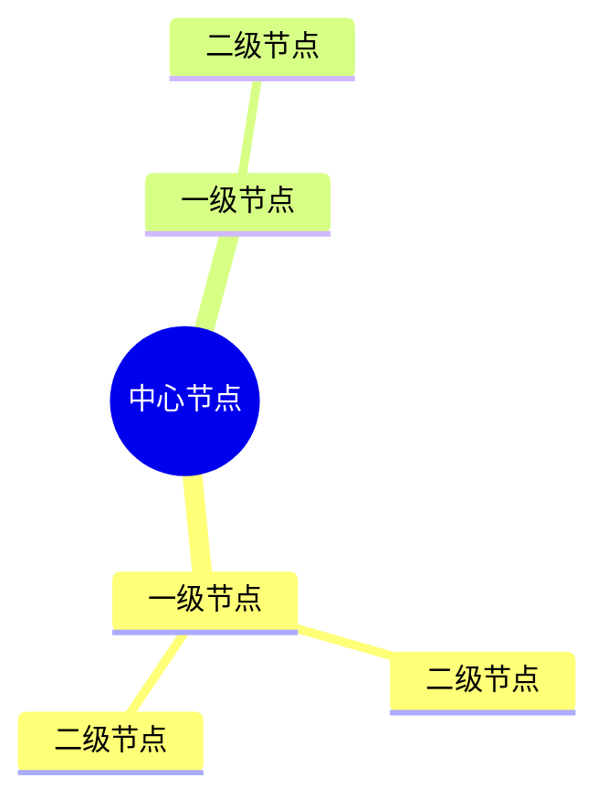

# Mindmap 模板库

本文档提供 Mermaid Mindmap (思维导图) 的标准模板，用于头脑风暴、知识组织和结构化规划。

**适用场景**：
- 创意头脑风暴
- 组织架构展示
- 技术栈规划
- 课程/知识大纲

---

## 模板1：产品功能规划（评分：96分）⭐⭐⭐⭐⭐

**适用场景**：产品管理、需求梳理、功能设计

**特点**：
- 使用 `root` 定义中心主题
- 清晰的层级缩进结构
- 覆盖了产品的主要功能模块

---

## 模板2：公司组织架构（评分：92分）⭐⭐⭐⭐

**适用场景**：企业介绍、团队管理、汇报关系

**特点**：
- 展示了典型的部门层级
- 适合展示团队结构

---

## 模板3：全栈技术路线图（评分：94分）⭐⭐⭐⭐⭐

**适用场景**：技术学习、技能树、技术选型

**特点**：
- 使用混合的中英文标签
- 展示了知识体系的关联性

---

## 模板4：项目会议头脑风暴（评分：88分）⭐⭐⭐⭐

**适用场景**：会议记录、创意发散、问题分析

**特点**：
- 使用图标 `::icon()` 增强视觉效果（需支持 FontAwesome 的环境）
- 结构化记录会议要点

---

## 语法参考

### 基本结构

### 节点形状
Mermaid Mindmap 会根据层级自动分配形状，但也支持部分自定义语法（取决于具体渲染器支持程度），通常通过缩进控制层级即可。

### 图标支持
使用 `::icon(class-name)` 语法添加图标，例如 `::icon(fa fa-book)`。这取决于渲染环境是否加载了图标库（如 FontAwesome）。
