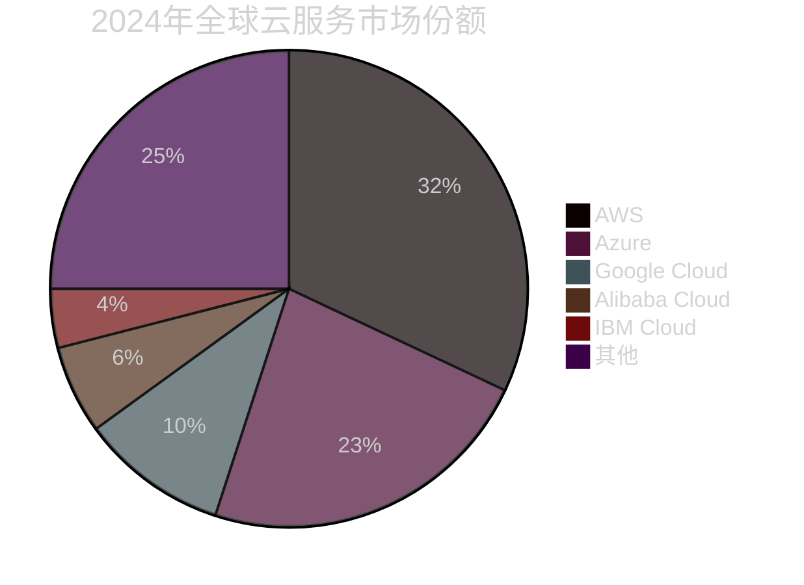
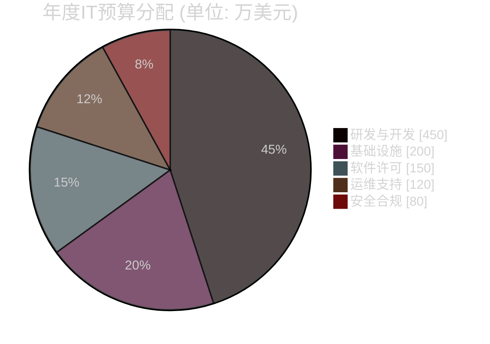
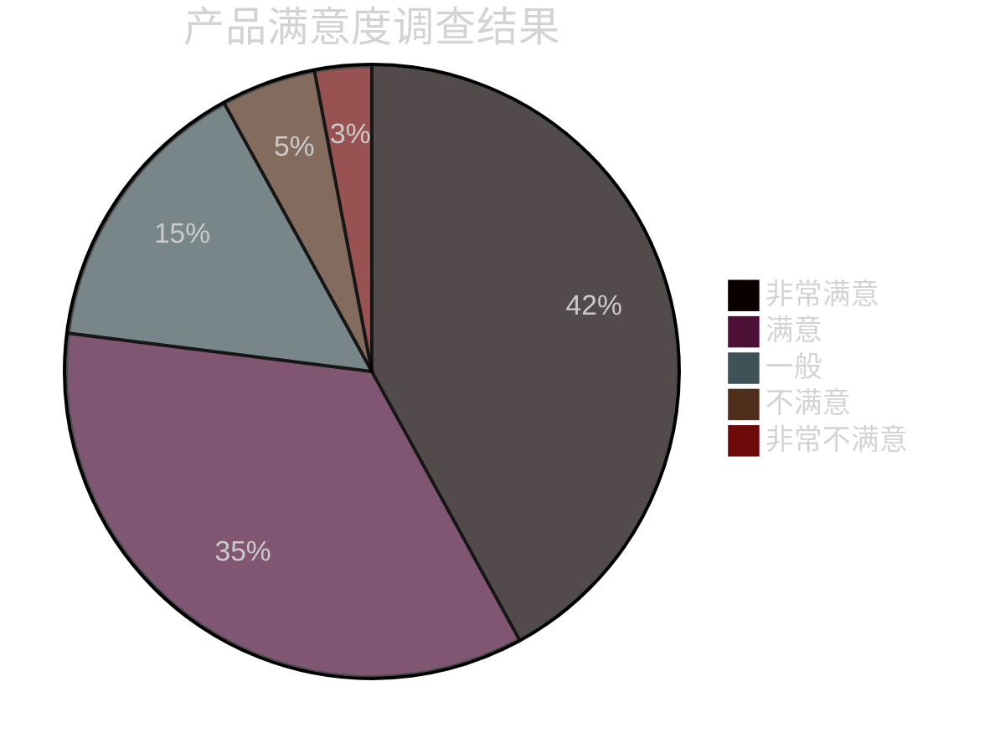
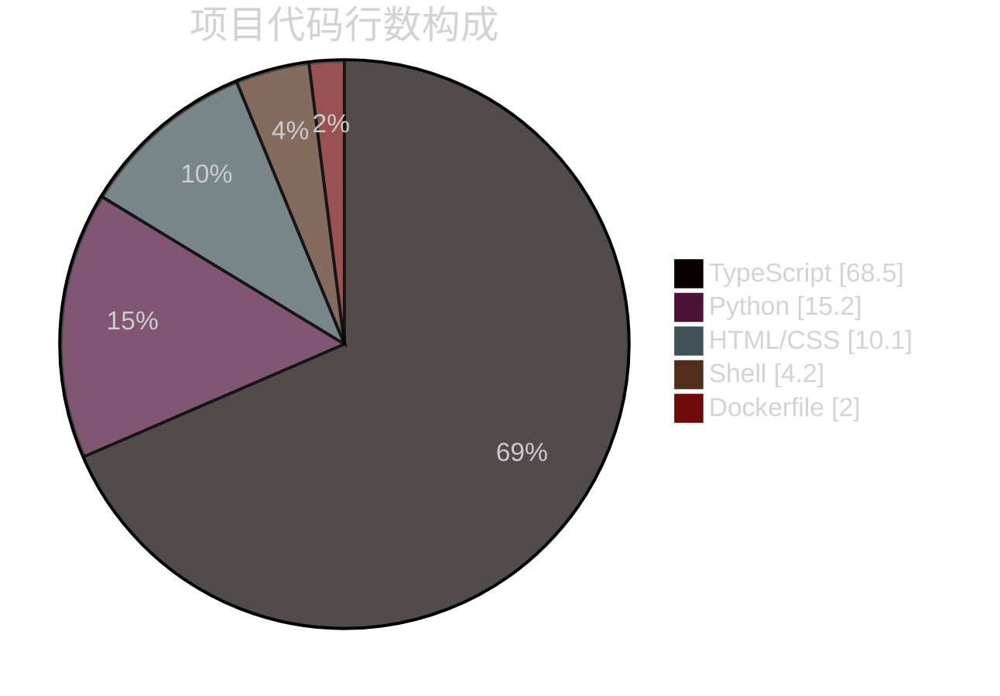
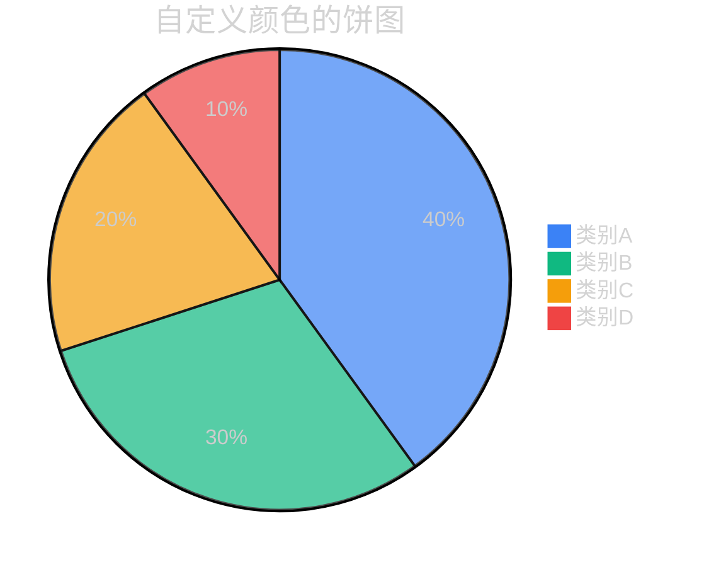

# Pie Chart Dark 模板库

本文档提供适用于深色背景编辑器的 Mermaid Pie Chart 模板。

**适用场景**：
- Dark 模式编辑器
- 深色背景仪表板

---

## 模板1：市场份额分布 (Dark)（评分：95分）⭐⭐⭐⭐⭐

---

## 模板2：项目预算分配 (Dark)（评分：92分）⭐⭐⭐⭐

---

## 模板3：用户满意度调查 (Dark)（评分：90分）⭐⭐⭐⭐

---

## 模板4：代码库语言构成 (Dark)（评分：88分）⭐⭐⭐⭐

---

## 视觉配置 (Dark Mode)

在 Dark 模式下，默认配色通常已经足够清晰。如果需要自定义切片颜色，可以使用 `themeVariables`：

