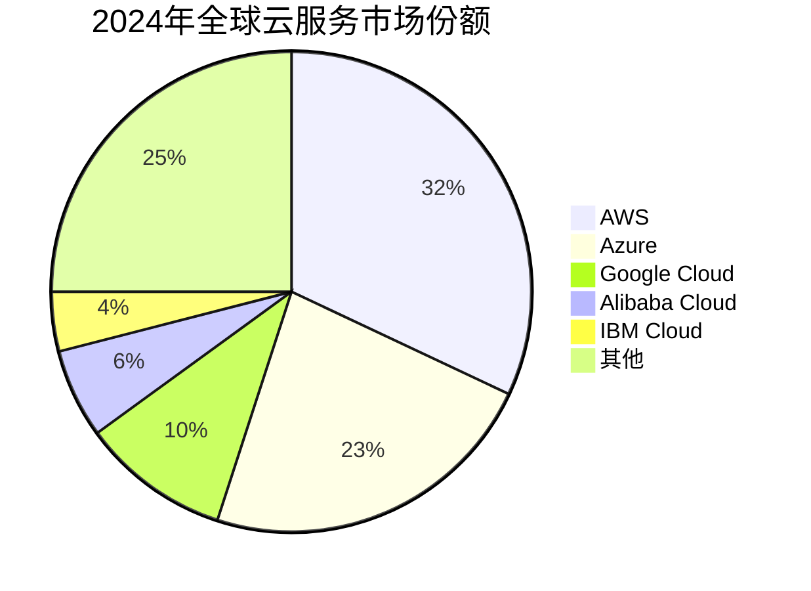
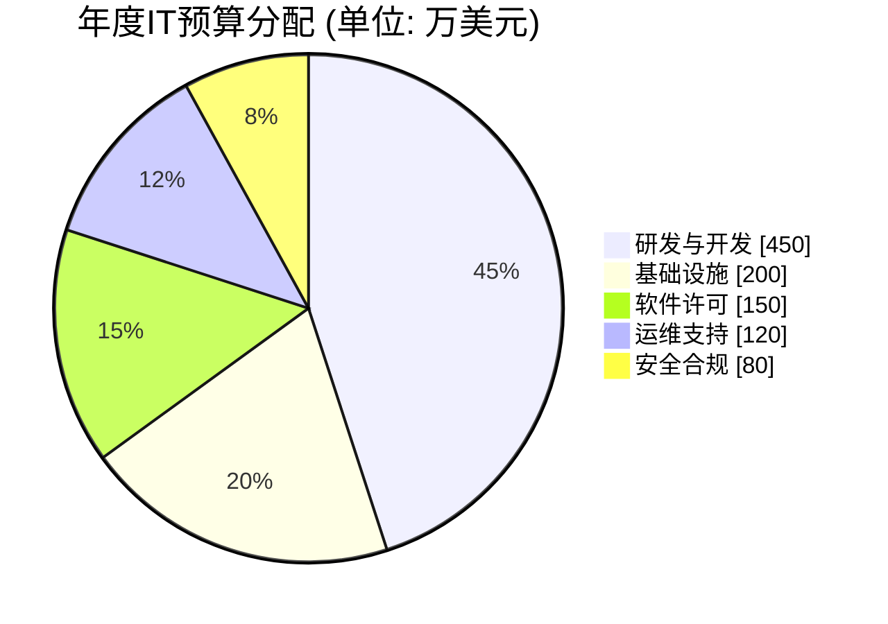
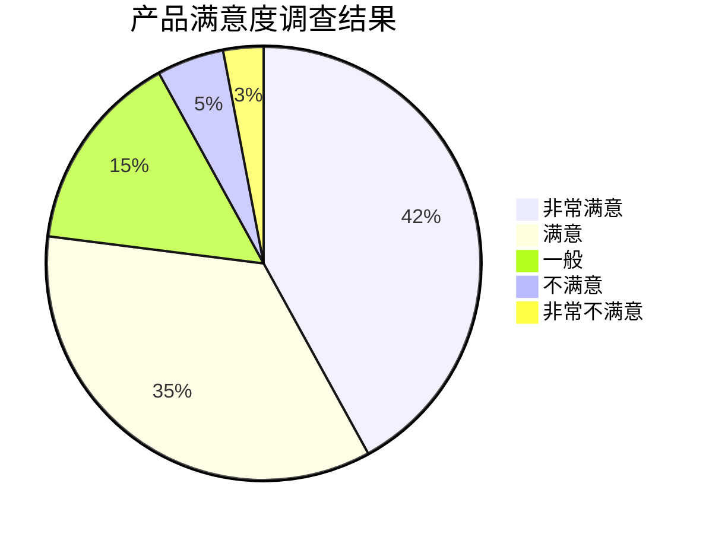
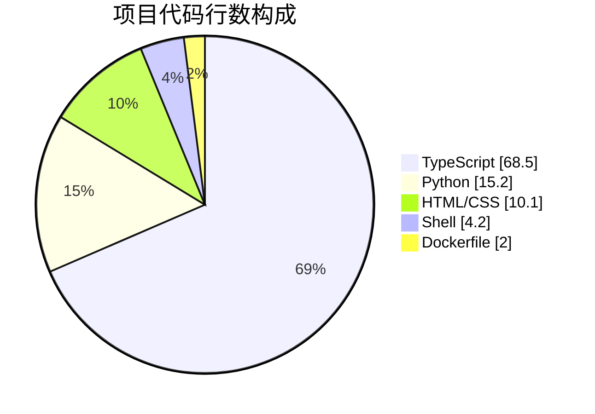

# Pie Chart 模板库

本文档提供 Mermaid Pie Chart (饼图) 的标准模板，用于数据占比可视化和统计分析。

**适用场景**：
- 数据分布分析
- 市场份额展示
- 预算/资源分配
- 调查结果统计

---

## 模板1：市场份额分布（评分：95分）⭐⭐⭐⭐⭐

**适用场景**：商业分析、竞品分析、行业报告

**特点**：
- 清晰的标题
- 典型的百分比分布展示
- 自动计算百分比

---

## 模板2：项目预算分配（评分：92分）⭐⭐⭐⭐

**适用场景**：项目管理、财务报告、成本分析

**特点**：
- 使用 `showData` 参数显示具体数值
- 适合展示绝对数值而非仅百分比

---

## 模板3：用户满意度调查（评分：90分）⭐⭐⭐⭐

**适用场景**：问卷调查、用户反馈、NPS分析

**特点**：
- 典型的李克特量表 (Likert Scale) 数据展示
- 直观反映用户情绪分布

---

## 模板4：代码库语言构成（评分：88分）⭐⭐⭐⭐

**适用场景**：GitHub/GitLab 项目概览、技术栈分析

**特点**：
- 精确到小数点的数值展示
- 模仿 GitHub 仓库语言条

---

## 语法参考

### 基本结构

### 关键参数
- **showData**: 可选关键字，添加在 `pie` 后面，会在图例中显示原始数值（不仅是百分比）。
- **title**: 图表标题，必须在第一行。
- **数值**: 可以是整数或浮点数，会自动计算总和并转换为百分比。
