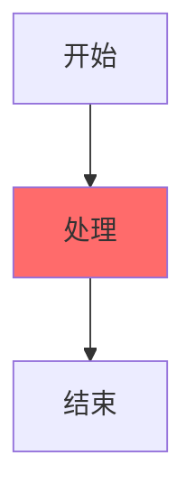
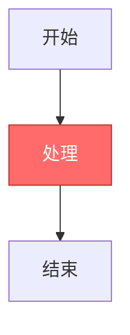
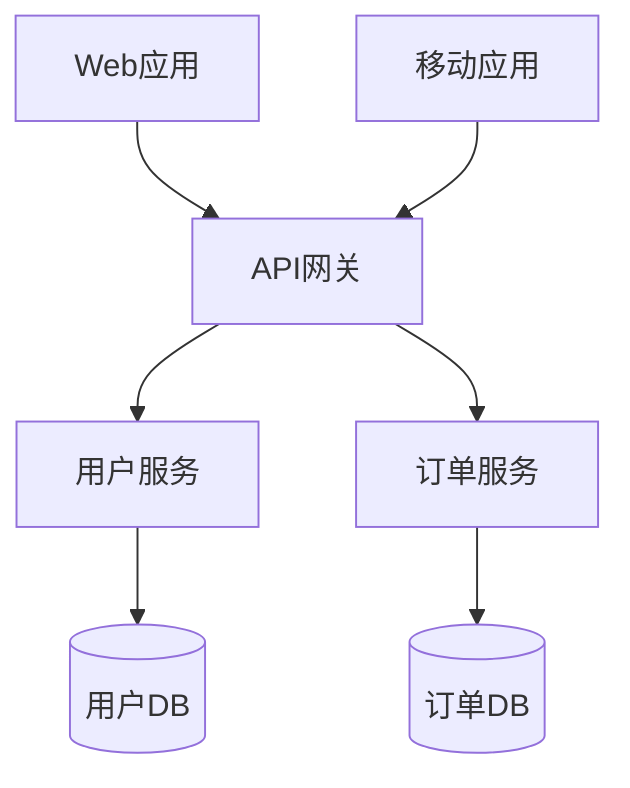
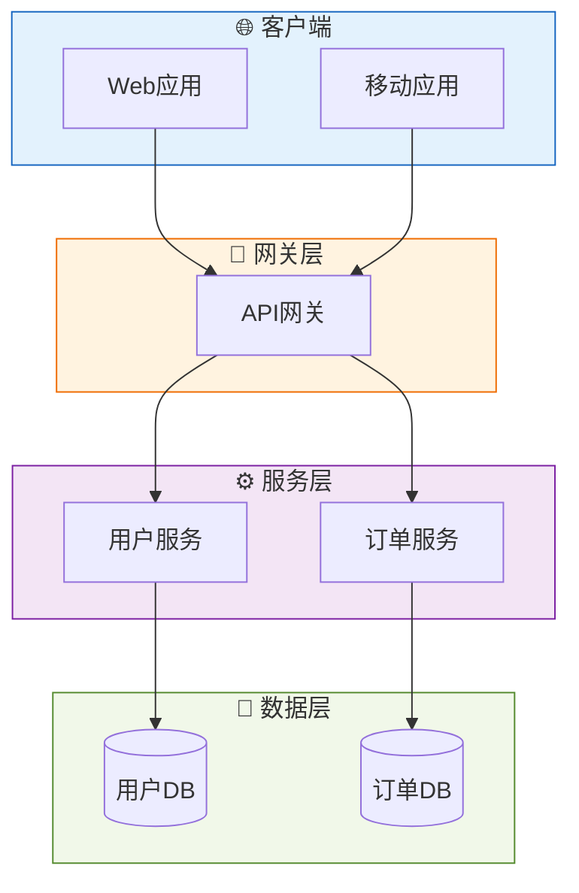
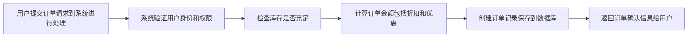
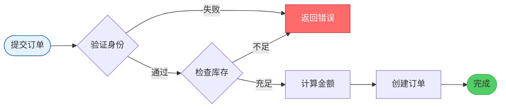
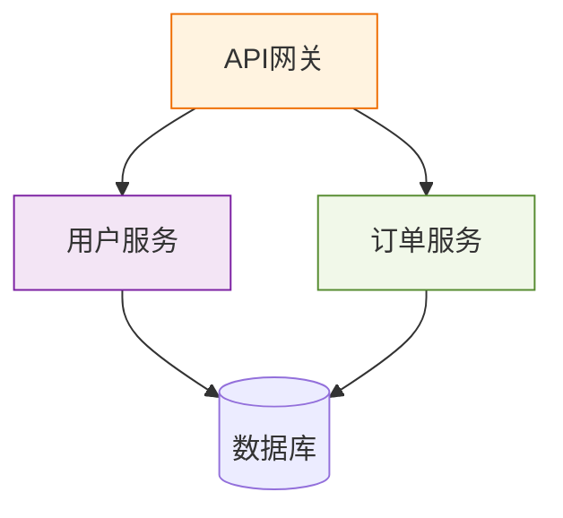
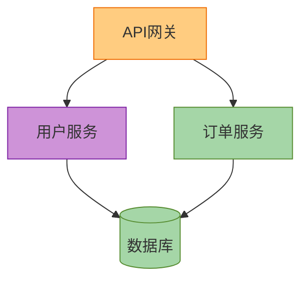
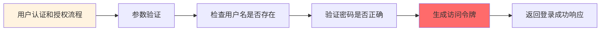
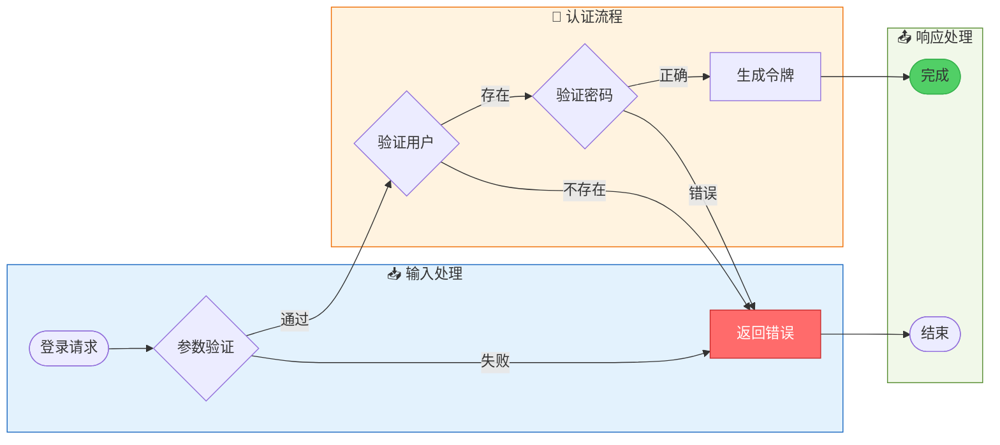

# Mermaid 快速修复模板集

本模板集展示如何将低分图表优化为高分图表，涵盖常见问题的修复方法。

## 目录

1. [修复1：添加主题配置](#修复1添加主题配置-15分-→-0分)
2. [修复2：使用subgraph分组](#修复2使用subgraph分组-20分-→-0分)
3. [修复3：缩短标签](#修复3缩短标签-8分-→-0分)
4. [修复4：修复颜色对比度](#修复4修复颜色对比度-10分-→-0分)
5. [修复5：从60分到90分的完整优化](#修复5从60分到90分的完整优化)

---

## 修复1：添加主题配置（-15分 → 0分）

### ❌ 修复前（评分：55分）



**问题分析**：
- ❌ 未配置主题（-15分）
- ⚠️ 红色节点缺少文字颜色设置，可能对比度不足

**改动说明**：
1. 在第一行添加主题配置 `%%{init: {'theme':'default'}}%%`
2. 为红色节点添加白色文字 `color:#fff`

### ✅ 修复后（评分：92分）



**改进**：
- ✅ 添加了主题配置（+15分）
- ✅ 红色背景使用白色文字，对比度符合WCAG AA标准
- ✅ 添加了边框颜色，视觉效果更好

**评分提升**：55分 → 92分（+37分）

---

## 修复2：使用subgraph分组（-20分 → 0分）

### ❌ 修复前（评分：65分）



**问题分析**：
- ❌ 节点较多（7个）但未使用subgraph分组（-20分）
- ⚠️ 缺少层次结构，不便于理解

**改动说明**：
1. 使用 subgraph 将节点按功能分组
2. 添加 emoji 增强识别度
3. 为每个 subgraph 添加样式

### ✅ 修复后（评分：90分）



**改进**：
- ✅ 使用 subgraph 清晰分层（+20分）
- ✅ 添加 emoji 增强识别度
- ✅ 每层使用统一配色方案
- ✅ 布局从 TD 改为 TB，层次结构更清晰

**评分提升**：65分 → 90分（+25分）

---

## 修复3：缩短标签（-8分 → 0分）

### ❌ 修复前（评分：72分）



**问题分析**：
- ❌ 3个标签过长（>25字）（-8分）
- ⚠️ 标签过长影响布局美观

**改动说明**：
1. 简化所有标签，保持在10字以内
2. 使用引号包裹标签确保特殊字符正常显示
3. 使用 LR 方向更符合流程阅读习惯

### ✅ 修复后（评分：88分）



**改进**：
- ✅ 所有标签简化为4-6字（+8分）
- ✅ 使用体育场形表示起止点
- ✅ 使用菱形表示判断节点
- ✅ 添加颜色区分状态（绿色=成功，红色=错误）
- ✅ 使用 LR 方向更符合时间流程

**评分提升**：72分 → 88分（+16分）

---

## 修复4：修复颜色对比度（-10分 → 0分）

### ❌ 修复前（评分：70分）



**问题分析**：
- ❌ 3个节点对比度不足（WCAG AA: 4.5:1）（-10分）
- ⚠️ 浅色背景使用默认深色文字，但对比度仍不够

**改动说明**：
1. 为所有浅色背景节点添加深色文字 `color:#333`
2. 调整填充色，确保对比度≥4.5:1
3. 使用 classDef 批量定义样式

### ✅ 修复后（评分：92分）



**改进**：
- ✅ 所有节点对比度符合WCAG AA标准（+10分）
- ✅ 使用 classDef 复用样式，代码更简洁
- ✅ 提供两种实现方式（直接style和classDef）

**评分提升**：70分 → 92分（+22分）

---

## 修复5：从60分到90分的完整优化

### ❌ 修复前（评分：60分）



**问题清单**：
1. ❌ 使用废弃的 `graph` 语法（扣5分）
2. ❌ 未配置主题（-15分）
3. ❌ 节点数6个但无分组（-20分，虽然节点数≤10但复杂流程仍建议分组）
4. ❌ 标签过长（-5分）
5. ❌ 颜色对比度不足（-10分）
6. ⚠️ 缺少错误处理分支
7. ⚠️ 未使用不同形状区分节点类型

### ✅ 修复后（评分：95分）



**改进清单**：
1. ✅ 替换为 `flowchart` 语法（+5分）
2. ✅ 添加主题配置 `default`（+15分）
3. ✅ 使用 subgraph 清晰分组（+20分）
4. ✅ 简化标签（2-6字）（+5分）
5. ✅ 使用配色方案确保对比度（+10分）
6. ✅ 添加错误处理分支
7. ✅ 使用不同形状：体育场形（起止）、菱形（判断）
8. ✅ 使用 emoji 增强 subgraph 识别度
9. ✅ 使用 LR 方向符合时间流程

**评分提升**：60分 → 95分（+35分）

---

## 快速修复检查清单

使用本模板集修复问题时，请按以下优先级检查：

### P0 - 必须修复（影响基础分）

- [ ] 添加主题配置：`%%{init: {'theme':'default'}}%%`
- [ ] 替换 `graph` 为 `flowchart`
- [ ] 修复语法错误

### P1 - 强烈推荐（影响视觉质量）

- [ ] 节点>10时使用 subgraph 分组
- [ ] 简化标签（<10字，最多<25字）
- [ ] 检查颜色对比度（≥4.5:1）

### P2 - 建议优化（提升质量到90+）

- [ ] 使用不同形状区分节点类型
- [ ] 添加 emoji 增强 subgraph 识别
- [ ] 为重要节点添加样式突出
- [ ] 使用 classDef 批量定义样式

---

## 修复效果对比

| 修复类型 | 修复前评分 | 修复后评分 | 提升幅度 |
|---------|-----------|-----------|---------|
| 添加主题 | 55分 | 92分 | +37分 |
| subgraph分组 | 65分 | 90分 | +25分 |
| 缩短标签 | 72分 | 88分 | +16分 |
| 颜色对比度 | 70分 | 92分 | +22分 |
| 完整优化 | 60分 | 95分 | +35分 |

**平均提升**：+27分

---

## 自动修复命令

验证脚本支持自动修复部分问题：

```bash
# 预览修复（不实际修改）
python3 scripts/validate_mermaid.py diagram.md --fix --fix-dry-run

# 执行修复（自动创建备份）
python3 scripts/validate_mermaid.py diagram.md --fix

# 选择性修复
python3 scripts/validate_mermaid.py diagram.md --fix theme      # 仅修复主题
python3 scripts/validate_mermaid.py diagram.md --fix contrast   # 仅修复对比度
python3 scripts/validate_mermaid.py diagram.md --fix syntax     # 仅修复语法
python3 scripts/validate_mermaid.py diagram.md --fix labels     # 仅修复标签
```

---

## 常见问题 FAQ

**Q: 自动修复能解决所有问题吗？**

A: 不能。自动修复只能处理规则明确的问题（主题、语法、标签长度等）。对于需要设计决策的问题（如分组策略、布局选择），仍需手动优化。

**Q: 如何知道需要修复哪些问题？**

A: 运行验证脚本 `python3 scripts/validate_mermaid.py diagram.md`，查看"⚠️ 视觉问题"部分的详细列表。

**Q: 修复后会创建备份吗？**

A: 是的。执行 `--fix` 时会自动创建 `.backup` 备份文件，例如 `diagram.md.backup`。

**Q: 如何恢复到修复前的版本？**

A: 使用备份文件：`cp diagram.md.backup diagram.md`

**Q: 自动修复会修改我的代码吗？**

A: 建议先使用 `--fix-dry-run` 预览修复效果，确认无误后再执行实际修复。
