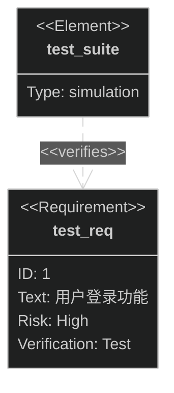
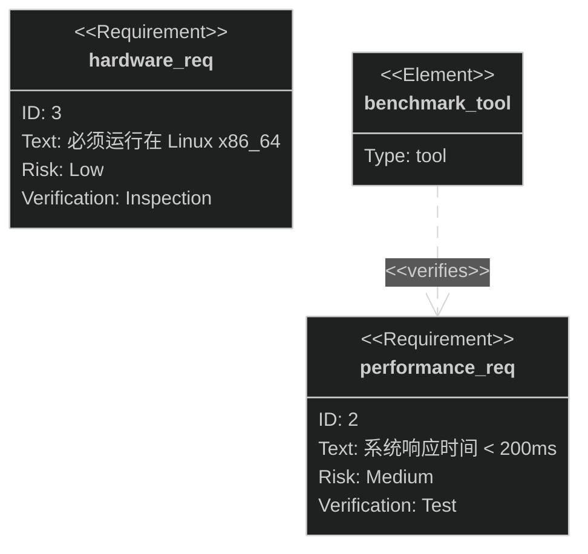
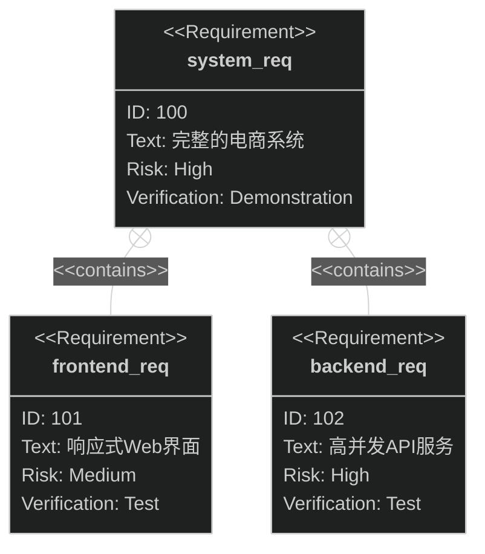
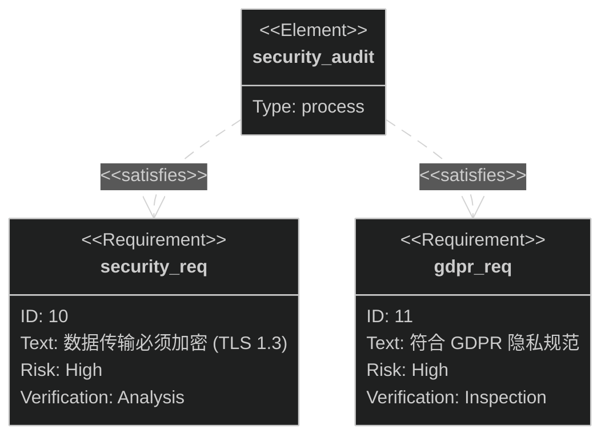

# Requirement Diagram Dark 模板库

本文档提供适用于深色背景编辑器的 Mermaid Requirement Diagram 模板。

**适用场景**：
- Dark 模式编辑器
- 深色背景技术文档

---

## 模板1：软件功能需求 (Dark)（评分：92分）⭐⭐⭐⭐

---

## 模板2：性能与约束需求 (Dark)（评分：90分）⭐⭐⭐⭐

---

## 模板3：层级需求结构 (Dark)（评分：94分）⭐⭐⭐⭐⭐

---

## 模板4：安全合规需求 (Dark)（评分：91分）⭐⭐⭐⭐

