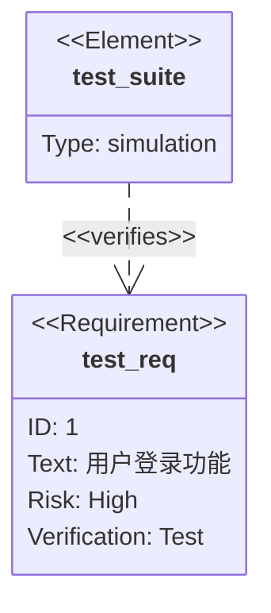
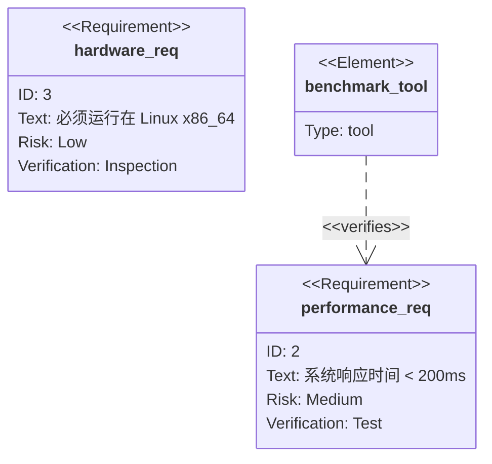
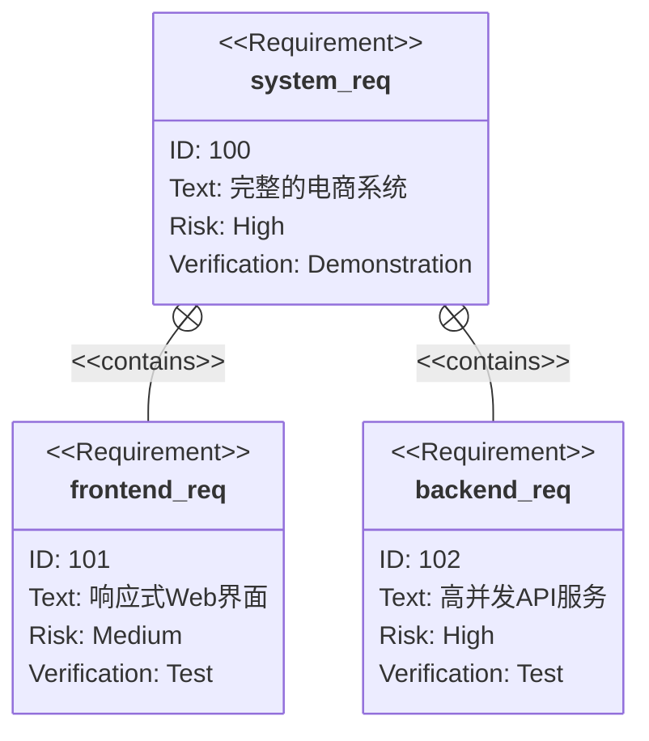
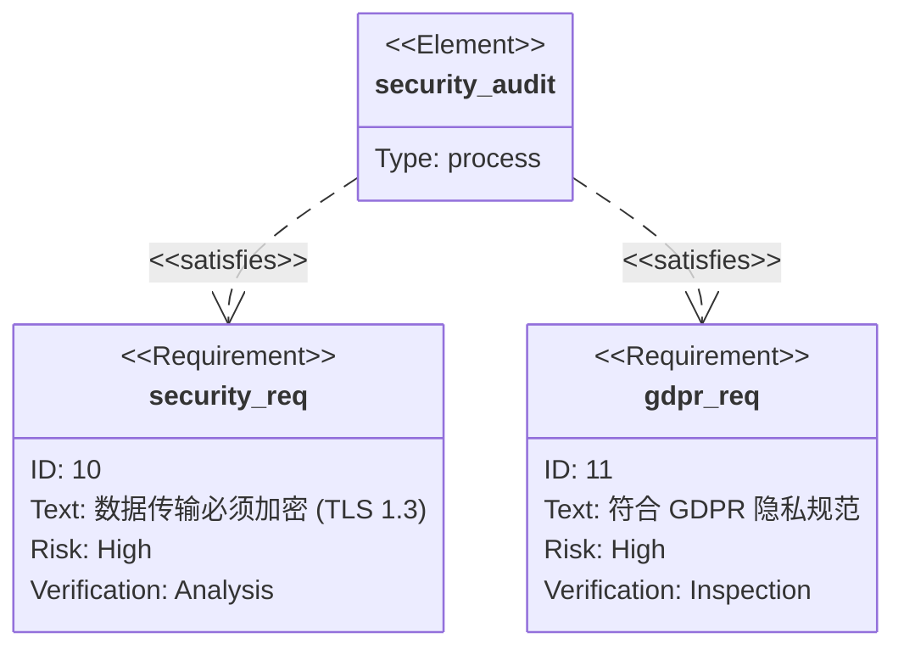

# Requirement Diagram 模板库

本文档提供 Mermaid Requirement Diagram (需求图) 的标准模板，用于系统工程、需求管理和追踪。

**适用场景**：
- 系统需求规格说明 (SRS)
- 需求验证与测试覆盖
- 硬件/软件约束定义
- 复杂系统设计

---

## 模板1：软件功能需求（评分：92分）⭐⭐⭐⭐

**适用场景**：软件开发、功能定义

**特点**：
- 定义了具体需求
- 关联了验证方法（测试套件）

---

## 模板2：性能与约束需求（评分：90分）⭐⭐⭐⭐

**适用场景**：非功能性需求、性能指标

**特点**：
- 定义了性能指标和硬件约束
- 明确了验证手段（测量、检查）

---

## 模板3：层级需求结构（评分：94分）⭐⭐⭐⭐⭐

**适用场景**：复杂系统、需求分解

**特点**：
- 展示了需求之间的父子关系（contains）
- 适合顶层设计

---

## 模板4：安全合规需求（评分：91分）⭐⭐⭐⭐

**适用场景**：安全审计、合规性检查

**特点**：
- 明确了合规性需求
- 定义了关键风险等级 (High)

---

## 语法参考

### 关系类型
- **contains**: 包含关系
- **copies**: 复制关系
- **derives**: 衍生关系
- **satisfies**: 满足关系
- **verifies**: 验证关系
- **refines**: 细化关系
- **traces**: 追踪关系

### 验证方法 (verifymethod)
- **analysis**: 分析
- **inspection**: 检查
- **test**: 测试
- **demonstration**: 演示
