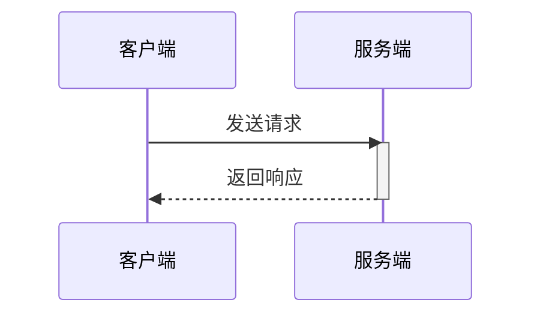
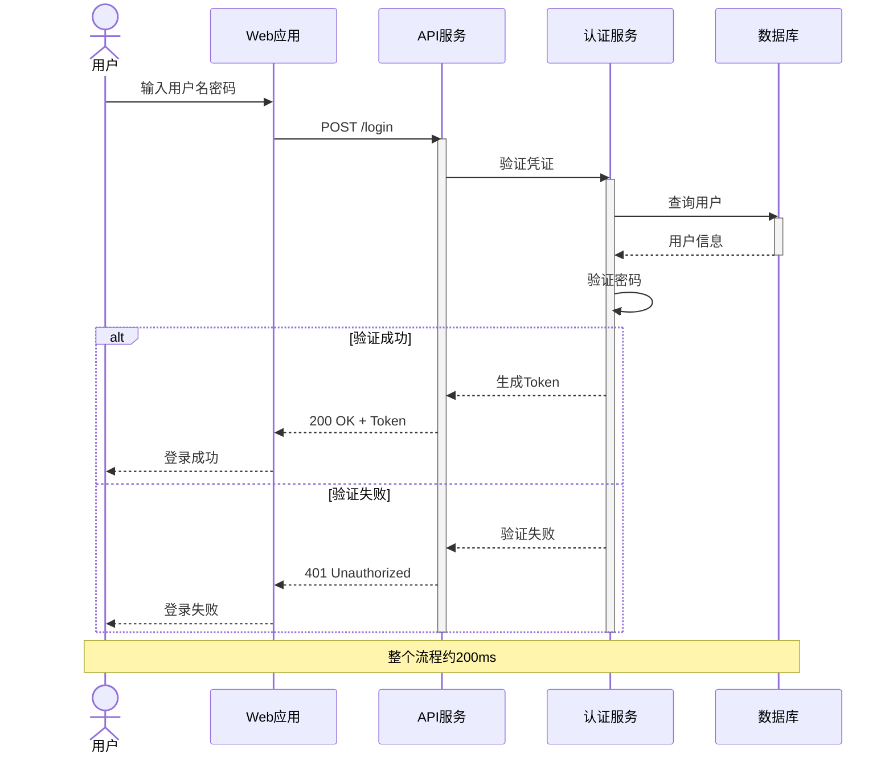
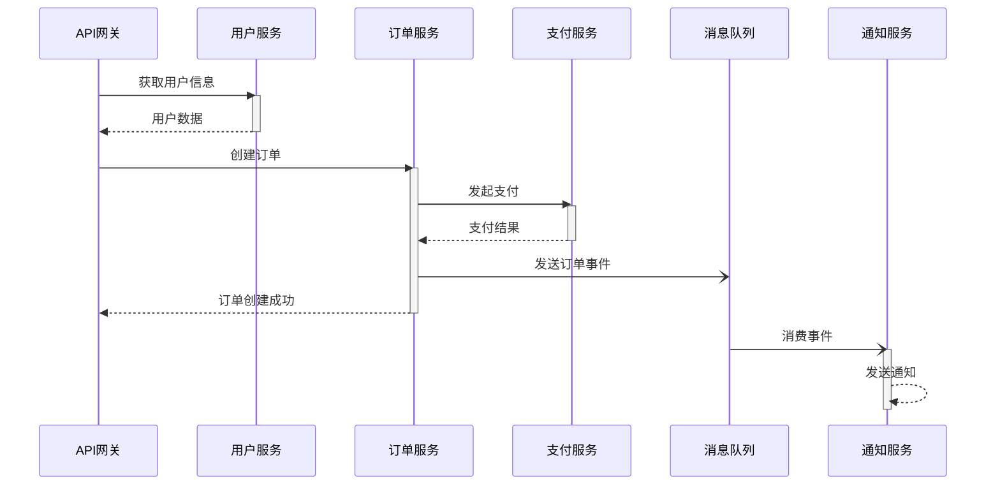
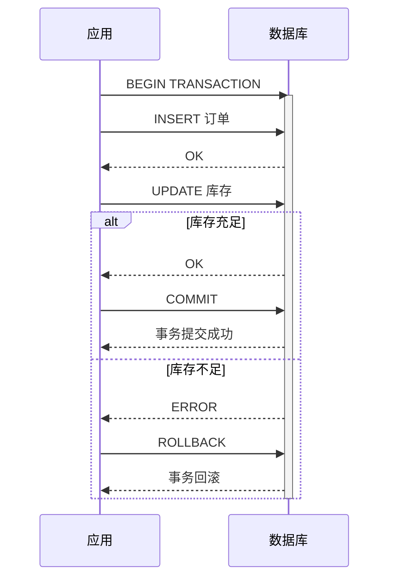
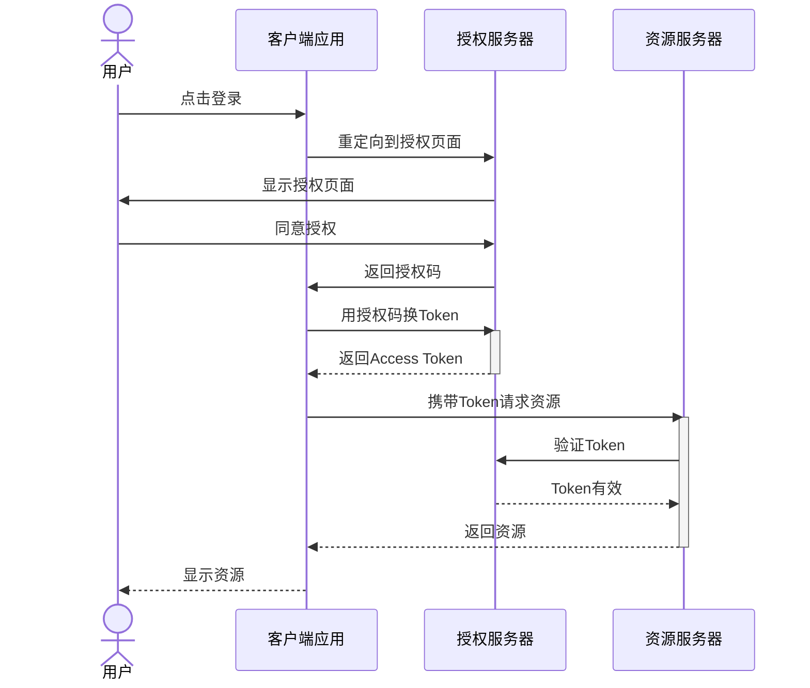
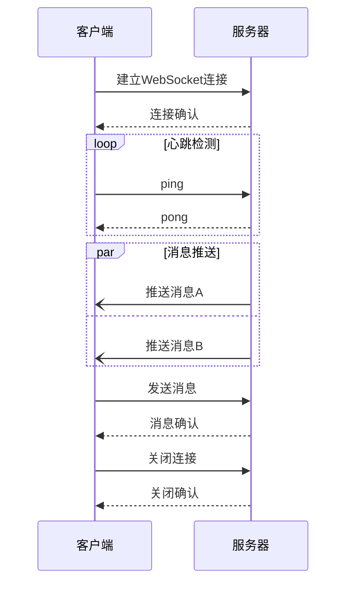
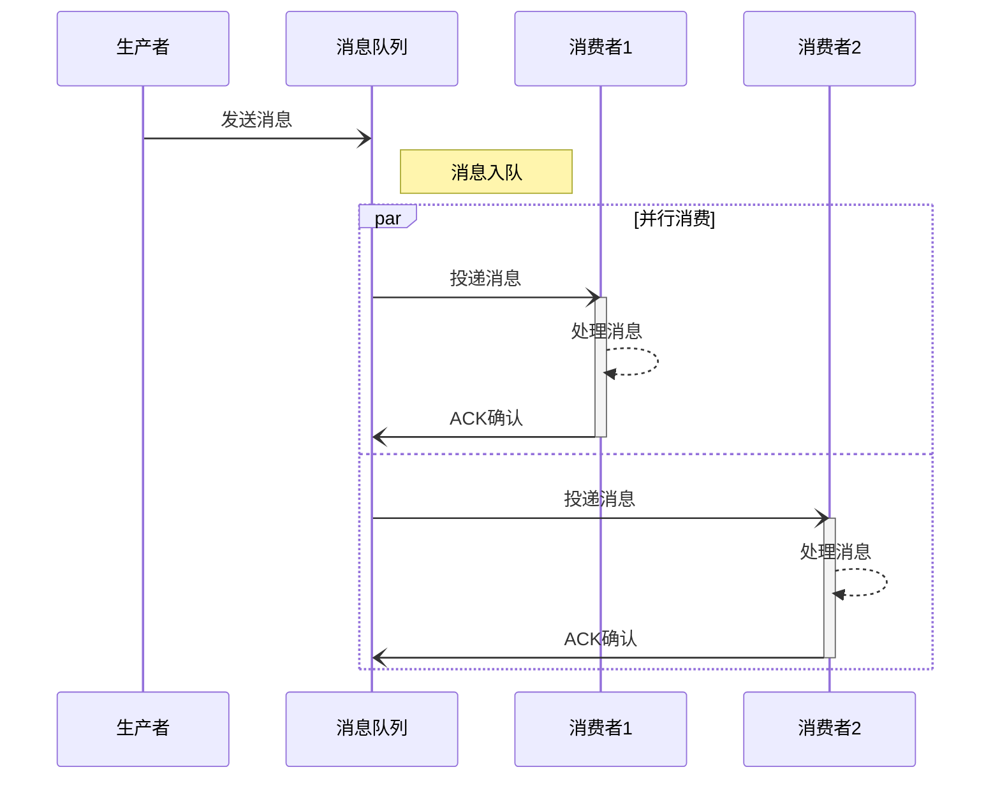
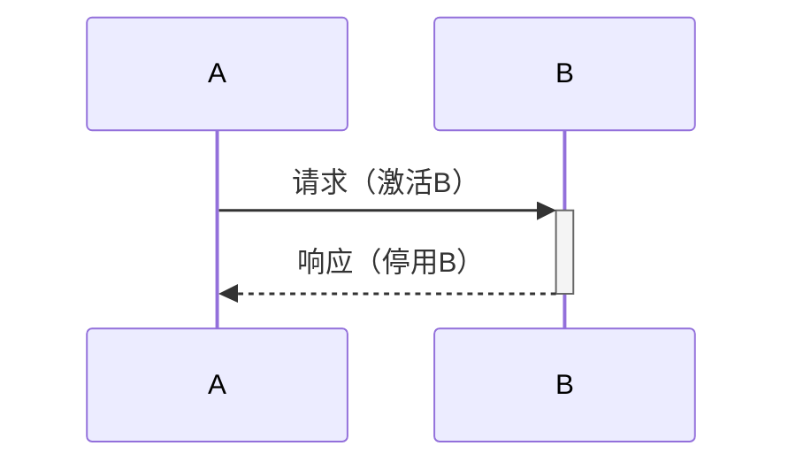
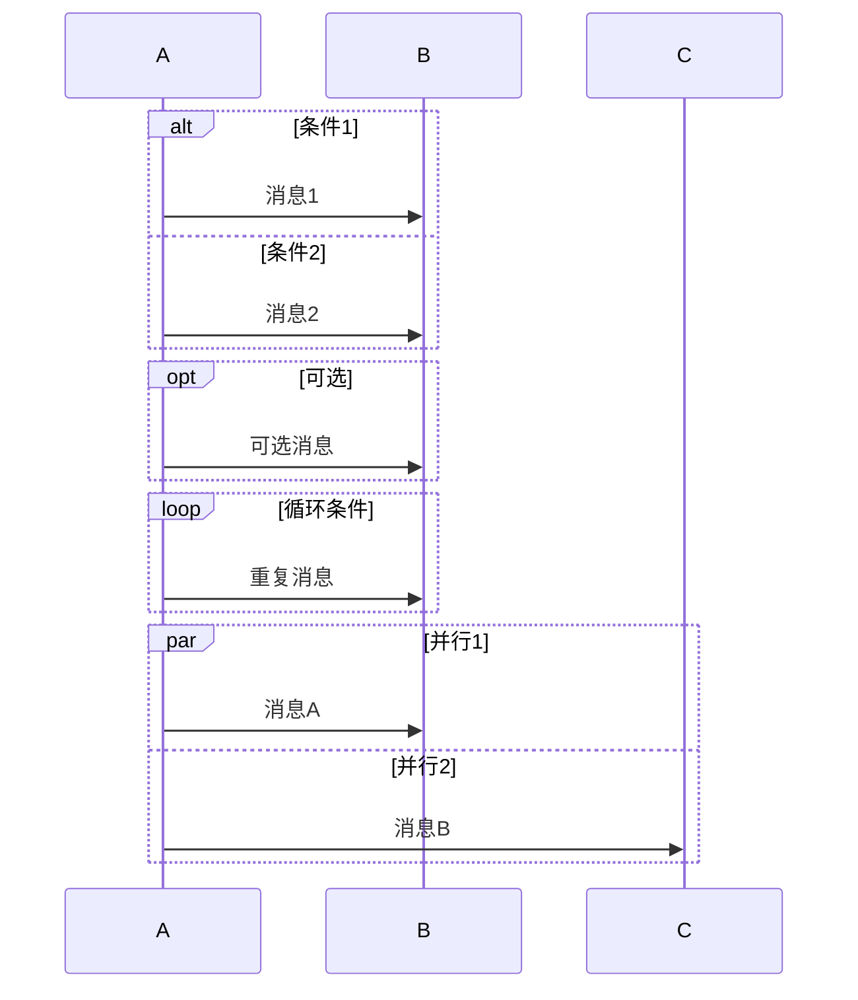

# Sequence Diagram 模板库

本文档提供高质量的时序图模板，可直接复制使用。

---

## 模板1：基础API调用（评分：85分）⭐⭐⭐⭐

**适用场景**：简单API请求、客户端-服务端交互

---

## 模板2：用户登录流程（评分：92分）⭐⭐⭐⭐⭐

**适用场景**：认证流程、JWT验证、OAuth

---

## 模板3：微服务调用链（评分：90分）⭐⭐⭐⭐⭐

**适用场景**：微服务通信、服务编排、分布式系统

---

## 模板4：数据库事务（评分：88分）⭐⭐⭐⭐

**适用场景**：事务处理、数据一致性、ACID操作

---

## 模板5：OAuth2授权流程（评分：90分）⭐⭐⭐⭐⭐

**适用场景**：第三方登录、OAuth2、SSO

---

## 模板6：WebSocket通信（评分：86分）⭐⭐⭐⭐

**适用场景**：实时通信、推送消息、长连接

---

## 模板7：异步消息处理（评分：87分）⭐⭐⭐⭐

**适用场景**：消息队列、异步处理、事件驱动

---

## 使用说明

### 消息类型说明

| 语法 | 说明 | 使用场景 |
|------|------|----------|
| `->>` | 实线箭头 | 同步请求 |
| `-->>` | 虚线箭头 | 同步响应 |
| `-)` | 开放箭头 | 异步消息 |
| `--)` | 虚线开放 | 异步响应 |
| `-x` | 带×箭头 | 丢失消息 |

### 激活框使用

### 逻辑块

