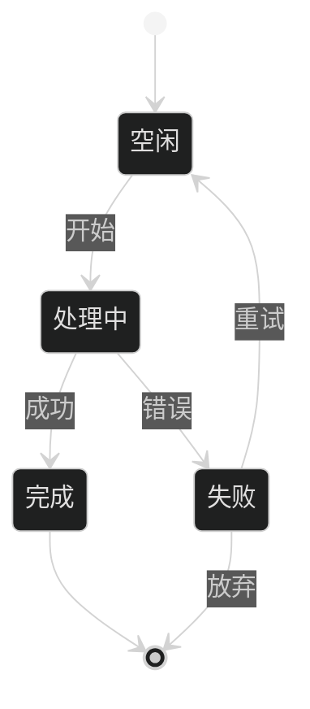
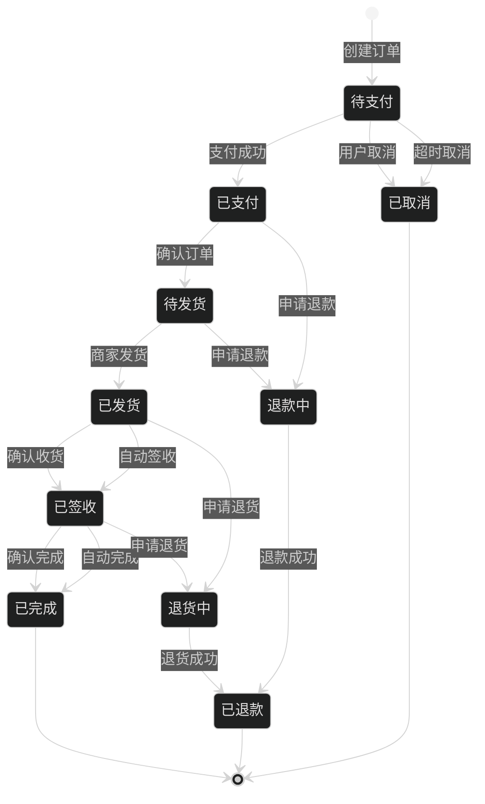
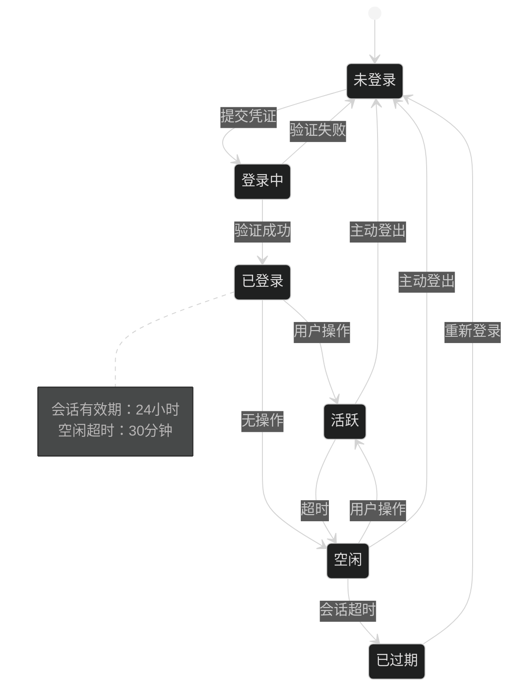
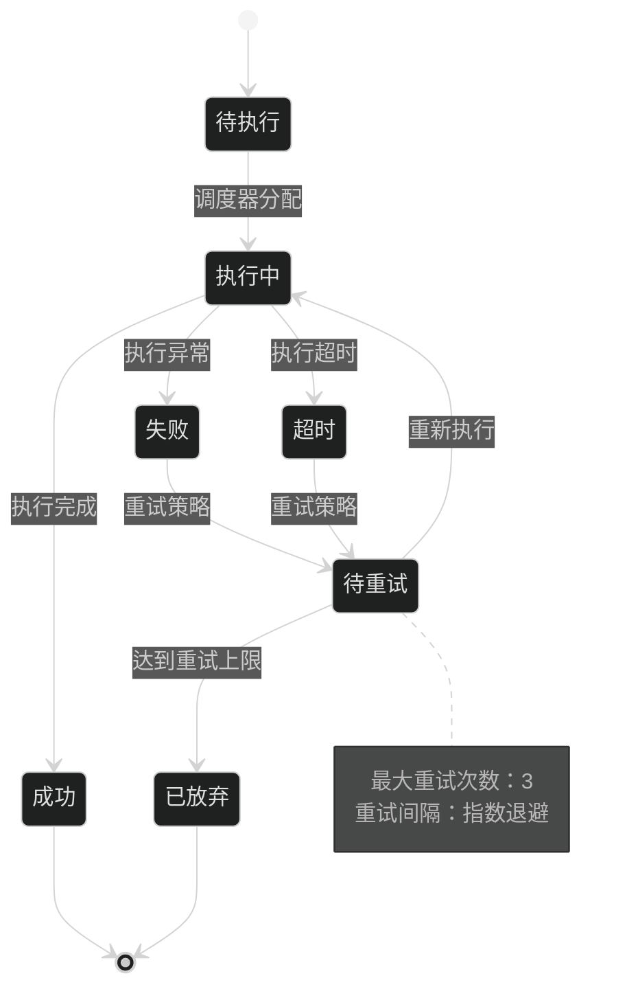
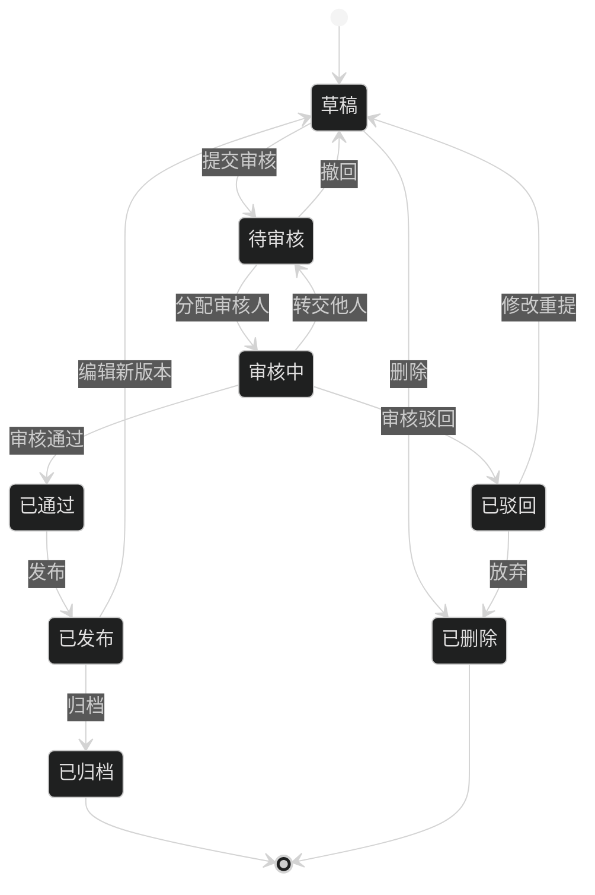
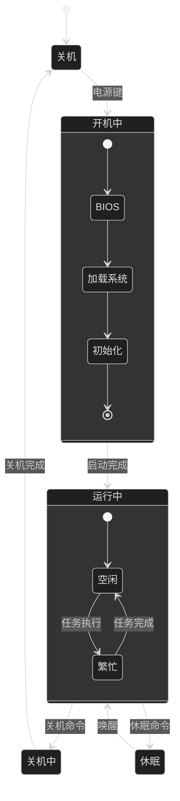
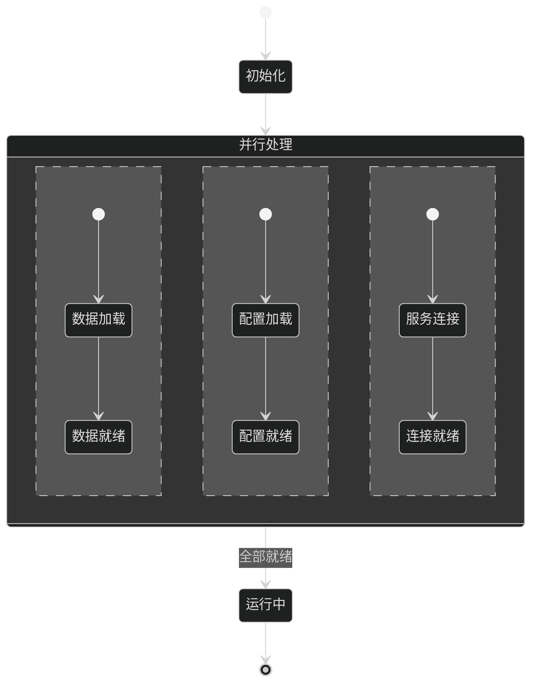

# State Diagram Dark 模板库

本文档提供适用于深色背景编辑器的高质量状态图模板，可直接复制使用。

**使用场景**：
- Dark 模式编辑器（如 VS Code Dark、JetBrains Darcula 等）
- 演示文稿中的深色幻灯片
- 深色主题的博客或文档网站

---

## 模板1：简单状态机（评分：87分）⭐⭐⭐⭐

**适用场景**：基础状态机、简单生命周期



---

## 模板2：订单状态流转（评分：94分）⭐⭐⭐⭐⭐

**适用场景**：电商订单、工单系统、任务状态



---

## 模板3：用户认证状态（评分：90分）⭐⭐⭐⭐

**适用场景**：登录状态、会话管理



---

## 模板4：任务执行状态（评分：88分）⭐⭐⭐⭐

**适用场景**：任务队列、后台任务、Job状态



---

## 模板5：文档审批流程（评分：92分）⭐⭐⭐⭐⭐

**适用场景**：审批流程、工作流、文档生命周期



---

## 模板6：嵌套状态（评分：90分）⭐⭐⭐⭐

**适用场景**：复合状态、嵌套状态机



---

## 模板7：并发状态（评分：87分）⭐⭐⭐⭐

**适用场景**：并行状态、Fork/Join



---

## 使用说明

### 主题配置

Mermaid 的 State Diagram 在 Dark 模式下表现良好，只需简单设置主题即可：

```text
%%{init: {'theme':'dark'}}%%
```
