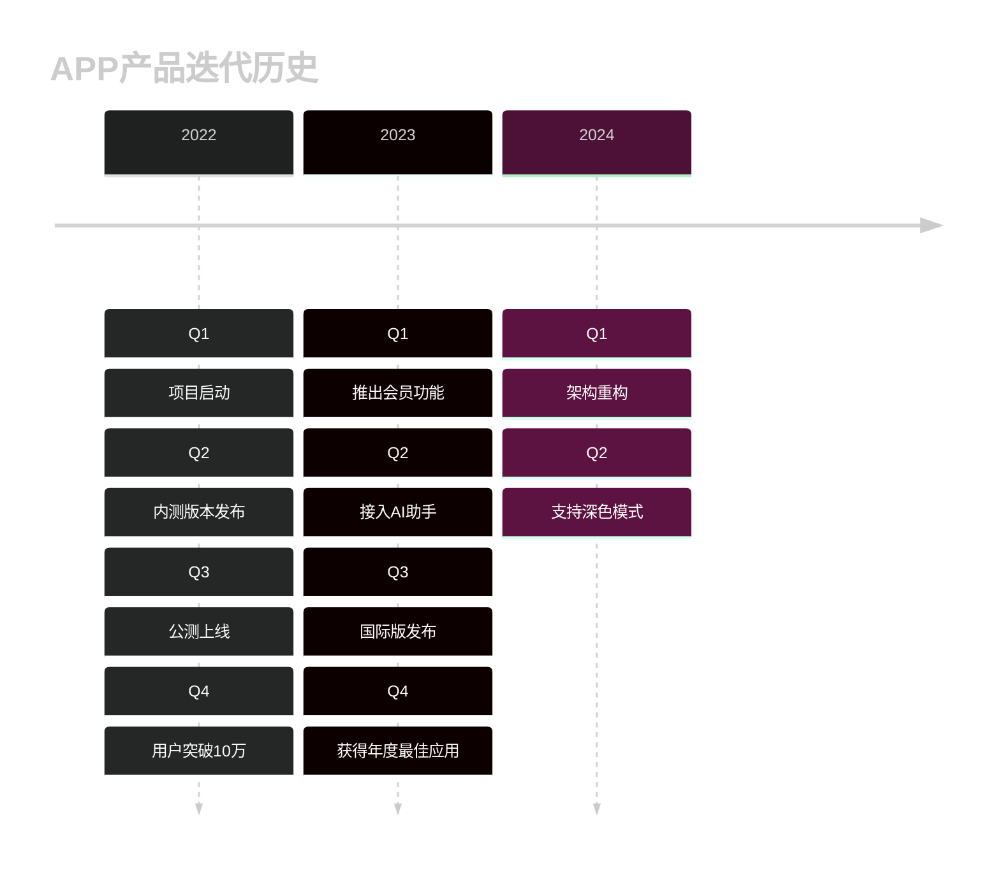
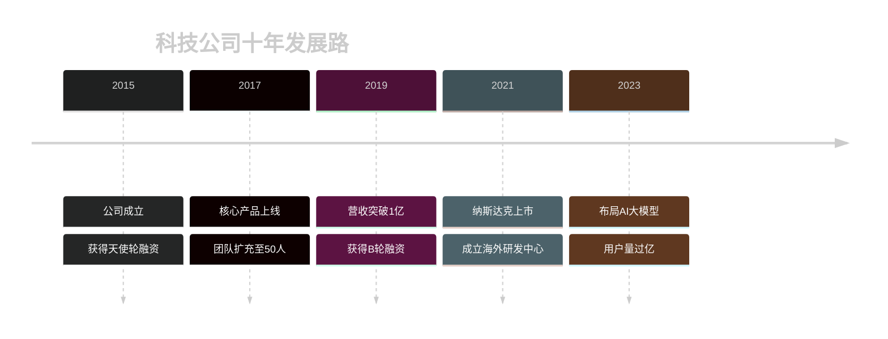
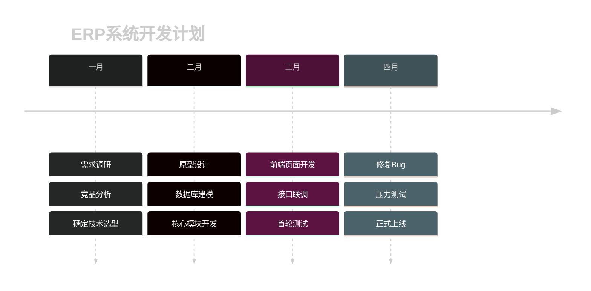
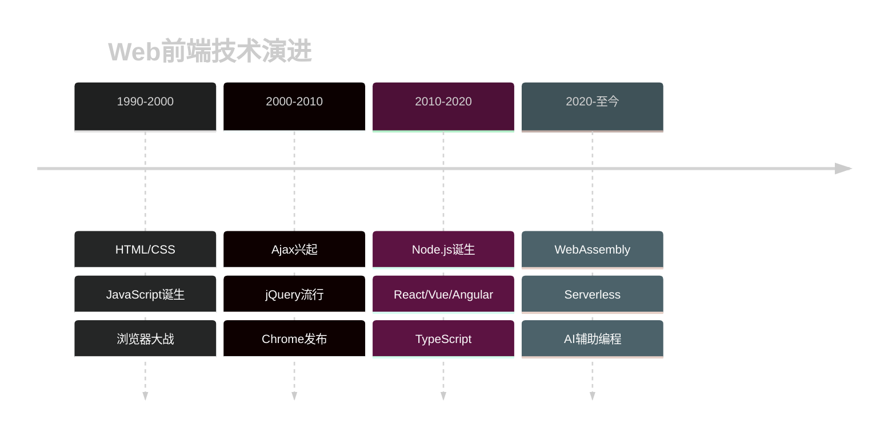

# Timeline Dark 模板库

本文档提供适用于深色背景编辑器的 Mermaid Timeline 模板。

**适用场景**：
- Dark 模式编辑器
- 深色背景演示

---

## 模板1：产品发布历史 (Dark)（评分：95分）⭐⭐⭐⭐⭐

---

## 模板2：公司发展里程碑 (Dark)（评分：92分）⭐⭐⭐⭐

---

## 模板3：项目开发阶段 (Dark)（评分：90分）⭐⭐⭐⭐

---

## 模板4：Web技术演进史 (Dark)（评分：88分）⭐⭐⭐⭐

