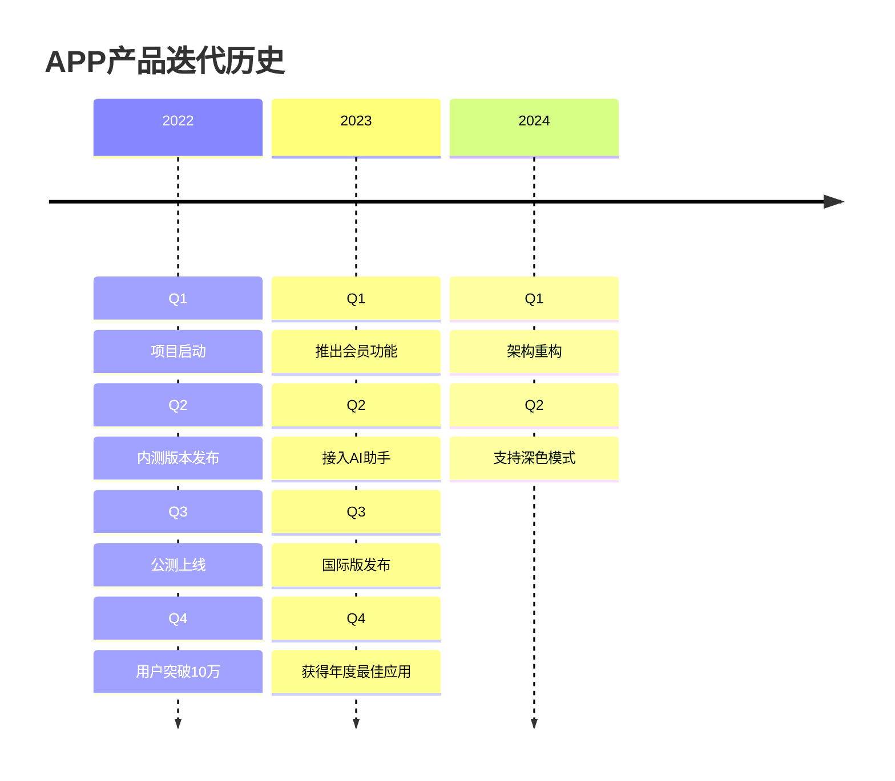
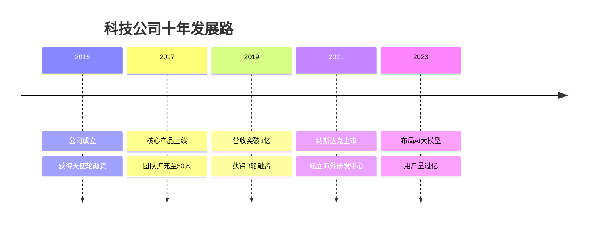
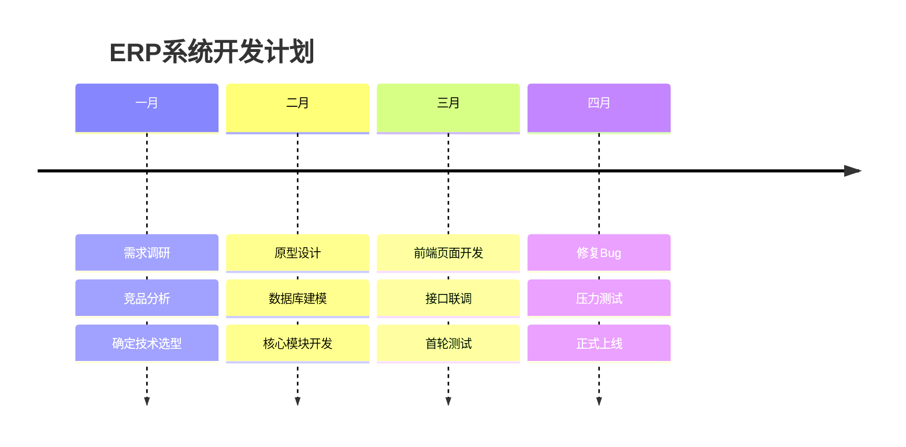
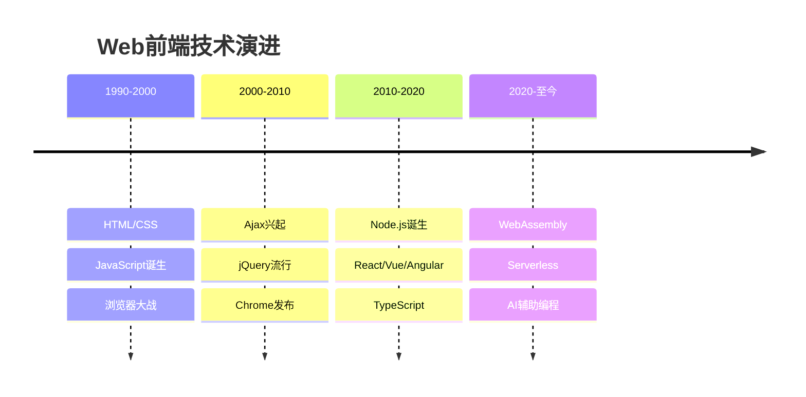
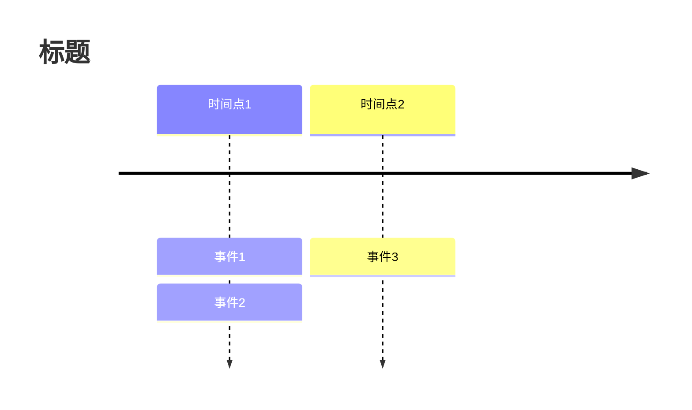

# Timeline 模板库

本文档提供 Mermaid Timeline (时间线) 的标准模板，用于可视化历史事件、项目里程碑和演进过程。

**适用场景**：
- 历史事件回顾
- 产品版本发布记录
- 项目里程碑规划
- 个人/公司成长历程

---

## 模板1：产品发布历史（评分：95分）⭐⭐⭐⭐⭐

**适用场景**：版本迭代记录、更新日志可视化

**特点**：
- 使用年份作为主要时间轴
- 每个时间点包含多个事件
- 清晰展示发展脉络

---

## 模板2：公司发展里程碑（评分：92分）⭐⭐⭐⭐

**适用场景**：企业介绍、融资历程、大事记

**特点**：
- 简洁明了
- 突出关键成就

---

## 模板3：项目开发阶段（评分：90分）⭐⭐⭐⭐

**适用场景**：项目规划、阶段性成果展示

**特点**：
- 以月份为单位
- 展示每个月的并行任务

---

## 模板4：Web技术演进史（评分：88分）⭐⭐⭐⭐

**适用场景**：技术分享、教育培训、历史回顾

**特点**：
- 使用时间段作为轴
- 概括性描述

---

## 语法参考

### 基本结构

### 样式
Timeline 图表自动适配 Mermaid 主题。可以通过 `%%{init: {'theme': 'base', 'themeVariables': { ... }}}%%` 进行微调。
