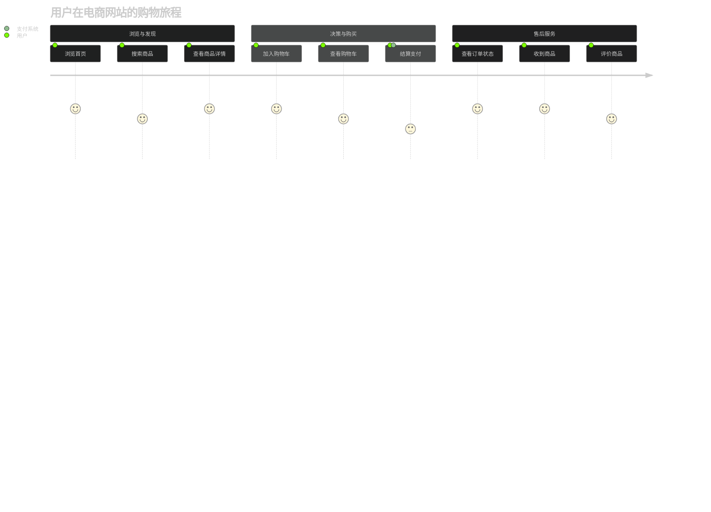
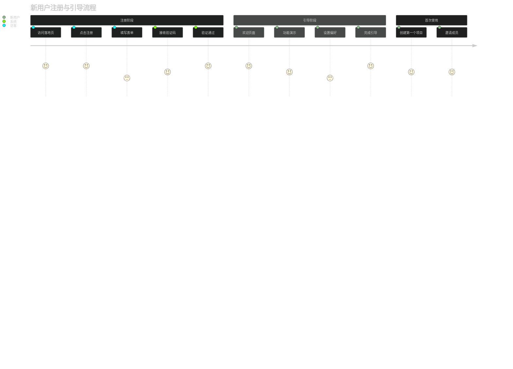
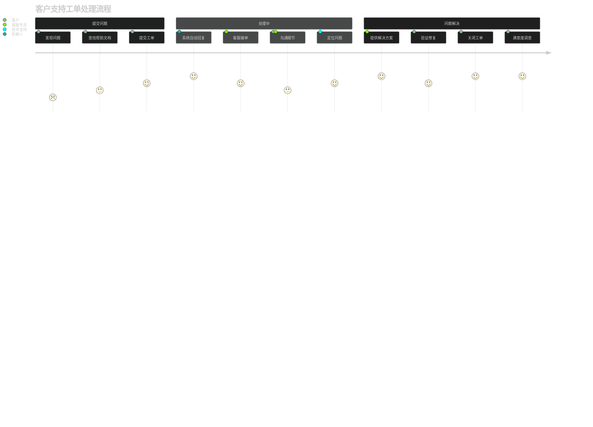
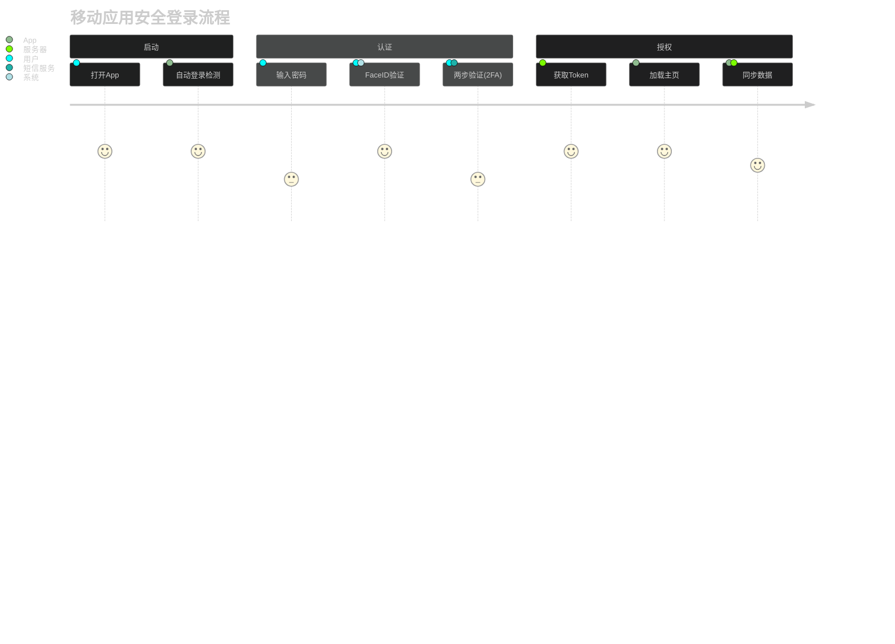
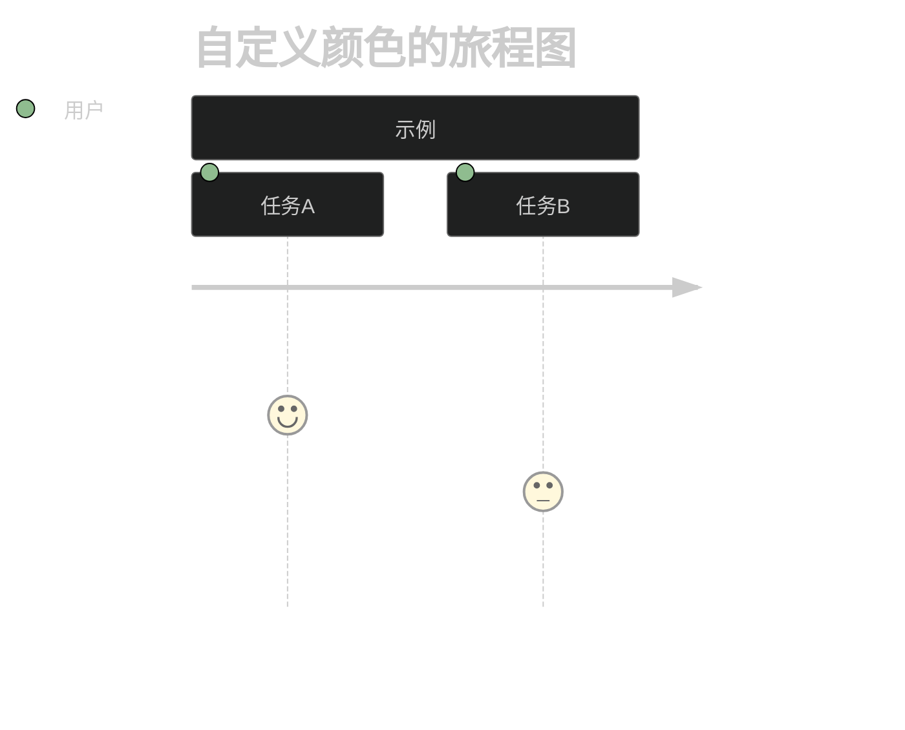

# User Journey Dark 模板库

本文档提供适用于深色背景编辑器的 Mermaid User Journey Diagram 模板。

**适用场景**：
- Dark 模式编辑器
- 深色背景演示文稿

---

## 模板1：电商购物旅程 (Dark)（评分：95分）⭐⭐⭐⭐⭐

---

## 模板2：新用户注册引导 (Dark)（评分：92分）⭐⭐⭐⭐

---

## 模板3：客户服务工单流程 (Dark)（评分：90分）⭐⭐⭐⭐

---

## 模板4：移动应用登录与安全 (Dark)（评分：88分）⭐⭐⭐⭐

---

## 视觉配置
User Journey 图表在 Dark 模式下的颜色配置通常由 `theme: dark` 自动处理，但你可以通过 `themeVariables` 微调：

