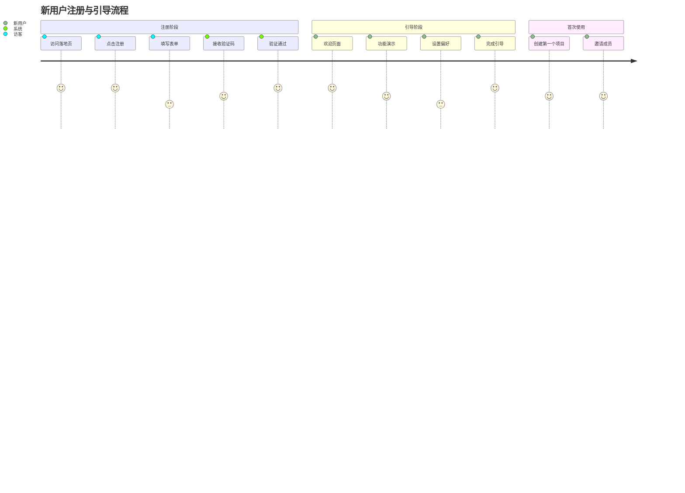
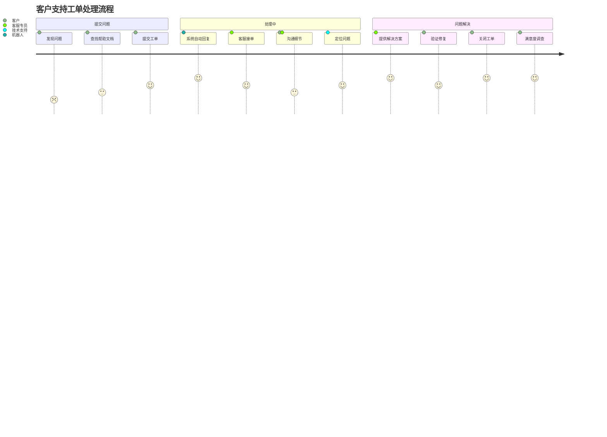
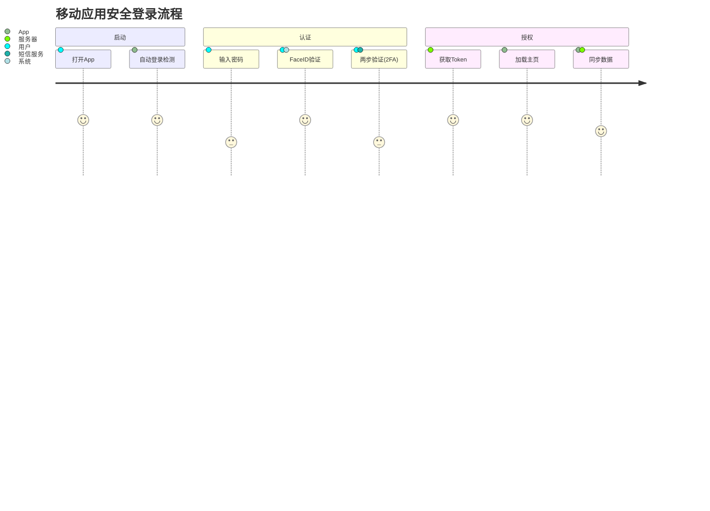
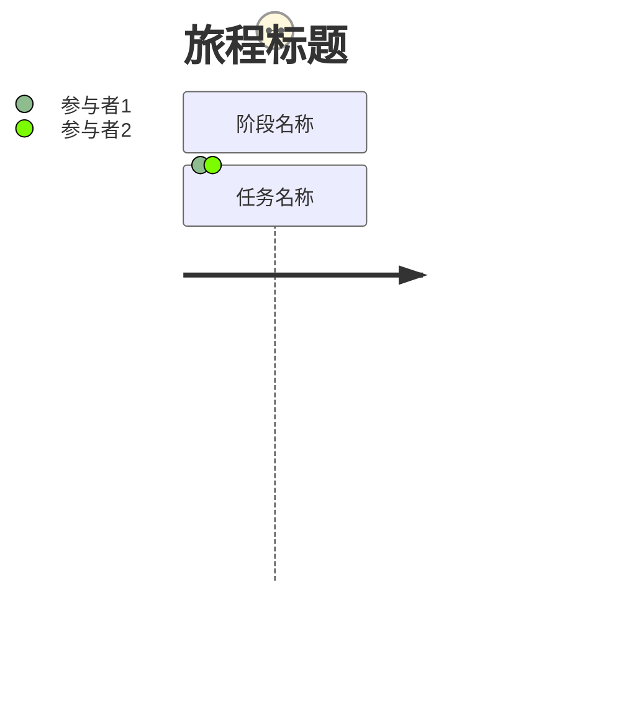

# User Journey 模板库

本文档提供 Mermaid User Journey Diagram (用户旅程图) 的标准模板，用于可视化用户体验、流程交互和满意度分析。

**适用场景**：
- 用户体验 (UX) 设计与分析
- 客户服务流程优化
- 产品功能交互流程
- 营销漏斗分析

---

## 模板1：电商购物旅程（评分：95分）⭐⭐⭐⭐⭐

**适用场景**：电商平台、在线购物、转化率分析

**特点**：
- 清晰的阶段划分（浏览、决策、售后）
- 包含多角色交互（用户、支付系统）
- 评分反映用户满意度/情绪曲线

---

## 模板2：新用户注册引导 (Onboarding)（评分：92分）⭐⭐⭐⭐

**适用场景**：SaaS产品、移动应用、新用户激活

**特点**：
- 关注用户从访客到新用户的身份转变
- 识别流程中的摩擦点（如填写表单、设置偏好评分较低）

---

## 模板3：客户服务工单流程（评分：90分）⭐⭐⭐⭐

**适用场景**：客服系统、IT支持、问题解决

**特点**：
- 涉及多个内部角色（机器人、客服、技术支持）
- 情绪曲线反映问题解决过程中的心情变化

---

## 模板4：移动应用登录与安全（评分：88分）⭐⭐⭐⭐

**适用场景**：App登录、安全性流程、多因素认证

**特点**：
- 侧重于交互细节和系统响应
- 对比了不同验证方式的体验差异（FaceID vs 密码/2FA）

---

## 语法参考

### 基本结构

### 评分说明
- **5**: 非常满意/轻松
- **4**: 满意/顺利
- **3**: 一般/中性
- **2**: 困难/沮丧
- **1**: 非常困难/愤怒

### 参与者
- 可以是用户角色（如：用户、管理员）
- 也可以是系统组件（如：服务器、数据库）
- 支持多个参与者，用逗号分隔
