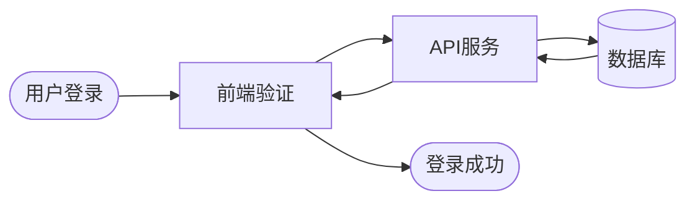
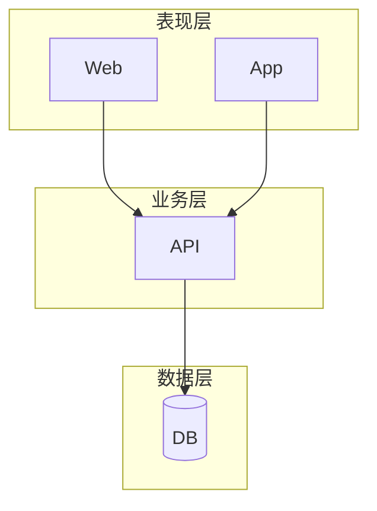
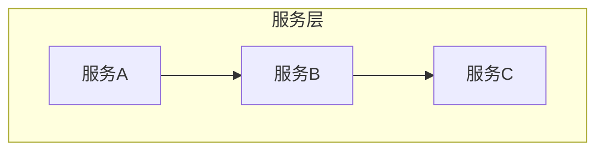
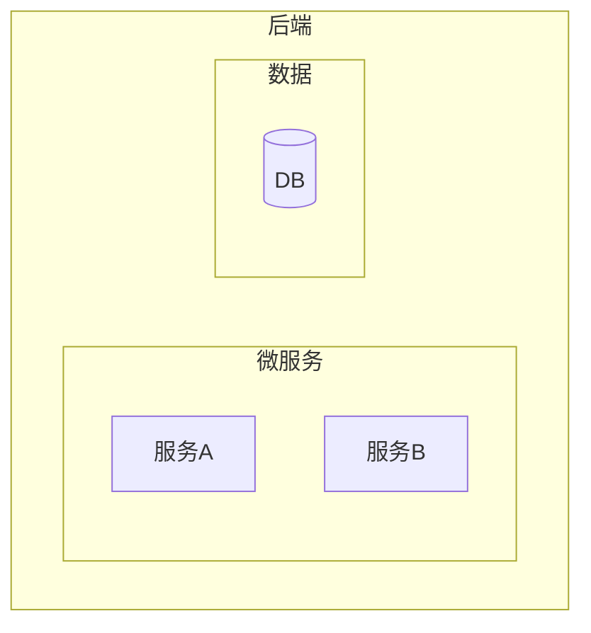
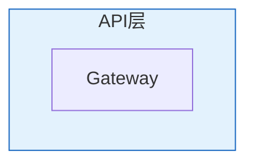
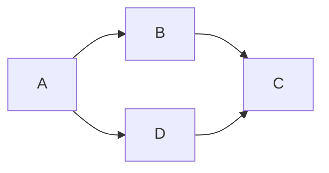
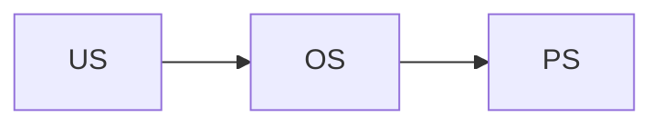
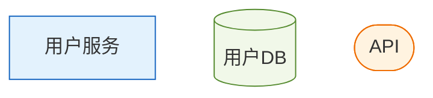

# Mermaid 最佳实践指南

本指南提供创建高质量 Mermaid 图表的最佳实践、常见陷阱和优化技巧。

## 目录

1. [核心原则](#核心原则)
2. [复杂度控制](#复杂度控制)
3. [布局优化](#布局优化)
4. [标签规范](#标签规范)
5. [样式一致性](#样式一致性)
6. [常见陷阱](#常见陷阱)
7. [性能优化](#性能优化)
8. [质量检查清单](#质量检查清单)

---

## 1. 核心原则

### 1. 简洁优先

> "能用10个节点说清楚的事，不要用20个"

**原则**：
- 每个节点都应有存在的意义
- 合并相似的节点
- 删除不必要的细节

**示例**：

❌ 过于详细：


✅ 简洁明了：


### 2. 层次清晰

使用 subgraph 创建清晰的逻辑分层。



### 3. 一致性

- 同类型节点使用相同形状
- 同级别节点使用相同样式
- 全图使用统一的命名规范

---

## 2. 复杂度控制

### 分级标准说明

本 Skill 使用**分级标准**来评估图表质量：

| 级别 | 节点数 | 标签长度 | 层次深度 | 用途 |
|------|--------|----------|----------|------|
| **推荐标准** | <20 | <10字 | <5层 | 追求高质量 |
| **最小要求** | <50 | <25字 | <6层 | 基本可用 |

**验证脚本使用方式**：
- 默认模式：检查最小要求（向后兼容）
- 严格模式：`--strict` 参数，使用推荐标准

```bash
# 默认模式（最小要求）
python3 scripts/validate_mermaid.py diagram.md

# 严格模式（推荐标准）
python3 scripts/validate_mermaid.py diagram.md --strict
```

### 节点数量限制

| 节点数 | 推荐标准 | 最小要求 |
|--------|----------|----------|
| 1-10 | ✅ 理想 | ✅ 理想 |
| 11-15 | ✅ 可接受 | ✅ 可接受 |
| 16-20 | ⚠️ 接近上限 | ✅ 可接受 |
| 21-49 | ⚠️ 建议拆分 | ⚠️ 接近上限 |
| 50+ | ❌ 必须拆分 | ❌ 必须拆分 |

### 层次深度限制

| 深度 | 推荐标准 | 最小要求 |
|------|----------|----------|
| 1-3 | ✅ 理想 | ✅ 理想 |
| 4 | ⚠️ 接近上限 | ✅ 可接受 |
| 5 | ⚠️ 接近上限 | ⚠️ 接近上限 |
| 6+ | ❌ 过于复杂 | ❌ 过于复杂 |

### 拆分策略

**策略1：按层次拆分**

将大图拆分为多个层次图：
- 总体架构图（全局视角）
- 各层详细图（局部视角）

**策略2：按模块拆分**

将大系统拆分为多个模块图：
- 用户模块图
- 订单模块图
- 支付模块图

**策略3：按时序拆分**

将长流程拆分为多个阶段图：
- 请求处理阶段
- 业务逻辑阶段
- 响应返回阶段

---

## 3. 布局优化

### 方向选择

| 内容类型 | 推荐方向 | 原因 |
|----------|----------|------|
| 层次结构 | TD/TB | 上下层级清晰 |
| 时间流程 | LR | 符合阅读习惯 |
| 数据流 | LR | 从源到目标 |
| 组织架构 | TD | 上下级关系 |

### subgraph 使用技巧

**技巧1：控制内部方向**


**技巧2：嵌套subgraph**


**技巧3：subgraph样式**


### 连接线优化

**减少交叉**：
- 调整节点顺序
- 使用invisible节点
- 合理利用方向

**示例**：使用invisible节点


---

## 4. 标签规范

### 长度控制

| 标签长度 | 建议 |
|----------|------|
| 1-5字 | ✅ 理想 |
| 6-10字 | ✅ 可接受 |
| 11-15字 | ⚠️ 略长 |
| 15+字 | ❌ 过长 |

### 标签简化技巧

**技巧1：使用缩写**
- `User Authentication` → `Auth`
- `Database Connection` → `DB Conn`

**技巧2：使用图例**


**技巧3：分层展示**

主图使用简称，详细说明放在子图或文档中。

### 命名规范

**规则**：
1. 使用有意义的ID（不要用A、B、C）
2. ID使用驼峰或下划线命名
3. 标签使用自然语言

**示例**：


---

## 5. 样式一致性

### 节点形状一致性

同类型组件使用相同形状：


### 颜色方案一致性

定义并复用颜色方案：



### 主题统一

整个项目使用统一的主题配置：

```mermaid
%%{init: {'theme':'default'}}%%
```

---

## 6. 常见陷阱

### 陷阱1：关键字冲突

**问题**：`end`、`class`、`click` 等是保留关键字

**错误**：
```mermaid
flowchart LR
    start --> end  %% ❌ end是关键字
```

**正确**：
```mermaid
flowchart LR
    start --> "end"  %% ✅ 用引号包裹
    start --> endNode  %% ✅ 或改用其他名称
```

### 陷阱2：特殊字符

**问题**：`(){}[]` 在标签中有特殊含义

**错误**：
```mermaid
flowchart LR
    A[函数()] --> B[对象{}]  %% ❌ 特殊字符
```

**正确**：
```mermaid
flowchart LR
    A["函数()"] --> B["对象{}"]  %% ✅ 用引号包裹
```

### 陷阱3：空格和缩进

**问题**：不一致的缩进可能导致解析错误

**建议**：
- 使用一致的缩进（2或4空格）
- subgraph内容缩进

### 陷阱4：废弃语法

**问题**：`graph` 已被 `flowchart` 取代

**错误**：
```mermaid
graph TD  %% ⚠️ 废弃语法
    A --> B
```

**正确**：
```mermaid
flowchart TD  %% ✅ 推荐语法
    A --> B
```

### 陷阱5：Unicode字符

**问题**：某些Unicode字符可能导致渲染问题

**建议**：
- 测试所有特殊字符
- 使用HTML实体作为备选

---

## 7. 性能优化

### 大型图表优化

**问题**：节点过多导致渲染缓慢

**解决方案**：

1. **减少节点数量**
   - 合并相似节点
   - 使用分层展示

2. **简化连接线**
   - 减少交叉
   - 避免过多虚线

3. **控制样式复杂度**
   - 减少自定义样式
   - 使用classDef复用

### 渲染超时处理

如果图表渲染超时：

1. 检查节点数量（目标<50）
2. 检查连接线复杂度
3. 拆分为多个图表

---

## 8. 质量检查清单

### 创建前检查

- [ ] 明确图表目的和受众
- [ ] 选择合适的图表类型
- [ ] 确定复杂度预算（节点数、层次）

### 创建中检查

- [ ] 配置主题
- [ ] 明确布局方向
- [ ] 使用语义化节点ID
- [ ] 保持标签简洁

### 创建后检查

**必须项**：
- [ ] 运行 validate_mermaid.py
- [ ] 语法验证通过
- [ ] 节点数 < 20
- [ ] 层次深度 < 5
- [ ] 标签长度 < 10字

**建议项**：
- [ ] 视觉评分 ≥ 80
- [ ] 使用subgraph分组
- [ ] 重要节点有样式突出
- [ ] 颜色使用协调

### 交付前检查

- [ ] 在目标环境中预览
- [ ] 检查文字是否清晰
- [ ] 检查颜色对比度
- [ ] 确认图表完整

---

## 9. 快速参考

### 常见问题速查

| 问题 | 解决方案 |
|------|----------|
| 关键字冲突 | 用引号包裹 |
| 特殊字符 | 用引号包裹 |
| 渲染失败 | 检查语法错误 |
| 布局混乱 | 使用subgraph |
| 节点太多 | 拆分图表 |
| 交叉太多 | 调整顺序/方向 |

### 质量目标

| 指标 | 目标值 |
|------|--------|
| 语法正确 | 100% |
| 视觉评分 | ≥80 |
| 节点数 | <20 |
| 标签长度 | <10字 |
| 层次深度 | <5 |
