# Mermaid 图表类型完全指南

本指南详细介绍 Mermaid 支持的所有图表类型，包括语法、使用场景和完整示例。

## 0. 目录

1. [Flowchart - 流程图](#1-flowchart---流程图)
2. [Sequence Diagram - 时序图](#2-sequence-diagram---时序图)
3. [Class Diagram - 类图](#3-class-diagram---类图)
4. [State Diagram - 状态图](#4-state-diagram---状态图)
5. [Gantt - 甘特图](#5-gantt---甘特图)
6. [ER Diagram - 实体关系图](#6-er-diagram---实体关系图)
7. [User Journey - 用户旅程图](#7-user-journey---用户旅程图)
8. [Pie Chart - 饼图](#8-pie-chart---饼图)
9. [Mindmap - 思维导图](#9-mindmap---思维导图)
10. [Timeline - 时间线](#10-timeline---时间线)
11. [v11+新图表类型](#11-v11新图表类型)

---

## 1. Flowchart - 流程图

### 适用场景

- 系统架构图
- 业务流程
- 算法逻辑
- 决策树
- 数据流

### 基本语法

**声明和方向**：
```mermaid
flowchart TD    %% 从上到下
flowchart LR    %% 从左到右
flowchart RL    %% 从右到左
flowchart BT    %% 从下到上
```

**节点形状**：
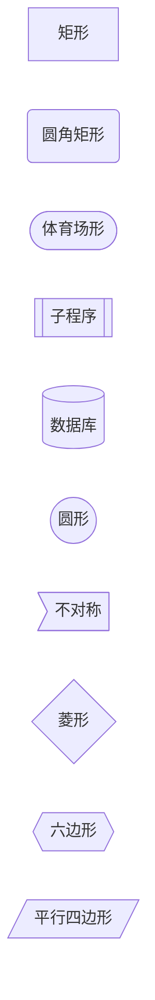

**连接线类型**：
```mermaid
flowchart LR
    A --> B       %% 箭头
    C --- D       %% 实线
    E -.- F       %% 虚线
    G ==> H       %% 粗箭头
    I --文字--> J  %% 带文字
    K -->|文字| L  %% 另一种带文字
```

### 完整示例

**系统架构图**：
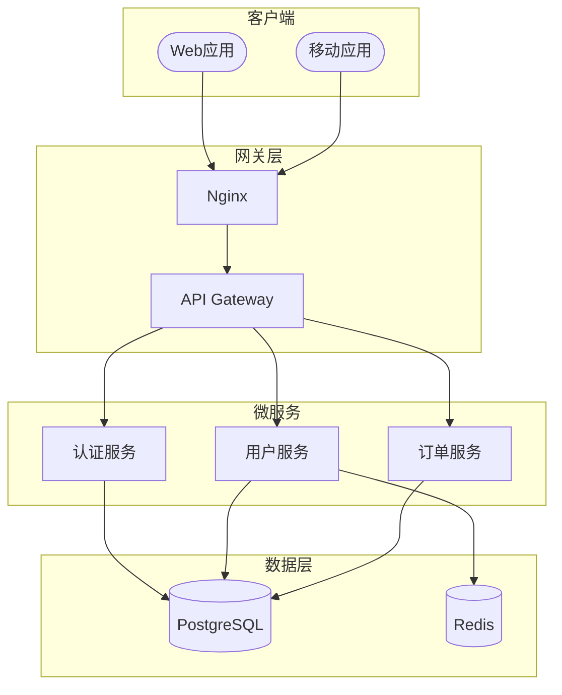

### 常见陷阱

1. **关键字冲突**：`end`、`class`、`click` 等需要用引号包裹
2. **特殊字符**：标签中的 `(){}[]` 需要用引号包裹
3. **废弃语法**：使用 `flowchart` 而非 `graph`

---

## 2. Sequence Diagram - 时序图

### 适用场景

- API 调用流程
- 对象间交互
- 协议通信
- 微服务调用链

### 基本语法

**参与者声明**：
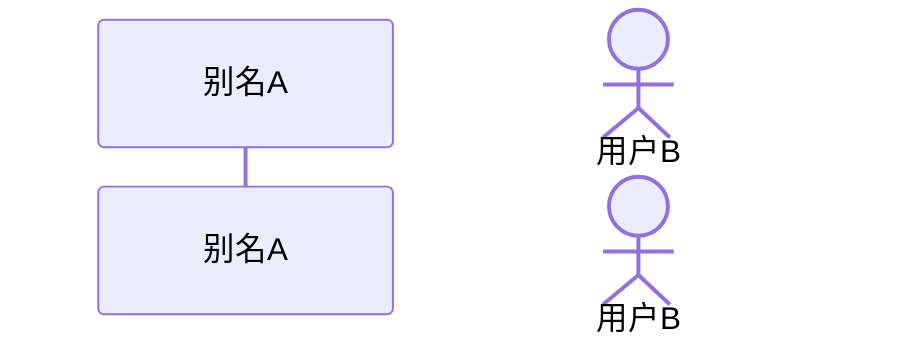

**消息类型**：
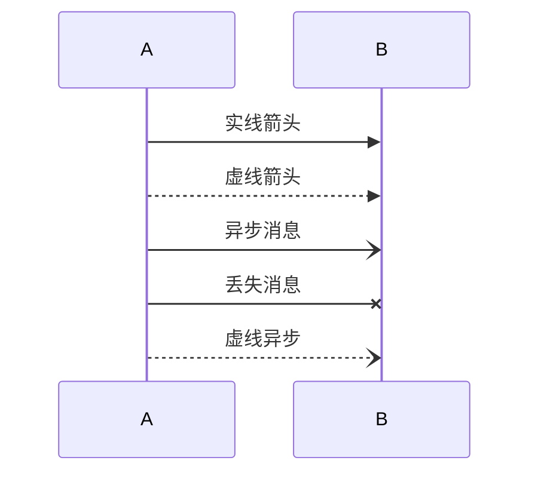

**激活和注释**：
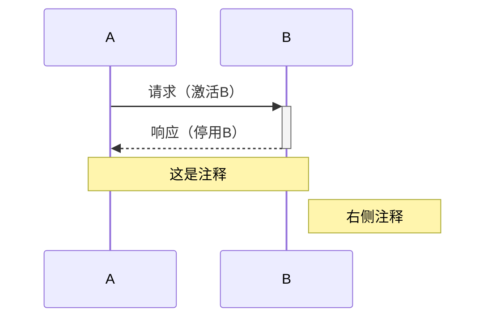

### 完整示例

**用户登录流程**：
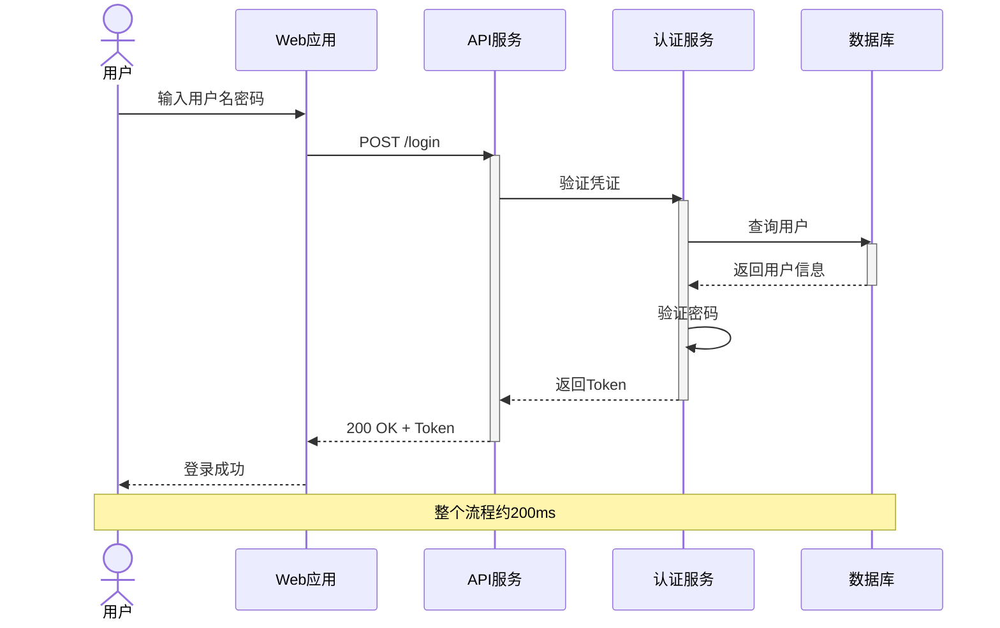

### 高级特性

**循环和条件**：
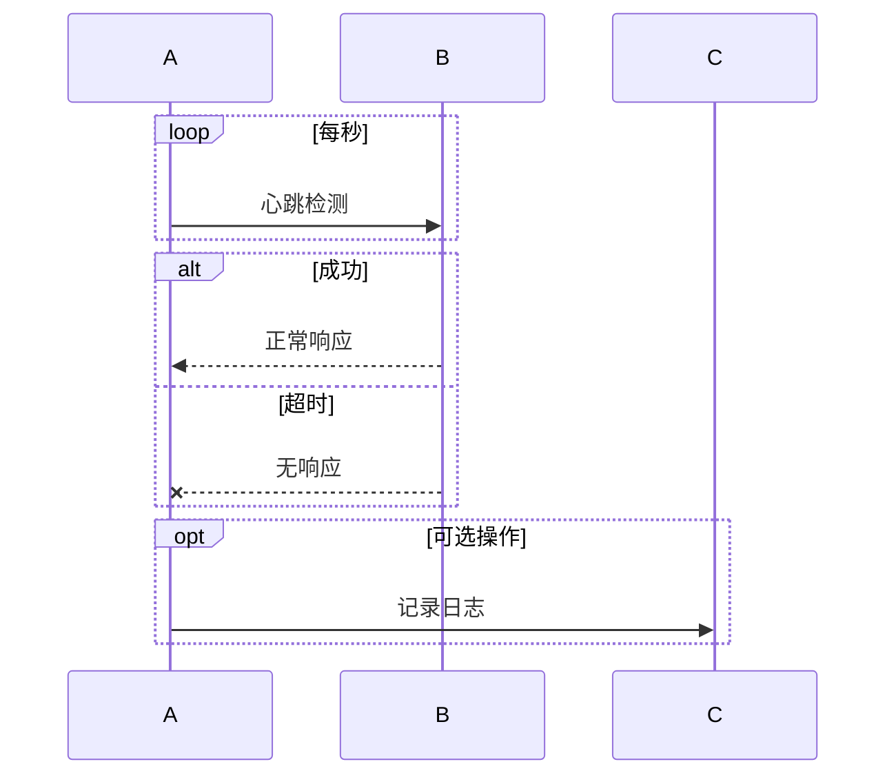

---

## 3. Class Diagram - 类图

### 适用场景

- 面向对象设计
- 数据模型
- API 接口定义
- 领域模型

### 基本语法

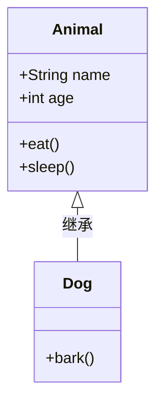

**关系类型**：
```
<|-- 继承
*-- 组合
o-- 聚合
--> 关联
-- 链接
..> 依赖
..|> 实现
```

### 完整示例

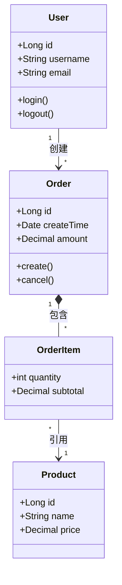

---

## 4. State Diagram - 状态图

### 适用场景

- 状态机设计
- 工作流状态
- 生命周期管理
- 订单状态流转

### 基本语法

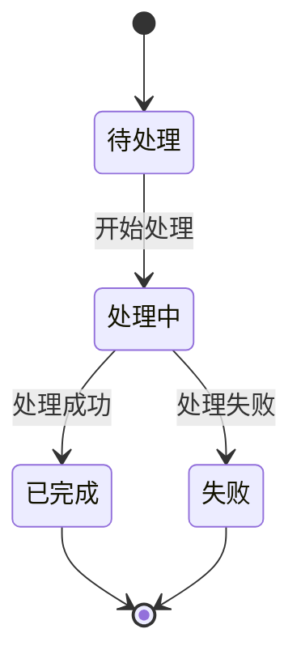

### 完整示例

**订单状态流转**：
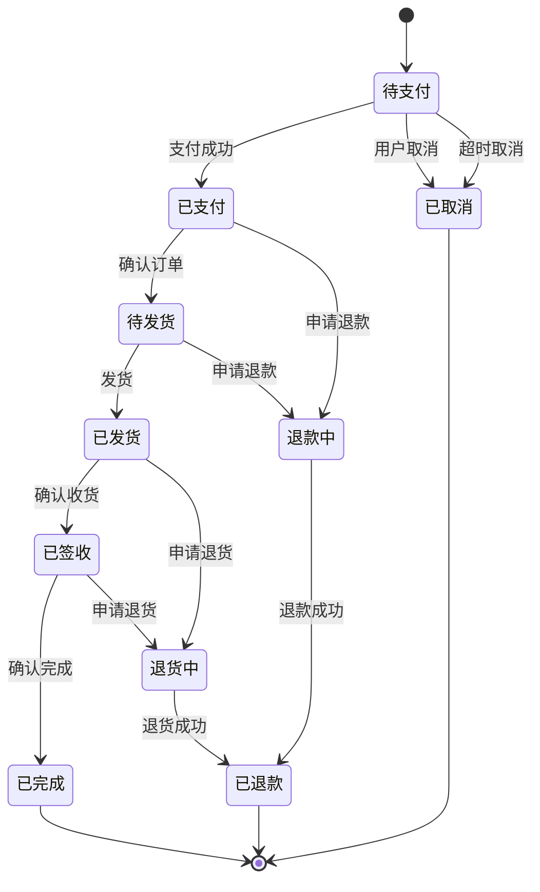

---

## 5. Gantt - 甘特图

### 适用场景

- 项目计划
- 任务排期
- 里程碑管理
- 资源分配

### 基本语法

```mermaid
gantt
    title 项目标题
    dateFormat YYYY-MM-DD
    
    section 阶段名称
    任务名称 :状态, id, 开始日期, 结束日期或持续时间
```

**任务状态**：
- `done` - 已完成
- `active` - 进行中
- `crit` - 关键任务
- 无状态 - 待开始

### 完整示例

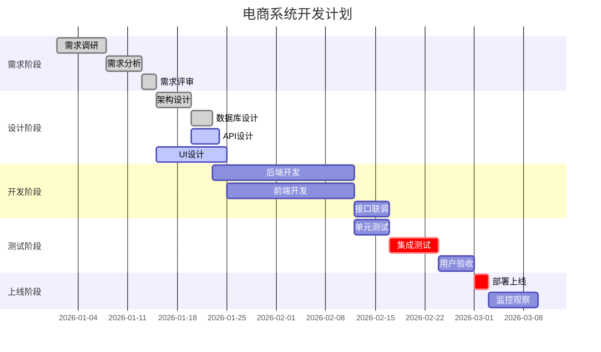

---

## 6. ER Diagram - 实体关系图

### 适用场景

- 数据库设计
- 数据模型
- 实体关系分析

### 基本语法

**关系符号**：
```
||--|| 一对一
||--o{ 一对多
}o--o{ 多对多
||--o| 一对零或一
```

### 完整示例

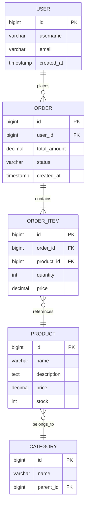

---

## 7. User Journey - 用户旅程图

### 适用场景

- 用户体验分析
- 服务设计
- 流程优化

### 基本语法

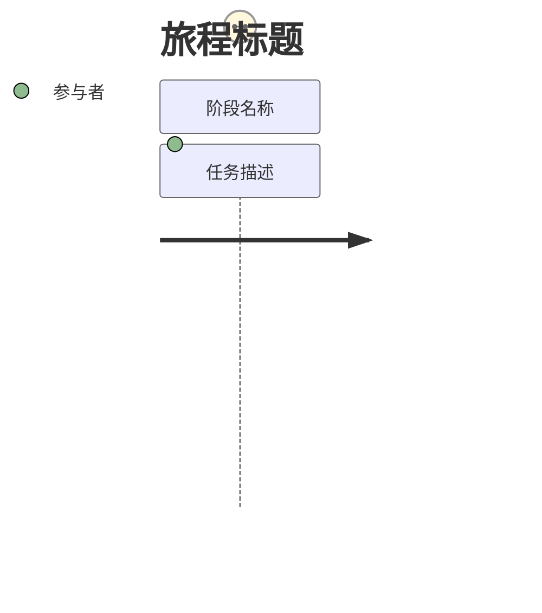

### 完整示例

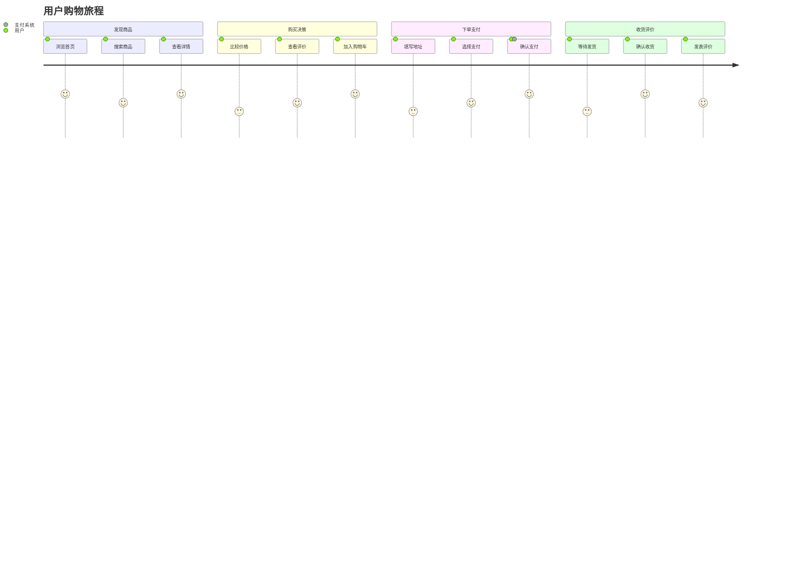

---

## 8. Pie Chart - 饼图

### 适用场景

- 占比展示
- 数据分布
- 统计报告

### 基本语法

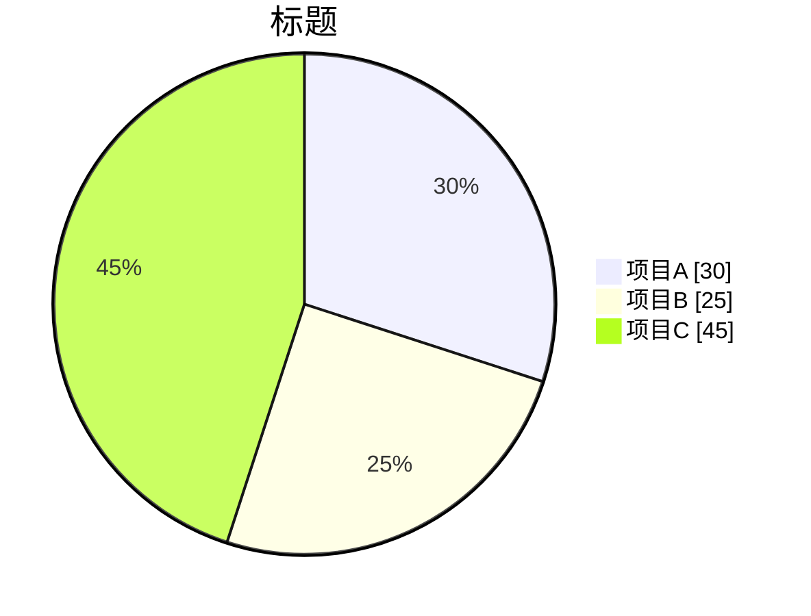

### 完整示例

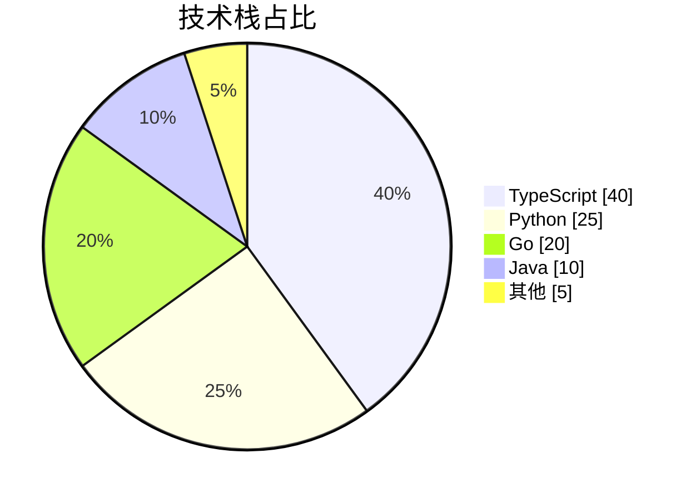

---

## 9. Mindmap - 思维导图

### 适用场景

- 知识整理
- 头脑风暴
- 概念梳理

### 基本语法

```mermaid
mindmap
  root((中心主题))
    分支1
      子分支1.1
      子分支1.2
    分支2
      子分支2.1
```

### 完整示例

```mermaid
mindmap
  root((系统架构))
    前端
      Web应用
        React
        Vue
      移动应用
        iOS
        Android
    后端
      微服务
        用户服务
        订单服务
        支付服务
      网关
        Nginx
        Kong
    数据
      关系型
        PostgreSQL
        MySQL
      NoSQL
        Redis
        MongoDB
```

---

## 10. Timeline - 时间线

### 适用场景

- 历史事件
- 版本发布
- 项目里程碑

### 基本语法

```mermaid
timeline
    title 标题
    时间点1 : 事件描述
    时间点2 : 事件描述
```

### 完整示例

```mermaid
timeline
    title 产品发展历程
    
    2020 : 项目启动
         : 完成MVP开发
    
    2021 : 发布1.0版本
         : 用户突破1万
         : 获得A轮融资
    
    2022 : 发布2.0版本
         : 支持多语言
         : 用户突破10万
    
    2023 : 发布3.0版本
         : 引入AI功能
         : 获得B轮融资
```

---

## 11. v11+新图表类型

### Architecture Diagram 🔥

系统架构可视化，v11+新增。

```mermaid
architecture-beta
    group api(cloud)[API]

    service db(database)[Database] in api
    service disk1(disk)[Storage] in api
    service server(server)[Server] in api

    db:L -- R:server
    disk1:T -- B:server
```

### Kanban Board 🔥

看板图，v11+新增。

```mermaid
kanban
    Todo
        task1[任务1]
        task2[任务2]
    In Progress
        task3[任务3]
    Done
        task4[任务4]
```

### Block Diagram 🔥

块状图，v11+新增。

```mermaid
block-beta
    columns 3
    
    A["前端"]:1
    B["网关"]:1
    C["服务"]:1
    
    D["数据库"]:3
```

### XY Chart 🔥

坐标图，v11+新增。

```mermaid
xychart-beta
    title "月度销售额"
    x-axis [Jan, Feb, Mar, Apr, May]
    y-axis "销售额(万)" 0 --> 100
    bar [30, 45, 60, 55, 80]
    line [30, 45, 60, 55, 80]
```

---

## 12. 图表类型选择指南

| 需求 | 推荐类型 | 备选类型 |
|------|----------|----------|
| 系统架构 | Flowchart | Architecture |
| API调用流程 | Sequence Diagram | Flowchart |
| 数据模型 | ER Diagram | Class Diagram |
| 状态流转 | State Diagram | Flowchart |
| 项目计划 | Gantt | Timeline |
| 用户体验 | User Journey | Flowchart |
| 知识整理 | Mindmap | Flowchart |
| 数据占比 | Pie Chart | XY Chart |
| 任务管理 | Kanban | Gantt |
