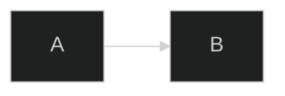
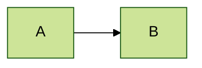
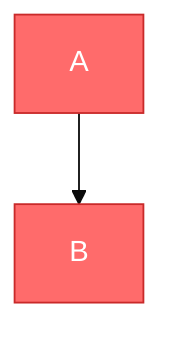
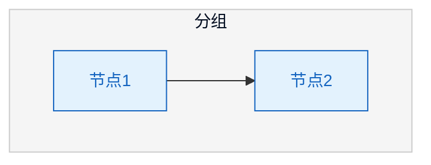
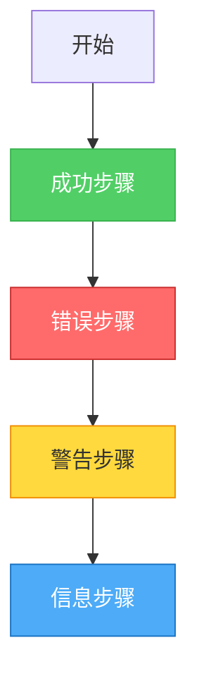
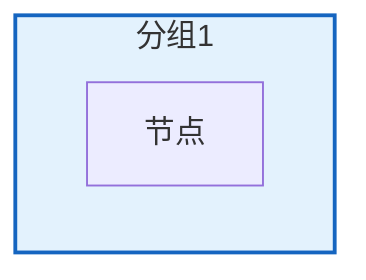
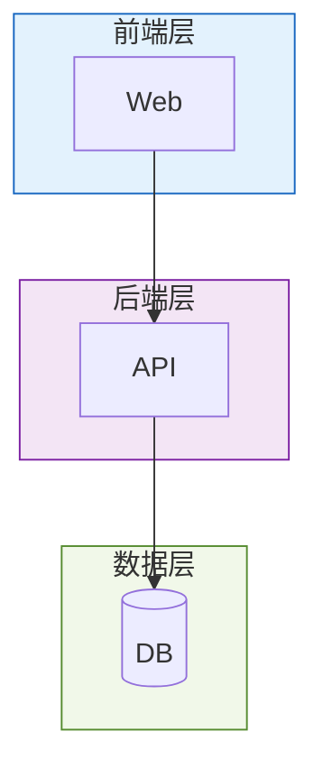
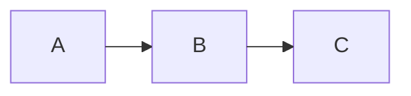

# Mermaid 样式与主题配置指南

详细介绍 Mermaid 的主题配置和样式定制方法。

---

## 1. 主题系统

### 内置主题

Mermaid 提供4个内置主题：

| 主题 | 说明 | 配色风格 |
|------|------|----------|
| `default` | 默认主题 | 蓝色系、专业 |
| `dark` | 深色主题 | 深色背景、高对比 |
| `forest` | 森林主题 | 绿色系、自然 |
| `neutral` | 中性主题 | 灰色系、极简 |

### 主题配置方式

**方式1：init指令**


**方式2：Frontmatter (v11+)**


**方式3：带变量的主题**


---

## 2. 主题变量

### 通用变量

| 变量 | 说明 | 示例值 |
|------|------|--------|
| `primaryColor` | 主色 | `#4dabf7` |
| `primaryTextColor` | 主色上的文字 | `#fff` |
| `primaryBorderColor` | 主色边框 | `#1971c2` |
| `secondaryColor` | 副色 | `#51cf66` |
| `tertiaryColor` | 第三色 | `#ffd93d` |
| `background` | 背景色 | `#ffffff` |
| `mainBkg` | 主背景 | `#f5f5f5` |
| `lineColor` | 连线颜色 | `#333333` |
| `textColor` | 文字颜色 | `#333333` |
| `fontSize` | 字体大小 | `16px` |
| `fontFamily` | 字体 | `Arial` |

### Flowchart 专用变量

| 变量 | 说明 |
|------|------|
| `nodeBorder` | 节点边框颜色 |
| `nodeTextColor` | 节点文字颜色 |
| `clusterBkg` | subgraph背景 |
| `clusterBorder` | subgraph边框 |
| `edgeLabelBackground` | 边标签背景 |

### Sequence Diagram 专用变量

| 变量 | 说明 |
|------|------|
| `actorBkg` | 参与者背景 |
| `actorBorder` | 参与者边框 |
| `actorTextColor` | 参与者文字 |
| `activationBkg` | 激活框背景 |
| `signalColor` | 信号线颜色 |
| `loopTextColor` | 循环文字颜色 |

### 完整主题配置示例



---

## 3. 节点样式

### style 语法

```mermaid
flowchart LR
    A[节点A]
    style A fill:#颜色,stroke:#边框,stroke-width:宽度,color:#文字色
```

### 常用样式属性

| 属性 | 说明 | 示例 |
|------|------|------|
| `fill` | 填充色 | `fill:#ff6b6b` |
| `stroke` | 边框色 | `stroke:#c92a2a` |
| `stroke-width` | 边框宽度 | `stroke-width:3px` |
| `color` | 文字颜色 | `color:#ffffff` |
| `stroke-dasharray` | 虚线边框 | `stroke-dasharray:5 5` |

### 样式示例

**成功状态**：
```mermaid
style nodeId fill:#51cf66,stroke:#37b24d,color:#fff
```

**错误状态**：
```mermaid
style nodeId fill:#ff6b6b,stroke:#c92a2a,color:#fff
```

**警告状态**：
```mermaid
style nodeId fill:#ffd93d,stroke:#f08c00
```

**信息状态**：
```mermaid
style nodeId fill:#4dabf7,stroke:#1971c2,color:#fff
```

**粗边框**：
```mermaid
style nodeId stroke-width:3px
```

**虚线边框**：
```mermaid
style nodeId stroke-dasharray:5 5
```

---

## 4. classDef 类定义

### 语法

```mermaid
flowchart LR
    classDef 类名 fill:#颜色,stroke:#边框
    A[节点]:::类名
    B[节点]
    class B 类名
```

### 使用示例



---

## 5. subgraph 样式

### 样式配置



### 分层配色方案



---

## 6. v11+ 新特性

### look 配置

v11+ 支持不同的视觉风格：


可用的 look 值：
- `classic` - 经典风格（默认）
- `handDrawn` - 手绘风格

### 布局引擎



可用的 layout 值：
- `dagre` - 默认布局
- `elk` - ELK布局（需要额外配置）

### ELK 高级配置


---

## 7. 预设配色方案

### 方案1：企业蓝

```mermaid
%%{init: {
  'theme': 'base',
  'themeVariables': {
    'primaryColor': '#1a73e8',
    'primaryTextColor': '#ffffff',
    'primaryBorderColor': '#1557b0',
    'secondaryColor': '#e8f0fe',
    'lineColor': '#5f6368',
    'textColor': '#202124'
  }
}}%%
```

### 方案2：自然绿

```mermaid
%%{init: {
  'theme': 'base',
  'themeVariables': {
    'primaryColor': '#2e7d32',
    'primaryTextColor': '#ffffff',
    'primaryBorderColor': '#1b5e20',
    'secondaryColor': '#e8f5e9',
    'lineColor': '#4caf50',
    'textColor': '#1b5e20'
  }
}}%%
```

### 方案3：暖橙色

```mermaid
%%{init: {
  'theme': 'base',
  'themeVariables': {
    'primaryColor': '#ff6f00',
    'primaryTextColor': '#ffffff',
    'primaryBorderColor': '#e65100',
    'secondaryColor': '#fff3e0',
    'lineColor': '#ff9800',
    'textColor': '#e65100'
  }
}}%%
```

### 方案4：深色模式

```mermaid
%%{init: {
  'theme': 'dark',
  'themeVariables': {
    'primaryColor': '#bb86fc',
    'primaryTextColor': '#000000',
    'primaryBorderColor': '#bb86fc',
    'background': '#121212',
    'mainBkg': '#1e1e1e',
    'lineColor': '#bb86fc',
    'textColor': '#e1e1e1'
  }
}}%%
```

---

## 8. 样式最佳实践

### 1. 保持一致性

同类型组件使用相同样式。

### 2. 使用 classDef 复用

避免重复定义样式，使用 classDef 统一管理。

### 3. 控制颜色数量

一个图表不超过5种主要颜色。

### 4. 确保可读性

- 深色背景配浅色文字
- 浅色背景配深色文字
- 确保足够的对比度

### 5. 语义化颜色

使用符合直觉的颜色：
- 绿色 = 成功/正常
- 红色 = 错误/危险
- 黄色 = 警告/注意
- 蓝色 = 信息/说明

---

## 9. 常见问题

### 样式不生效

1. 检查语法是否正确
2. 确认节点ID是否匹配
3. 检查是否有冲突的样式

### 主题变量不生效

1. 确认使用 `'theme': 'base'`
2. 检查变量名是否正确
3. 确认JSON格式正确

### 颜色显示异常

1. 使用标准HEX颜色格式
2. 避免使用透明度（部分渲染器不支持）
3. 测试在目标环境中的显示效果
