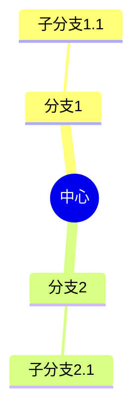
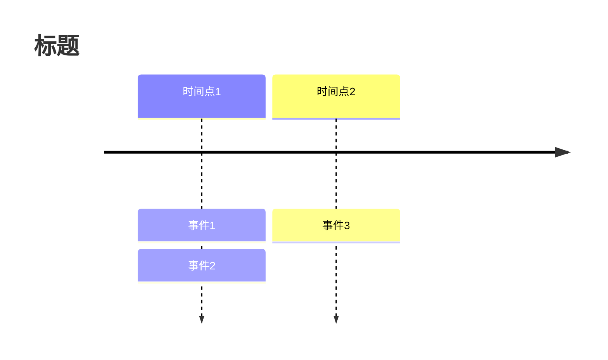
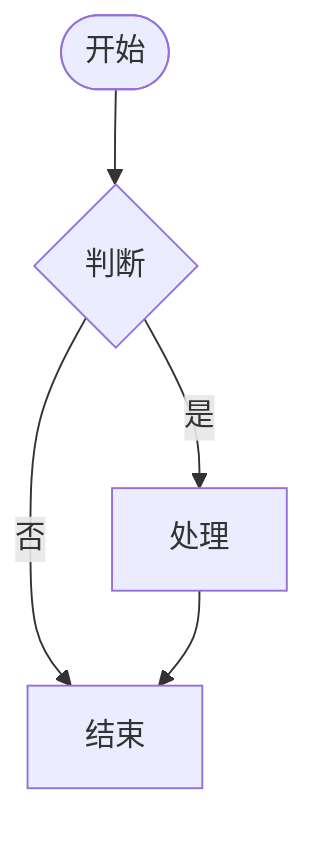
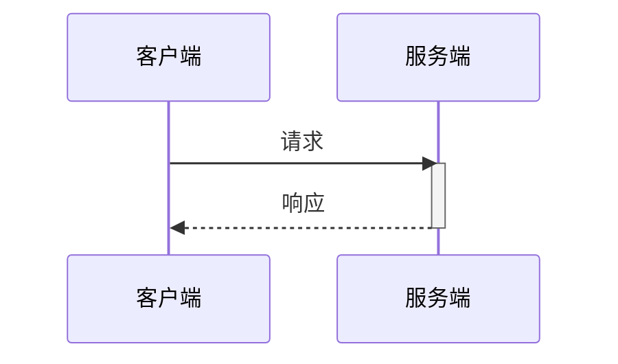
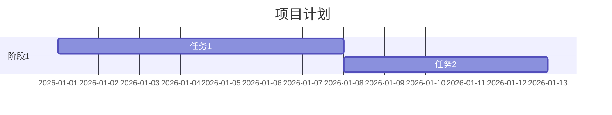

# Mermaid 语法速查手册

快速查阅 Mermaid 各类图表的语法要点。

---

## 1. Flowchart 流程图

### 声明

```mermaid
flowchart TD    %% 从上到下
flowchart LR    %% 从左到右
flowchart RL    %% 从右到左
flowchart BT    %% 从下到上
```

### 节点形状

```
[文字]      矩形
(文字)      圆角矩形
([文字])    体育场形
[[文字]]    子程序
[(文字)]    圆柱形（数据库）
((文字))    圆形
{文字}      菱形
{{文字}}    六边形
[/文字/]    平行四边形
[\文字\]    平行四边形（反）
[/文字\]    梯形
[\文字/]    梯形（反）
>文字]      不对称形状
(((文字)))  双圆形
```

### 连接线

```
A --> B     实线箭头
A --- B     实线
A -.- B     虚线
A -.-> B    虚线箭头
A ==> B     粗线箭头
A === B     粗线
A --文字--> B    带文字实线箭头
A ---|文字| B    带文字实线
A -.文字.-> B    带文字虚线箭头
A -->|文字| B    另一种带文字写法
```

### 分组

```mermaid
subgraph 名称[显示标题]
    direction LR    %% 内部方向
    节点定义...
end
```

### 样式

```mermaid
style 节点ID fill:#颜色,stroke:#边框色,stroke-width:3px,color:#文字色

classDef 类名 fill:#颜色,stroke:#边框色
节点ID:::类名
```

---

## 2. Sequence Diagram 时序图

### 声明

```mermaid
sequenceDiagram
```

### 参与者

```
participant A as 别名
actor B as 用户角色
```

### 消息

```
A->>B      实线箭头
A-->>B     虚线箭头
A-)B       异步（开放箭头）
A--)B      异步虚线
A-xB       丢失消息
A--xB      丢失消息虚线
```

### 激活

```
activate A
deactivate A
A->>+B     发送时激活B
B-->>-A    返回时停用B
```

### 注释

```
Note left of A: 左侧注释
Note right of A: 右侧注释
Note over A: 上方注释
Note over A,B: 跨越注释
```

### 逻辑块

```
loop 循环条件
    消息...
end

alt 条件1
    消息...
else 条件2
    消息...
end

opt 可选条件
    消息...
end

par 并行1
    消息...
and 并行2
    消息...
end
```

---

## 3. Class Diagram 类图

### 声明

```mermaid
classDiagram
```

### 类定义

```
class 类名 {
    +String 公有属性
    -int 私有属性
    #float 保护属性
    ~double 包级属性
    +publicMethod()
    -privateMethod()
    +methodWithReturn() String
    +methodWithParams(int a, String b)
}
```

### 关系

```
A <|-- B    继承
A *-- B     组合
A o-- B     聚合
A --> B     关联
A -- B      链接
A ..> B     依赖
A ..|> B    实现
```

### 多重性

```
A "1" --> "*" B     一对多
A "1" --> "0..1" B  一对零或一
A "n" --> "m" B     n对m
```

---

## 4. State Diagram 状态图

### 声明

```mermaid
stateDiagram-v2
```

### 状态

```
[*] --> 状态1          开始
状态1 --> 状态2        转换
状态2 --> [*]          结束
状态1 --> 状态2: 事件   带事件的转换
```

### 复合状态

```
state 复合状态名 {
    [*] --> 子状态1
    子状态1 --> 子状态2
}
```

### 并发状态

```
state 并发 {
    [*] --> A
    --
    [*] --> B
}
```

### 分支和合并

```
state fork_state <<fork>>
state join_state <<join>>
```

---

## 5. Gantt 甘特图

### 声明

```mermaid
gantt
    title 图表标题
    dateFormat YYYY-MM-DD
```

### 任务

```
section 阶段名称
任务名称 :状态, id, 开始日期, 结束日期
任务名称 :状态, id, 开始日期, 持续天数d
任务名称 :状态, id, after 前置id, 持续天数d
```

### 状态

```
done        已完成
active      进行中
crit        关键任务
(无)        未开始
```

### 日期格式

```
dateFormat YYYY-MM-DD     2026-01-15
dateFormat DD-MM-YYYY     15-01-2026
dateFormat YYYY-MM-DD HH:mm
```

---

## 6. ER Diagram 实体关系图

### 声明

```mermaid
erDiagram
```

### 实体

```
ENTITY {
    type name PK "主键"
    type name FK "外键"
    type name UK "唯一键"
    type name    "普通字段"
}
```

### 关系

```
A ||--|| B    一对一
A ||--o{ B    一对多
A }o--o{ B    多对多
A ||--o| B    一对零或一
```

---

## 7. Pie Chart 饼图


---

## 8. Mindmap 思维导图



---

## 9. Timeline 时间线



---

## 10. 通用配置

### 主题

```mermaid
%%{init: {'theme':'default'}}%%
%%{init: {'theme':'dark'}}%%
%%{init: {'theme':'forest'}}%%
%%{init: {'theme':'neutral'}}%%
```

### Frontmatter (v11+)


### 注释

```
%% 这是注释
```

---

## 11. 快速模板

### Flowchart



### Sequence



### Gantt


