# Mermaid v11+ 新特性指南

本指南介绍 Mermaid v11 及以上版本的新功能和改进。

---

## 1. 版本概述

Mermaid v11 引入了多项重要更新：

- 🆕 新图表类型（Architecture、Kanban、Block等）
- 🎨 新的视觉风格（handDrawn look）
- ⚙️ 改进的布局引擎（ELK支持）
- 📝 Frontmatter 配置语法
- 🔧 更好的主题定制能力

---

## 2. 新图表类型

### 1. Architecture Diagram 🔥

系统架构的专业可视化，支持云服务图标。

**语法**：
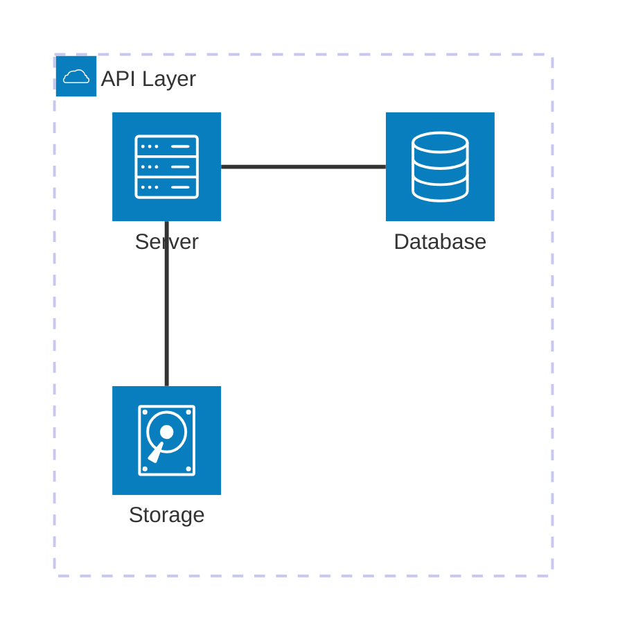

**图标类型**：
- `cloud` - 云
- `database` - 数据库
- `disk` - 存储
- `server` - 服务器
- `internet` - 互联网

**连接语法**：
```
服务1:方向 -- 方向:服务2
方向：L(左), R(右), T(上), B(下)
```

**示例：云架构**：
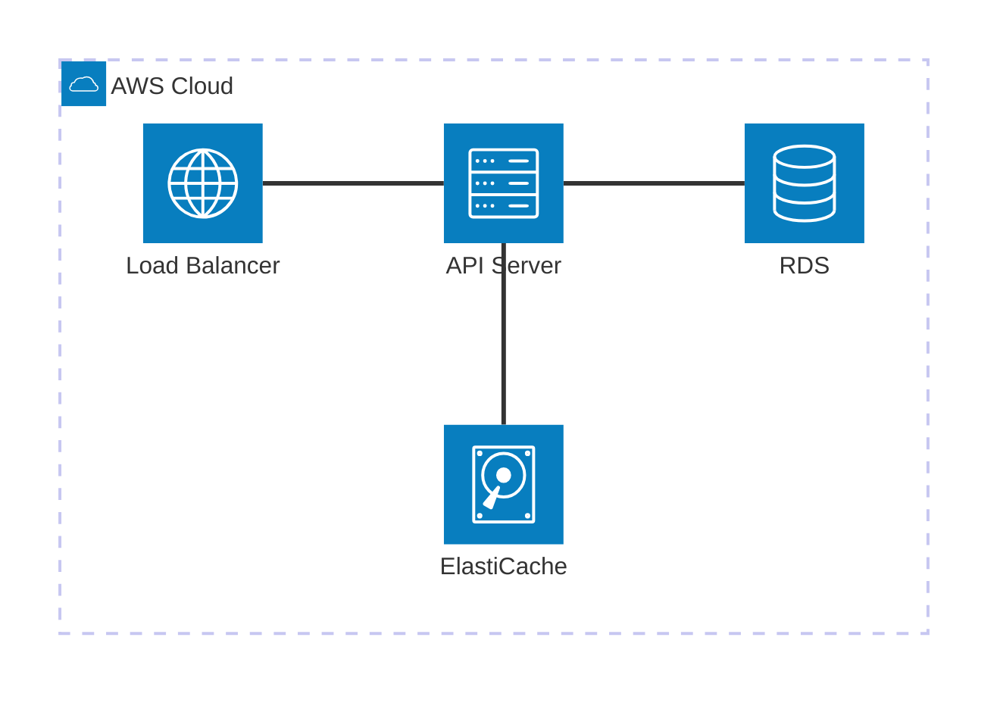

---

### 2. Kanban Board 🔥

看板式任务管理可视化。

**基本语法**：
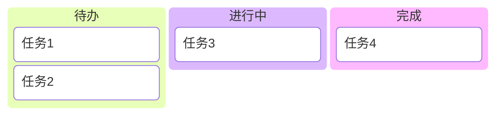

**示例：项目看板**：
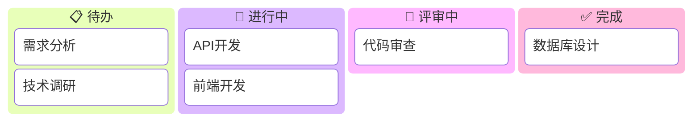

---

### 3. Block Diagram 🔥

块状图，适合展示系统组件和它们的关系。

**基本语法**：
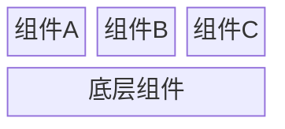

**列数控制**：
- `columns N` - 设置列数
- `:N` - 跨越N列

**示例：系统层次**：
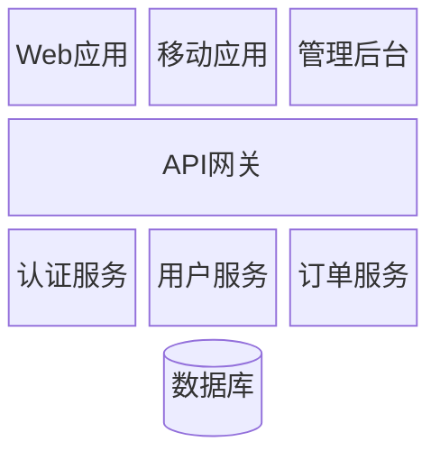

---

### 4. XY Chart 🔥

支持柱状图和折线图的坐标图表。

**基本语法**：
```mermaid
xychart-beta
    title "图表标题"
    x-axis [类别1, 类别2, 类别3]
    y-axis "Y轴标签" 0 --> 100
    bar [30, 50, 70]
    line [25, 55, 65]
```

**示例：销售数据**：
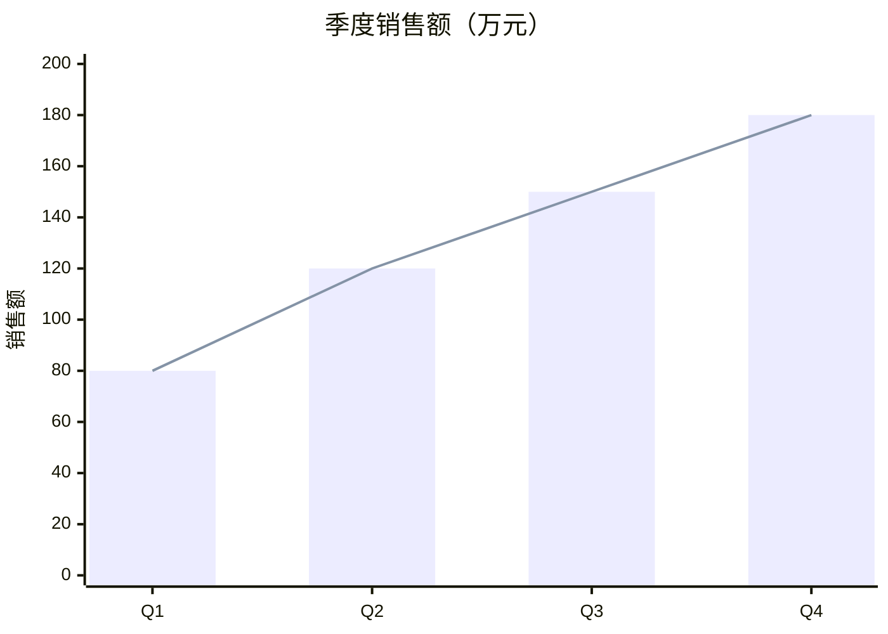

---

### 5. Packet Diagram 🔥

网络数据包结构可视化。

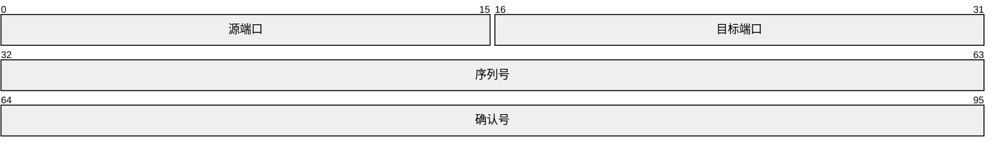

---

### 6. Sankey Diagram 🔥

桑基图，展示流量/能量流动。

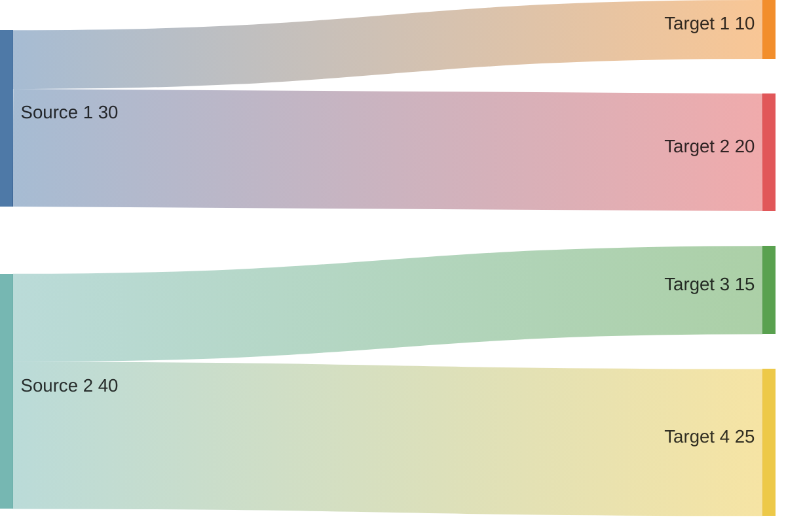

---

## 3. 新视觉风格

### handDrawn Look

v11+ 支持手绘风格，使图表看起来更加亲和。

**配置方式**：


**可用值**：
- `classic` - 经典风格（默认）
- `handDrawn` - 手绘风格

**适用场景**：
- 头脑风暴
- 概念草图
- 非正式文档
- 教学材料

---

## 4. Frontmatter 配置

### 基本语法


### 完整配置示例

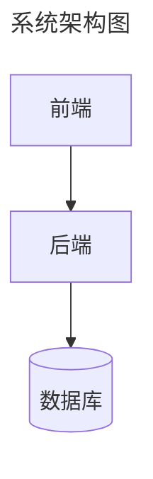

### 配置选项

```yaml
config:
  # 全局配置
  theme: default|dark|forest|neutral
  look: classic|handDrawn
  layout: dagre|elk
  
  # 流程图配置
  flowchart:
    htmlLabels: true|false
    curve: basis|linear|stepBefore|stepAfter
    padding: 10
    nodeSpacing: 50
    rankSpacing: 50
    
  # 时序图配置
  sequence:
    actorMargin: 50
    messageMargin: 50
    boxMargin: 10
```

---

## 5. ELK 布局引擎

### 启用 ELK

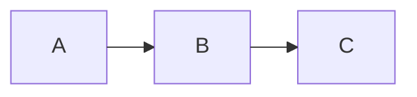

### ELK 配置选项


**nodePlacementStrategy 选项**：
- `SIMPLE`
- `NETWORK_SIMPLEX`
- `LINEAR_SEGMENTS`
- `BRANDES_KOEPF`（默认）

### ELK vs Dagre

| 特性 | Dagre | ELK |
|------|-------|-----|
| 默认支持 | ✅ | 需配置 |
| 复杂图表 | 一般 | 更好 |
| 边缘合并 | ❌ | ✅ |
| 自定义选项 | 少 | 多 |
| 性能 | 快 | 较慢 |

---

## 6. 改进的功能

### 1. 更好的主题定制

v11 增强了主题变量系统：

```mermaid
%%{init: {
  'theme': 'base',
  'themeVariables': {
    'primaryColor': '#ff6b6b',
    'primaryTextColor': '#fff',
    'primaryBorderColor': '#c92a2a',
    'lineColor': '#333',
    'fontSize': '16px',
    'fontFamily': 'Arial'
  }
}}%%
```

### 2. 改进的 Flowchart

**新节点形状**：
```mermaid
flowchart LR
    A@{ shape: rect }
    B@{ shape: rounded }
    C@{ shape: stadium }
    D@{ shape: subroutine }
    E@{ shape: cylinder }
    F@{ shape: circle }
    G@{ shape: asymmetric }
    H@{ shape: rhombus }
    I@{ shape: hexagon }
```

### 3. 图标支持

v11+ 支持在节点中使用图标：

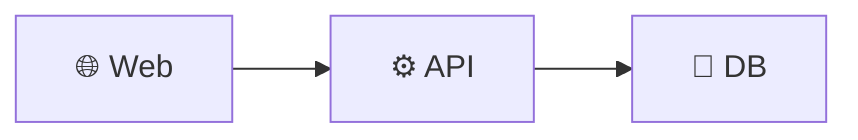

---

## 7. 迁移指南

### 从 v10 迁移到 v11

**1. 语法兼容性**

大部分 v10 语法在 v11 中继续有效。

**2. 废弃警告**

- `graph` 关键字 → 使用 `flowchart`
- 旧的配置方式 → 使用 Frontmatter

**3. 新特性使用**

```mermaid
%% v10 方式
%%{init: {'theme':'dark'}}%%

%% v11 推荐方式
---
config:
  theme: dark
---
```

---

## 8. 浏览器/环境支持

### 支持的环境

| 环境 | 支持情况 |
|------|----------|
| Chrome 90+ | ✅ 完全支持 |
| Firefox 88+ | ✅ 完全支持 |
| Safari 14+ | ✅ 完全支持 |
| Edge 90+ | ✅ 完全支持 |
| Node.js 16+ | ✅ 完全支持 |

### CLI 使用

```bash
# 安装
npm install -g @mermaid-js/mermaid-cli

# 使用 v11 特性
mmdc -i input.mmd -o output.svg

# 指定配置
mmdc -i input.mmd -o output.svg -c config.json
```

---

## 9. 示例集合

### 完整的现代架构图

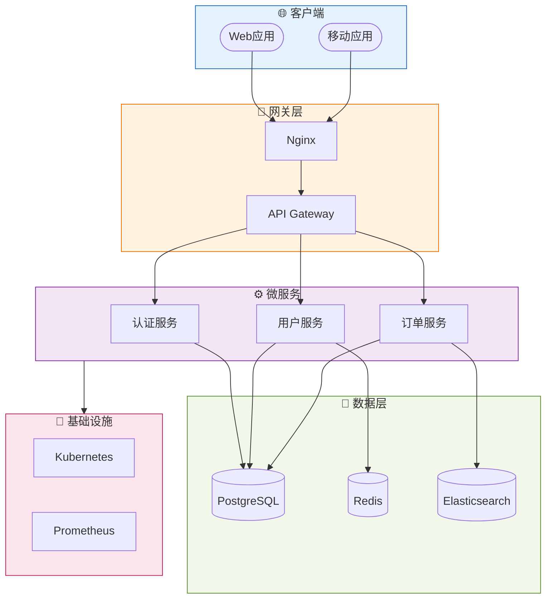

---

## 10. 资源链接

- [Mermaid 官方文档](https://mermaid.js.org/)
- [Mermaid Live Editor](https://mermaid.live/)
- [GitHub 仓库](https://github.com/mermaid-js/mermaid)
- [更新日志](https://github.com/mermaid-js/mermaid/releases)
