# Mermaid 视觉设计指南

本指南提供配色方案、节点形状语义、布局原则和视觉优化案例，帮助创建美观专业的图表。

## 0. 目录

1. [主题选择](#主题选择)
2. [配色方案](#配色方案)
3. [节点形状语义](#节点形状语义)
4. [布局方向选择](#布局方向选择)
5. [视觉优化技巧](#视觉优化技巧)
6. [优化案例分析](#优化案例分析)

---

## 1. 主题选择

### 内置主题对比

| 主题 | 特点 | 适用场景 |
|------|------|----------|
| **default** | 蓝色系、专业、清晰 | 技术文档、博客、通用场景 |
| **dark** | 深色背景、对比强烈 | 演示文稿、深色主题网站 |
| **forest** | 绿色系、自然清新 | 环保主题、自然风格文档 |
| **neutral** | 灰色系、极简 | 正式报告、简约风格 |

### 主题选择决策树

```
使用场景？
├─ 技术文档/博客 → default（通用、专业）
├─ 演示文稿/暗色背景 → dark（对比强、酷炫）
├─ 自然/环保主题 → forest（绿色系、清新）
└─ 正式报告/极简 → neutral（灰色系、简洁）
```

### 主题配置语法

**方式1：init 指令**
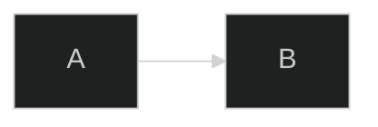

**方式2：Frontmatter（v11+）**
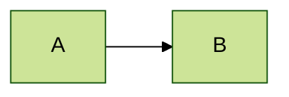

**方式3：带主题变量**
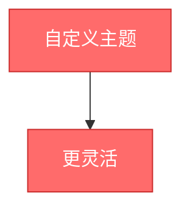

---

## 2. 配色方案

### 方案1：状态配色（通用）

适用于表示不同状态的场景。

| 状态 | 颜色 | HEX | 使用场景 |
|------|------|-----|----------|
| ✅ 成功/正常 | 绿色 | `#51cf66` | 完成、通过、正常状态 |
| ⚠️ 警告/注意 | 黄色 | `#ffd93d` | 警告、待处理、注意 |
| ❌ 错误/危险 | 红色 | `#ff6b6b` | 错误、失败、危险 |
| ℹ️ 信息/说明 | 蓝色 | `#4dabf7` | 信息、提示、说明 |
| ⚪ 默认/中性 | 灰色 | `#868e96` | 默认、未知、中性 |

**使用示例**：
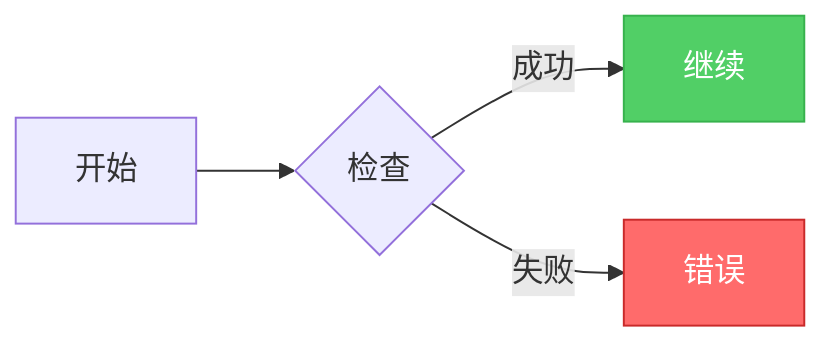

### 方案2：层次配色（架构图）

适用于分层架构展示。

| 层次 | 颜色 | HEX | 典型应用 |
|------|------|-----|----------|
| 前端层 | 浅蓝 | `#e3f2fd` | Web、移动应用 |
| 网关层 | 浅橙 | `#fff3e0` | API网关、负载均衡 |
| 服务层 | 浅紫 | `#f3e5f5` | 微服务、业务逻辑 |
| 数据层 | 浅绿 | `#f1f8e9` | 数据库、缓存 |
| 基础设施 | 浅灰 | `#f5f5f5` | 网络、监控 |

**使用示例**：
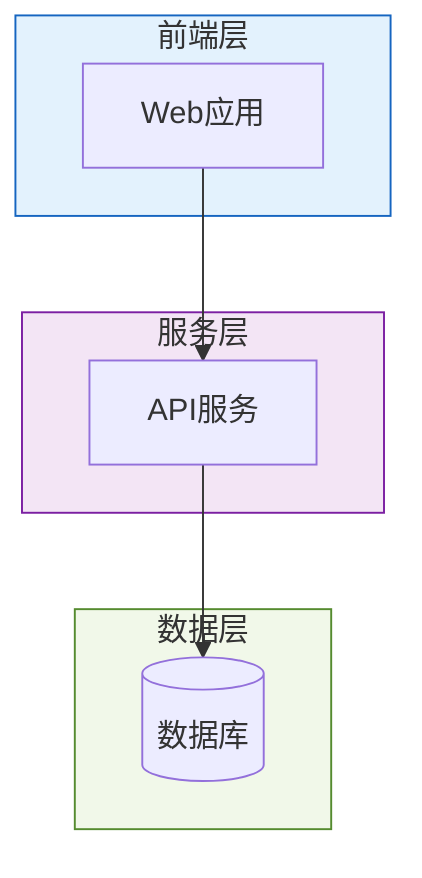

### 方案3：流程配色（时序/流程）

适用于展示流程步骤。

| 阶段 | 颜色 | HEX | 典型应用 |
|------|------|-----|----------|
| 用户操作 | 浅橙 | `#ffe0b2` | 用户输入、触发 |
| 系统处理 | 浅绿 | `#c5e1a5` | 内部处理、计算 |
| 数据操作 | 浅青 | `#b2dfdb` | 读写数据库 |
| 外部服务 | 浅粉 | `#f8bbd0` | 第三方API调用 |

### 方案4：品牌配色

根据品牌色自定义主题。

```mermaid
%%{init: {
  'theme': 'base',
  'themeVariables': {
    'primaryColor': '#1a73e8',
    'secondaryColor': '#34a853',
    'tertiaryColor': '#fbbc04'
  }
}}%%
```

---

## 3. 节点形状语义

### 形状与语义对照表

| 形状 | 语法 | 视觉 | 语义 | 使用场景 |
|------|------|------|------|----------|
| 矩形 | `[文字]` | ▭ | 过程/步骤 | 普通流程、组件 |
| 圆角矩形 | `(文字)` | ⬭ | 处理/操作 | 数据处理、转换 |
| 体育场形 | `([文字])` | ⬬ | 起止点/端点 | 开始、结束、API端点 |
| 圆柱形 | `[(文字)]` | ⌭ | 存储 | 数据库、文件系统 |
| 圆形 | `((文字))` | ● | 连接点/状态 | 连接器、状态节点 |
| 菱形 | `{文字}` | ◇ | 判断/决策 | 条件判断、分支 |
| 六边形 | `{{文字}}` | ⬡ | 准备/初始化 | 准备阶段、配置 |
| 子程序 | `[[文字]]` | ⧈ | 子流程/模块 | 调用子流程 |
| 平行四边形 | `[/文字/]` | ▱ | 输入 | 数据输入 |
| 平行四边形 | `[\文字\]` | ▱ | 输出 | 数据输出 |
| 梯形 | `[/文字\]` | ⏢ | 优先级 | 手动操作 |
| 双圆 | `(((文字)))` | ◎ | 双重边界 | 重要节点 |

### 形状使用最佳实践

**1. 语义一致性**

同类型组件使用相同形状：
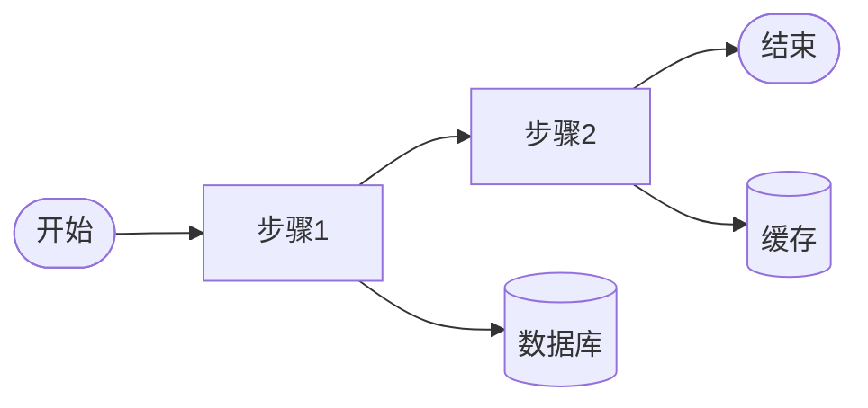
- 所有起止点用体育场形 `([...])`
- 所有流程步骤用矩形 `[...]`
- 所有存储用圆柱形 `[(...)]`

**2. 形状数量控制**

- 简单图表：2-3种形状
- 复杂图表：4-5种形状
- 避免使用超过5种形状（视觉混乱）

**3. 常用组合**

| 图表类型 | 推荐形状组合 |
|----------|-------------|
| 系统架构 | 体育场(端点) + 矩形(服务) + 圆柱(数据库) |
| 业务流程 | 体育场(起止) + 矩形(步骤) + 菱形(判断) |
| 数据流 | 平行四边形(输入输出) + 矩形(处理) + 圆柱(存储) |

---

## 4. 布局方向选择

### 方向代码说明

| 代码 | 全称 | 方向 | 特点 |
|------|------|------|------|
| TD | Top Down | ↓ | 从上到下 |
| TB | Top Bottom | ↓ | 同TD |
| LR | Left Right | → | 从左到右 |
| RL | Right Left | ← | 从右到左 |
| BT | Bottom Top | ↑ | 从下到上 |

### 方向选择决策树

```
图表内容类型？
├─ 层次结构（架构、组织）
│   └─ 使用 TD/TB（从上到下）
├─ 时间流程（步骤、工作流）
│   └─ 使用 LR（从左到右，符合阅读习惯）
├─ 反向追溯（依赖分析）
│   └─ 使用 RL（从右到左）
├─ 自下而上构建
│   └─ 使用 BT（从下到上）
└─ 不确定
    └─ 默认使用 TD
```

### 方向使用示例

**TD - 层次结构**：
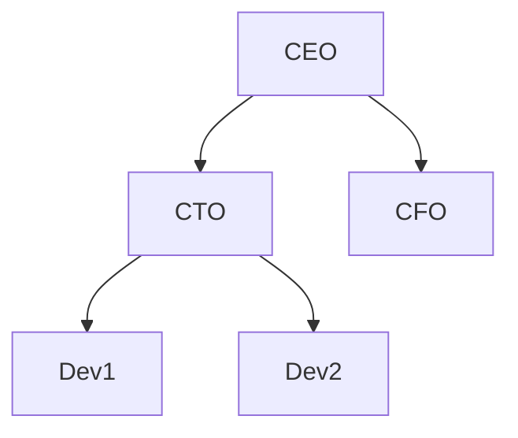

**LR - 时间流程**：
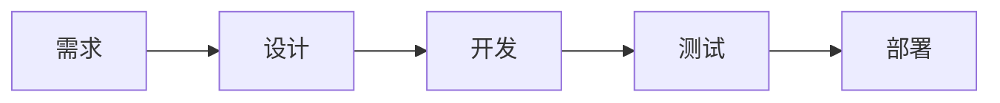

**混合方向**（subgraph内部）：
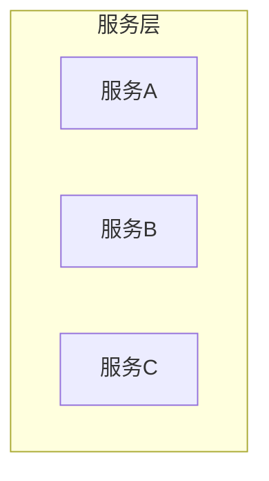

---

## 5. 视觉优化技巧

### 技巧1：使用subgraph分组

**问题**：节点过多，视觉混乱

**解决**：使用subgraph逻辑分组

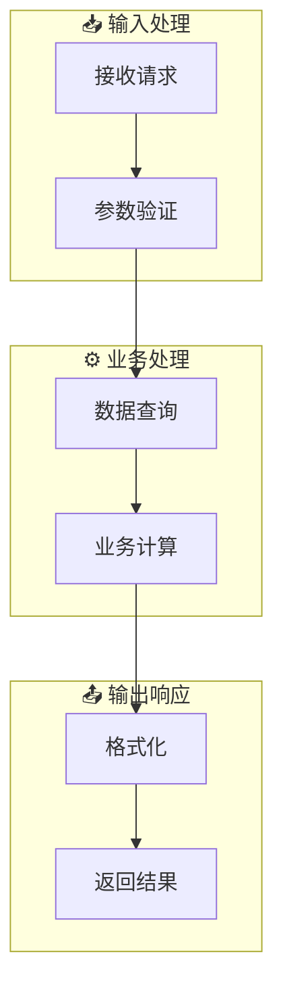

### 技巧2：使用样式突出重点

**问题**：所有节点看起来一样重要

**解决**：使用style突出关键节点

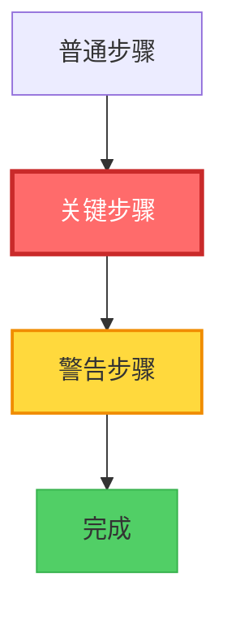

### 技巧3：使用classDef批量样式

**问题**：多个节点需要相同样式

**解决**：定义classDef复用

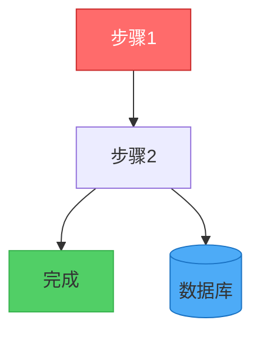

### 技巧4：简化标签

**问题**：标签过长影响布局

**解决**：简化标签，必要时使用注释

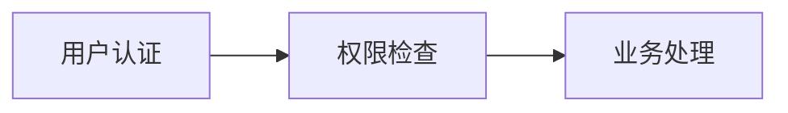

### 技巧5：使用emoji增强识别度

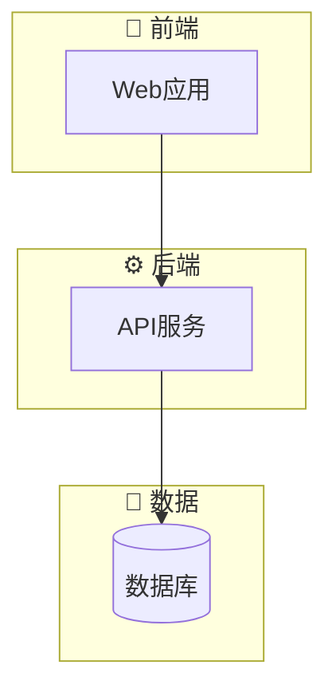

---

## 6. 优化案例分析

### 案例1：系统架构图优化

**优化前**（评分：55分）⭐⭐

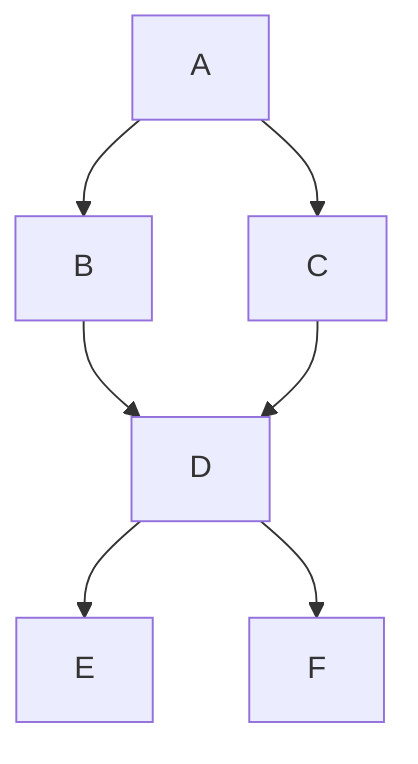

问题：
- ❌ 未配置主题
- ❌ 使用废弃的 `graph` 语法
- ❌ 无节点标签
- ❌ 无分组
- ❌ 无样式区分

**优化后**（评分：92分）⭐⭐⭐⭐⭐

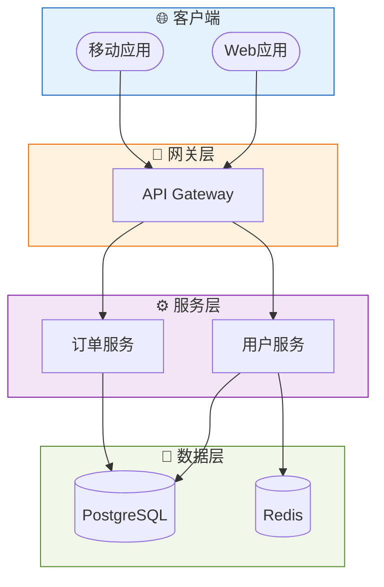

改进：
- ✅ 配置了主题
- ✅ 使用 `flowchart` 语法
- ✅ 清晰的节点标签
- ✅ 使用subgraph分层
- ✅ 使用emoji增强识别
- ✅ 不同形状区分组件类型
- ✅ 每层使用统一配色

### 案例2：业务流程图优化

**优化前**（评分：60分）⭐⭐

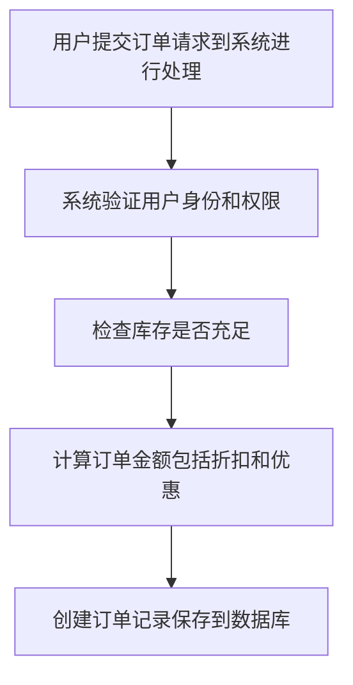

问题：
- ⚠️ 未配置主题
- ❌ 标签过长
- ❌ 缺少判断节点
- ⚠️ 无样式区分

**优化后**（评分：88分）⭐⭐⭐⭐

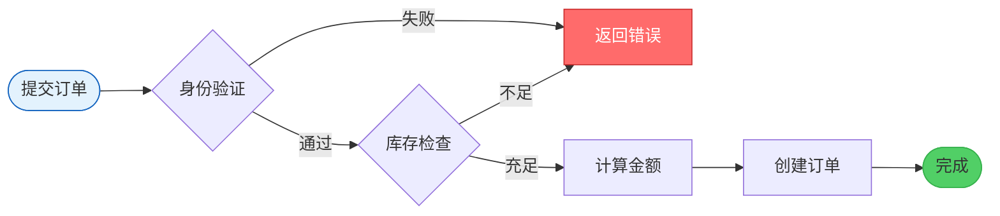

改进：
- ✅ 配置了主题
- ✅ 简洁的标签（<10字）
- ✅ 使用菱形表示判断
- ✅ 使用LR方向（符合流程阅读习惯）
- ✅ 起止点使用体育场形
- ✅ 错误路径使用红色突出
- ✅ 完成状态使用绿色

---

## 7. 视觉质量检查清单

### 必须项（基础分）

- [ ] ✅ 已配置主题
- [ ] ✅ 已明确布局方向（TD/LR/RL/BT）
- [ ] ✅ 节点标签简洁（<10字）
- [ ] ✅ 节点数量合理（<20个）
- [ ] ✅ 复杂图表使用subgraph分组

### 加分项（高级分）

- [ ] 💎 重要节点有样式突出
- [ ] 💎 使用不同形状区分组件类型
- [ ] 💎 颜色使用协调统一
- [ ] 💎 使用emoji增强识别度
- [ ] 💎 分组有清晰的标题

### 评分标准

| 完成情况 | 预期评分 |
|----------|----------|
| 完成全部必须项 | 75-80分 |
| 完成必须项 + 1-2个加分项 | 80-85分 |
| 完成必须项 + 3个以上加分项 | 85-95分 |
| 全部完成 + 精细调整 | 95-100分 |

---

## 8. 快速参考

### 常用样式代码

```mermaid
%% 成功状态
style nodeId fill:#51cf66,stroke:#37b24d,color:#fff

%% 错误状态
style nodeId fill:#ff6b6b,stroke:#c92a2a,color:#fff

%% 警告状态
style nodeId fill:#ffd93d,stroke:#f08c00

%% 信息状态
style nodeId fill:#4dabf7,stroke:#1971c2,color:#fff

%% 粗边框
style nodeId stroke-width:3px

%% 虚线边框
style nodeId stroke-dasharray:5 5
```

### 常用主题配置

```mermaid
%% 默认主题
%%{init: {'theme':'default'}}%%

%% 深色主题
%%{init: {'theme':'dark'}}%%

%% 森林主题
%%{init: {'theme':'forest'}}%%

%% 中性主题
%%{init: {'theme':'neutral'}}%%

%% 自定义主题
%%{init: {
  'theme': 'base',
  'themeVariables': {
    'primaryColor': '#your-color'
  }
}}%%
```
